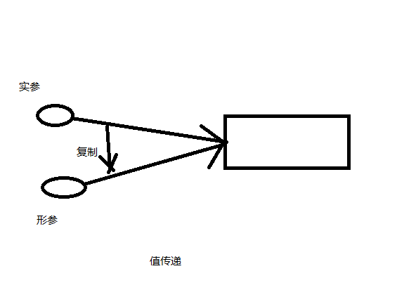
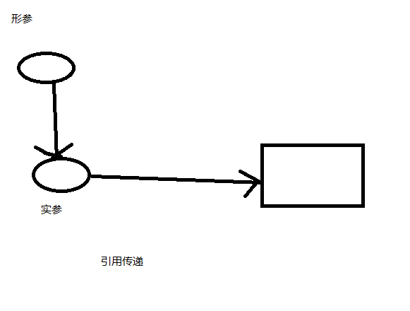

**可以这么理解（实际上可能实现有点不同），区分是否是值传递的关键是，实参是否是复制了一份。**

**无论是值传递还是引用传递，其实都是一种求值策略(Evaluation strategy)。**在求值策略中，还有一种叫做按**共享传递**(call by sharing)。其实Java中的参数传递严格意义上说应该是按共享传递。

按共享传递，是指在调用函数时，传递给函数的是实参的地址的拷贝（如果实参在栈中，则直接拷贝该值）。在函数内部对参数进行操作时，需要先拷贝的地址寻找到具体的值，再进行操作。如果该值在栈中，那么因为是直接拷贝的值，所以函数内部对参数进行操作不会对外部变量产生影响。如果原来拷贝的是原值在堆中的地址，那么需要先根据该地址找到堆中对应的位置，再进行操作。因为传递的是地址的拷贝所以函数内对值的操作对外部变量是可见的。

简单点说，Java中的传递，是值传递，而这个值，实际上是对象的引用。**而按共享传递其实只是按值传递的一个特例罢了。**所以我们可以说Java的传递是按共享传递，或者说Java中的传递是值传递。

参考：https://juejin.im/entry/5ac187ad6fb9a028e52dfaee

　　　[https://zh.wikipedia.org/wiki/%E6%B1%82%E5%80%BC%E7%AD%96%E7%95%A5](https://zh.wikipedia.org/wiki/求值策略)