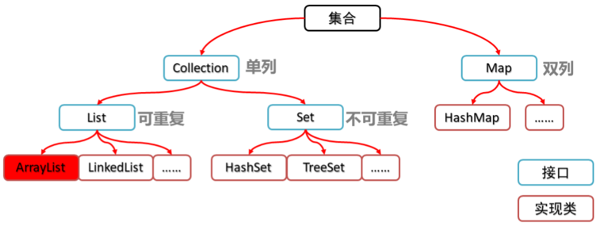

[TOC]


# JavaEE知识

## java基础

### java基础知识

#### 位
位(bit)
字节(Byte)这是数据存储的最小单位

	1Byte= 8  bit
	1KB= 1024 Bte
	1Mb= 1024 KB
	1GB= 1024 MB
	1TB= 1024 GB
	1PB= 1024 TB

#### windows 控制台指令

1. 命令提示符(控制台,命令行)的打开方式
		win+R 输入cmd 回车

2. 常见命令
	 ①切换盘符   盘符名:
	 ②进入某个文件夹   cd 文件夹名
	 ③返回上一级         cd ..
	 ④直接回根路径      cd \
	 ⑤查看当前目录的所有内容    dir
	 ⑥清屏                  cls
	 ⑦退出命令提示符    exit

3. 帮助命令
	help

#### JDK,JRE,JVM

JVM:java虚拟机,java代码都是运行在java虚拟机上
JRE:java运行环境   jvm+核心类库
JDK:java开发工具包   JRE+java开发工具

查看jdk版本的命令
java -version

#### hello world 案例

1. HelloWorld源码:

```java
public class HelloWorld {
	public static void main(String[] args){
		System.out.println("HelloWorld");
	}

}
```

2. 编译 :把.java文件编译生成.class文件
	javac 文件名.文件后缀

3 .运行 :运行.class文件
	java 类名

```java
public class 类名 {
	public static void main(String[] args){
		//这里写我们要写的代码
	}
}
```
//注意：类名要和文件名相同
`System.out.print();`  //这是不换行的输出语句

#### 注释

1. 注释就是对代码的解释说明
它是给计算机看的吗?是给程序员看的

2. 注释分类
	①单行注释	//注释内容
	②多行注释	/*注释内容 无论多少行*/
	③文档注释	/** ... */

#### 关键字

关键字就是java中有特殊意义的词
关键字的特点;
	①完全是小写的字母
	②常见的开发软件中会有特殊颜色标识

#### 常量

常量:在程序运行过程中,固定不变的量

分类:

	整数常量	1	2	4222
	浮点数常量	1.0	1.1
	字符常量(有且仅有一个字符)	'a'	' '	'你'
	字符串常量	"你好啊"	"我很好"	""	"a"
	布尔常量	true	false
	空常量	null

#### java中的数据类型

##### 基本数据类型

* 整数
	* byte       1Byte         -128~127
	* short        2Byte
	* int       4Byte
	* long          8Byte
* 浮点数
	* float         4Byte
	* double            8Byte
* 字符
	* char         2Byte
* 布尔类型
	* boolean       1Byte

##### 引用数据类型

* 字符串 String
* 其他类

整数默认是int类型,如果想要表示一个long类型的整数,在值的后面加L(l)
浮点数默认是是double类型,如果想表示一个float类型的小数在值的后面加F(f)

#### 变量:在程序运行过程中,可以发生改变的量

变量一般是用来存储一些数据

定义格式:

	1. 
	数据类型 变量名;
	变量名 = 值;
	2. 
	数据类型 变量名 = 值;//推荐


变量的使用格式:

	直接写变量名

```java
示例代码:
	int num1 = 20;//定义了一个变量num1并且赋值为20
	System.out.println(num1);//使用输出语句输出了num1这个变量,实际输出的是变量的值
```

注意事项:
1. 变量使用不能超过作用域的范围。
【作用域】：从定义变量的一行开始，一直到直接所属的大括号结束为止。
2 可以通过一个语句来创建多个变量，但是一般情况不推荐这么写。

```java
public class Demo3{
	public static void main(String[] args){
		//【作用域】：从定义变量的一行开始，一直到直接所属的大括号结束为止。
		
		{
			int a = 1;
			System.out.println(a);
		}
		int a = 20;//这里不会报错
		System.out.println(a);
	}
}
public class Demo3{
	public static void main(String[] args){
		//【作用域】：从定义变量的一行开始，一直到直接所属的大括号结束为止。
		int a = 20;
		{
			int a = 1;//这里会报错
			System.out.println(a);
		}
		System.out.println(a);
	}
}
```

#### 标识符

标识符:我们给变量,方法或者类取的名字就是标识符

命名规则:(硬性要求)

	①标识符可以包含英文大小写字母,数字,$和_     中文也可以
	②不能以数字开头
	③不能是关键字

命名规范(约定俗成)
	类名:大驼峰    HelloWorld  所有单词首字母都大写
	变量名和方法名:小驼峰  helloWorld  除了第一个单词外，所有单词首字母都大写
	包名：全小写

### 数据类型转化

#### 自动类型转换(隐式类型转换)

1. 特点:代码不需要进行特殊处理,自动完成
2. 规则:数据范围从小到大

数据范围的规律**byte,short,int,long,float,double**范围从小到大
	
理解:
	可以理解为把一个小杯子里的水倒到一个更大的杯子类(数据类型范围从小到大),这种情况下是肯定非常安全的,所以可以自动完成.

例如:

	long nu1 = 100;//int ->long int类型的范围比long类型小,所以是从小到大会进行自动类转换
	
	double num2 = 2.5F;//float ->double  float类型的范围比double类型的范围小,所以是从小到大会进行自动类型转换

#### 强制类型转换

1. 特点:代码需要进行特殊的格式处理,不能自动完成
2. 格式:

	目标类型   变量名 = (目标类型)被转换的数据;
	最纯粹的格式其实就是在你想转换的数据前面加个(目标类型)就可以了

3. 注意事项:

	1. 强制了下转换一般不推荐使用,因为可能会发生精度损失,数据溢出.只有你确定了我这个转换不会发生这些问题,或者就算出现了也无所谓的时候我们才用.
	2. byte/short/char这三种类型都可以发生数学运算.在运算的时候都会先被提升为int类型再进行计算.
	4. boolean类型不能发生数据类型转换

理解:相当于把大杯子里的水放到了小杯子里,(大范围->小范围)可能会有水的溢出等问题,所以计算机在编译的时候会给出提示.这个时候我们加上了强制类型转换相当于告诉计算机你尽管倒.

```java
byte b1=10;
byte b2=20;
byte sum = b1+b2;//报错

byte b1=10;
double b2=20.0;
byte sum = b1+b2;//   int+double->double  报错

double d =3.14;
int num=(int)d;
double d2=d-num;
```

```java
下面代码能正常运行的是？(不定项)答案：CD
A :  int a = 10.3;
B :  
	 byte a = 10;
    byte b = 20;
	 byte sum = a + b;
C:  
	 byte a = 10+20;
D:
	 long l = 1000;
```

注意：byte，short,char参与运算的时候结果会提升为int类型，但是如果还有其他数据范围更大的数据参与运算，则会转化为该类型。

```java
byte b = 10;
byte b2 = 20;
byte sum = (byte)(b+b2);//两个byte类型一起进行运行结果会自动提升为int类型
byte a = 30;
```

编译器的优化：当我们把常量赋值个byte，short的时候，编译器获取判断常量值是否在对应类型的范围之内，如果在则不会报错可以直接赋值。如果超过了范围则会报错。
编译的时候，编译器会进行语法检查，但是在这个过程中不会去计算有变量参与的运算。

### 运算符

#### 算术运算符

1. +和- * /, %（取余）	（双目运算符）

	1. /和数学中的除不太一样.两个整数相除只能得到整数,如果需要得到小数要求至少其中一个数是浮点数.
	2. %取余  比如10%3结果为1
	3. 如果+旁边有char参与运算,会把它转换为对应的数字再计算.`int num = 'a'+1;//98`
	4. 字符串和字符进行+操作的时候是直接把字符的内容拼接进去，不会把字符转换成数字

2. ++ ,--	单目运算符

	++/--
		a++;//相当于a=(a的数据类型)(a+1);
		a--;//相当于a=(a的数据类型)(a-1);

注意:
	++可以写在变量的前面也可以写在变量的后面,单独写的时候写前面写后面都没有区别.区别就在和其它运算符一起写.
	++写在变量前的时候先自增然后再参与其他运算
	++写在变量后面的时候先参与其它运算后自增

```java
int i = 0;
System.out.println(i++);	//0
System.out.println(i);	//1
```

```java
int i = 0;
System.out.println(++i);	//1
System.out.println(i);	//1
```

#### 赋值运算符

1. 基本赋值运算符:=
	代表将右侧的数据交给左侧的变量.
	例如:
	int a = 30;
	a=a+3;

2. 符合赋值运算符:+=,-=,*=,/=,%=
	只要知道一种的含义,其它的就都知道了
	例如:
			int a=10;
			a+=3;//相当于 a=(int)(a+3);
			a-=3;//相当于 a = (a的数据类型)(a-3)

+=  和=  +  等的区别：
+=会更快就跟++一样，只是对于一块内存的操作
而先+后=操作了三块内存（其他/=  *=  也是）

#### 比较运算符

>1.== 比较左右两边是否相等,结果是布尔类型的
2.< 比较左边是否小于右边,结果是布尔类型
3.>比较左边是否大于右边,结果是布尔类型
4.<= 比较左边是否小于等于右边,结果是布尔类型
5.>= 比较左边是否大于等于右边,结果是布尔类型
6.!= 比较左右两边是否不相等,如果不相等结果是true,否则是false

#### 逻辑运算符

|符号|描述|实例|
|:-:|:-:|:-:|
|与     &&(短路与)  ,&(没有短路效果)|读成并且(全真为真)|true&&false   true&false   &&和&结果都是一样的 false|
或 \|\| | 读成或者 （全假为假）| true \|\| false true |
|非 !| 取反 （真变假 假变真）|!true结果为false |
|异或 ^ | 可以用来判断是否是异性恋(相异为真) | true^true=false  true^false=true   false^false=flase |

短路:左边表达式的结果确定之后,如果整个表达式的结果已经被确定了,就不会去执行右边的表达式

#### 三目运算符

1. 格式:
	数据类型 变量名= 表达式?表达式1:表达式2;
	纯粹的格式:
		布尔表达式?表达式1:表达式2;

2. 执行流程:
	先判断布尔表达式的结果,如果结果为true三元表达式的结果就是表达式1,否则就是表达式2

#### 位运算符

int举例 int 4 字节的，int i=1中的i转换成二进制就是
0000 0000 0000 0000 0000 0000 0000 0001
为了方便简写成 0001 与0010进行运算
(与或 异或既是位运算符又是逻辑运算符)
1. | 按位或 结果 0011
2. & 按位与 结果 0000
3. ^ 按位异或 结果 0011
4. ~ 按位取反 结果 1110
* 和2 进行运算
5. << 例M << n 所有的位全都向左移动n位，然后把右边空的位用0补上，最左边多出的位去掉，其实可以这么算 M << n  = M * 2n 结果 0100
6. \>> 二进制右移n位，负数或者正数来说，移位的时候是一样的，但是在补位的时候，如果最高位是0就补0，如果最高位是1就补1，由此我们得出一个快速的算法  M >> n   其实可以这么算   M >> n  = M / 2n 结果 0000 如果是1001>>2 -> 1110
7. \>>> 在移动位的时候与右移运算符的移动方式一样的，区别只在于补位的时候不管是0还是1，都补0 结果 0000 如果是1001>>2 -> 0010

### 分支语句 

流程控制语句分为	顺序语句	分支语句	循环语句
只要这三种就可以满足所有情况了

#### if 语句

①	if(判断表达式){
		语句体;
	}
②  else if(判断表达式){
		语句体;
	}
③  else{
		语句体;
	}

可以有0个到多个else if或0个到1个else

从上到下依次执行判断表达式
	结果为true:则执行后面紧跟着的语句体.语句体执行完了整个if语句就结束了.
	结果为false:则继续判断下面一个判断表达式
如果所有判断表达式的结果都为false,在有else语句的情况下就执行else里面的语句体,没有的话if语句结束.

注意:
	1. 一旦执行了一个大括号中的语句体,整个if语句就结束了.不可能出现执行两个语句体的情况.
	2. 如果大括号中的语句体只有一行代码的时候可以把大括号省略.但是建议永远不要省略

#### switch

switch (表达式) {
	case 值1:
		语句体1;
		break;
	case 值2:
		语句体2;
		break;
	case 值3:
		语句体3;
		break;
	...
	default:
		语句体n+1;
		break; // 最后一个break语句可以省略，但是强烈推荐不要省略
}

执行流程:
	看表达式的结果和哪个case后面的值相同,就执行那个case后面的语句体,碰到break就结束switch.
	如果没有符合要求的case则执行default后面的语句体.


注意事项:
	1. switch后面小括号当中只能是下列数据类型：
		基本数据类型：byte/short/char/int
		引用数据类型：String字符串、enum枚举
	2. switch可以没有default,但是一般都会加上
	3. case语句后面可以不加break.但是如果不加break就会出现case穿透问题.匹配哪一个case就从哪一个位置向下执行，直到遇到了break或者整体结束为止;

#### 输入（键盘录入）

```java
import java.util.Scanner；
Scanner sc = new Scanner(System.in);
int num = sc.nextInt();
```

### 循环语句

1. 方式一
for(初始化语句①;判断条件②;步进语句③){
	循环体;④
}

```java
for(int i=1;i<=5;i++){
	System.out.println("HelloWolrd");
}
for循环的变量在小括号当中定义，只有循环内部才可以使用。①、②、③ 可以根据情况改变
执行顺序： 1-2(true)-4-3-2(true)-4-3-2(false)-结束

```

2. 方式二
while(判断条件){
	循环体;
}

```java
while(布尔表达式){ 
	...
}
看判断表达式的结果,如果为false循环结束,如果为true,则执行循环体.循环体执行完后继续看判断表达式的结果以此类推
```

3. 方式三
do{
	循环体;
}while(判断条件);

```java
do{
	...
}while(布尔表达式)
先执行循环一次循环体的内容，然后看判断表达式的结果如果为true则继续执行循环体如果判断表达式的结果为false则循环结束，如此反复。
```

#### break / continue 关键字

在循环过程中,碰到break整个循环就直接结束了，如果在循环过程中碰到了continue,则跳过本次循环,继续下次循环

应用场景:break只能出现在循环中或者switch中

#### 死循环

死循环就是会一直循环下去的循环

```java
while(true){

}


for(;;){

}
```

#### Random类

[n,m]   这个范围内有多少个数：m-n+1

Random对象.nextInt(范围内数的个数)+范围内的最小值;   ->  r.nextInt(m-n+1)+n;  ->[n,m) 包含n不包含m的整数
...


### 数组

* 特点
1. 数组的长度一旦确定就不能改变
2. 数组中元素的数据类型都是一样的

* 数组的初始化：在内存当中创建一个数组，并且向其中赋予一些默认值。
1. 动态初始化（指定长度）	数据类型[] 数组名 = new 数据类型[长度];
2. 静态初始化（指定内容）		数据类型[] 数组名 = {元素值1,元素值2,元素值3,...}; / 数据类型[] 数组名 =new 数据类型[] {元素值1,元素值2,元素值3,...};

* 取数组中的元素
`数组名[索引]`
索引值：就是一个int数字，代表数组当中元素的编号。
【注意】索引值从0开始，一直到“数组的长度-1”为止。

* 数组名.length 数组长度
* 数组遍历

```java
方式一：

int[] arr={1,2,3,4,5,7};
//遍历输出数组元素
for(int i=0;i<arr.length;i++){
	System.out.println(arr[i]);
}

方式二：(没有索引，jdk1.5/5.0  后才有)（好写）
for(int i : arr){
	System.out.println(i);
}
```

	java内存中的几块区域(重要的)
		①栈
			方法被调用的时候都会入栈
			局部变量都被保存在栈中
		②堆
			new出来的东西都在堆中
			堆中的东西都有默认初始化值
	
	数组的实体保存在堆中
	数组名实际保存的是数组实体的地址值
	
	局部变量:定义在方法中的变量

### 面向对象

面向过程的思想：在乎的是完成一个事情的执行流程，把执行流程中的每一个步骤封装成一个个函数，调用函数完成事情。
面向对象的思想：面向对象的基本哲学是认为世界是由各种各样具有自己的运动规律和内部状态的对象所组成的；不同对象之间的相互作用和通讯构成了完整的现实世界，在乎的是对象之间的关系和对象本身。

####  类和对象

类：是一类事物所共有的行为和属性。
对象：是这类事物的某一个个体。（在java中也叫实例）

#### 字段和属性

字段：用来存储事物内部状态的一个内存空间，--java成员变量
属性：对于字段的抽象，类对于外部世界表现出的，该类具有的属性 --java中是 setter/getter方法去掉get/set 然后首字母小写

```java
public void getA(){} ---属性：a
```
行为：类具有的运动规律，对外表现的对象可以做的事情。 --java中是方法

#### 成员方法和成员变量和声明类

```java
public class Phone {
	// 成员变量
	private String brand; // 品牌
	private double price; // 价格
	private String color; // 颜色

	// 成员方法
	public void call(String who) {
		System.out.println("给" + who + "打电话");
	}

	public void sendMessage() {
		System.out.println("群发短信");
	}

	public String getBrand(){
		return this.brand;
	}
	public void setBrand(String brand){
		this.brand = brand;
	}
}

```

#### 创建对象

* 创建对象的格式:
	类名 对象名 = new 类名();
	`Student stu = new Student();`

* 成员变量的使用格式:
	对象名.成员变量名
	`Syste.out.println(stu.name);`

* 成员方法的使用格式:
		对象名.成员方法名(参数);

注意：
1. 对象的实体保存在哪里?	堆中,因为是new出来的
2. 对象名（引用）保存的是什么?	对象实体在堆中的地址值.
3. 一个类就是一个数据类型

#### 构造方法

构造方法的特点:

	①类名和方法名相同
	②没有返回值类型,连void都不能写

构造方法就是用来创建对象的,它还有一个非常重要的作用是进行类中成员变量的默认初始化(即使构造方法中什么代码也不写)

构造方法的调用格式:

`new 类名(参数);`

注意事项:

	①如果没有写构造方法,编译器会默认赠送一个无参构造,如果写了,它就不会赠送了
	②构造方法也可以重载
	③如果在创建对象的时候已经知道了所有成员变量的值可以使用有参构造进行设置,因为这样子需要调用一次即可。但是如果对象已经创建完了,还想要修改成员变量的值就必须用setXxx方法.

### 封装

面向对象的三大特征：封装、继承、多态

封装:
	就是把一些东西隐藏起来，对外提供一些方法供别人去操作，这样可以更安全，也可以提供代码的复用性

* private是一个修饰符,它可以用来修饰类中的成员变量或者成员方法,被它修饰的成员变量只能在本类中访问,不能在其他类中直接访问
* this代表：哪个对象调用了这个成员方法,this就代表那个对象.

### 方法

方法的定义格式:
		修饰符  返回值类型  方法名(参数类型 参数名,参数类型2 参数名2,.....){
				方法体;
				return 返回值;
		}

* 修饰符:目前修饰符就是public static 
* 返回值类型:结果的数据类型
* 返回值:其实就做完这件事情后的结果
* 参数:  做这件事情需要的东西
* 参数类型  : 参数的数据类型  参数名:就是给参数取的一个名字
* 结果要求用return 返回

```java
public static void main(String[] args){
	...
	return ..;
}
```

* 定义方法三要素:(先把这三个要素分析出来再去定义方法)
1. 方法的功能
2. 方法的参数
3. 方法的返回值类型

#### 调用方法

* 加了 static 的修饰符的就是静态方法，是属于类的（详细可看关键字static）
用类来调用（其实也可以用对象调用，不推荐），静态方法中不能用非静态的东西

* 普通方法必须用对象调用

* 调用方法时必须把需要的参数传递进去


#### 方法重载(Overload)的定义

**在同一个类中,方法名相同,参数列表不同的方法才叫重载**

1. 参数列表不同:

	参数个数不同
	参数类型不同
	参数的多类型顺序不同

2. 如何快速的分辨参数列表是否相同:

	把每个参数的数据类型拼接在一起组成一个字符串.
	比较两个字符串是否相同

* 注意:
1. 看参数列表是否相同的时候和参数名没有关系
2. 没有返回值的方法中能不能写return?可以，可以用来结束方法。但是return的后面不能跟数据;

### string 字符串

String的特点:String是不可变的 

1. String的特点:

String是不可变的

2. 一些常用方法
	contains	判断一个字符串(比如"sjasd")中是否包含某个字符串(比如"ja")
	charat	获得某个字符串指定索引位置的字符
	public String substring​(int beginIndex)	把某个字符串从index索引开始截取到最后
	public String substring​(int beginIndex,int endIndex)	把某个字符串索引start到索引end截取出来
	public char[] toCharArray​()	把字符串转化成字符数组
	public byte[] getBytes​()	把字符串转化成字节数组
	public int length​()	获得字符串的长度
	public int indexOf​(int ch)	获取某个字符在字符串中第一次出现的索引

#### StringBuilder是一个可变的字符序列

主要用来拼接字符串

```java
创建
StringBuilder sb = StringBuilder​();
StringBuilder sb = StringBuilder​("abc");
```

```java
使用
StringBuilder append(Object obj)   向缓冲区添加内容
StringBuilder reverse()       将缓冲区内容进行反转
toString()	把 StringBuilder 转化成字符串
```

## java 加强阶段

### 继承

继承可以理解为就是让两类事物产生从属关系，有了从属关系子类就肯定会具有父类的特征（父类中的成员），这样我们描述一些事物的时候就可以更方便

格式：

```java
在子类名后面加extends 父类名
例如:
public class Dog extends Animal {
...
}
```

1. **在子类方法中**访问一个**变量**，采用的是就近原则。

	子类局部范围找
	子类成员范围找
	父类成员范围找
	如果都没有就报错(不考虑父亲的父亲…)

2. 通过**子类对象**访问一个**方法**

	子类成员范围找
	父类成员范围找
	如果都没有就报错(不考虑父亲的父亲…)


假设父类和子类成员变量重名了怎么去区分:

	父类的成员变量用: super.成员变量名
	当前类的成员变量: this.成员变量名

子类中所有的构造方法默认都会访问父类中无参的构造方法。
子类会继承父类中的数据，可能还会使用父类的数据。所以，子类初始化之前，一定要先完成父类数据的初始化
每一个子类构造方法的第一条语句默认都是：super()

1. 如果父类中没有无参构造方法，只有带参构造方法，该怎么办呢？
	通过使用super关键字去显示的调用父类的带参构造方法，在父类中自己提供一个无参构造方法
	推荐：自己给出无参构造方法
2. 继承的时候构造方法会不会被继承?
	不会!如果被继承了,这个方法名和类名就肯定不相同,所以不能算是构造方法.

#### 方法重写

子类出现了和父类中一模一样的方法声明（方法名一样，参数列表也必须一样，返回值也一样）

方法重写的应用场景

	当子类需要父类的功能，而功能主体子类有自己特有内容时，可以重写父类中的方法，这样，即沿袭了父类的功能，又定义了子类特有的内容

Override注解

	用来检测当前的方法，是否是重写的方法，起到【校验】的作用

* 方法重写的注意事项
1. 私有方法不能被重写(父类私有成员子类是不能继承的)
2. 子类方法访问权限不能更低(public >protected> 默认 > private)

#### 说说overload（重载）和override（重写）的区别

1. 方法重载：
	在同一个类中，方法名相同，参数列表不同，和返回值无关

2. 方法重写：
	在子父类中，子类有一个和父类方法名相同，参数列表相同，返回值类型也相同的方法。这个就叫方法的重写

#### 继承好处

提高了代码的复用性(多个类相同的成员可以放到同一个类中)
提高了代码的维护性(如果方法的代码需要修改，修改一处即可)

#### 继承弊端

继承让类与类之间产生了关系，类的耦合性增强了，当父类发生变化时子类实现也不得不跟着变化，削弱了子类的独立性

#### 注意

“is a”代表的是类之间的继承关系
"has a”代表的是对象和它的成员的从属关系

### this 和 super 关键字

1. this关键字：
this：代表本类对象的引用
2. super关键字：
super：代表父类存储空间的标识(可以理解为父类对象引用)

3. this和super的使用分别
1. 成员变量：
	this.成员变量    -   访问本类成员变量
	super.成员变量 -   访问父类成员变量
2. 成员方法：
	this.成员方法()	- 访问本类成员方法
	super.成员方法() - 访问父类成员方法
3. 构造方法：
	this(…)	-  访问本类构造方法
	super(…)	-  访问父类构造方法

### 包

1. 包的概念
包就是文件夹，用来管理类文件的
2. 包的定义格式
package 包名; (多级包用.分开)
例如：`package com.heima.demo;`
3. 导包的意义
使用不同包下的类时，使用的时候要写类的全路径，写起来太麻烦了
为了简化带包的操作，Java就提供了导包的功能
导包的格式
格式：`import 包名;`
范例：`import java.util.Scanner;`

注意：如果当前类和我们要使用的类在同一个包下这个时候是不需要导的
		如果一个类是在java.lang包下的，也不需要导包。

### 权限修饰符

Java中有四种权限修饰符：
|public | protected | (default) | private |
|:-:|:-:|:-:|:-:|
|同一个类（我自己） | YES | YES | YES | YES |
|同一个包（我邻居） | YES | YES | YES | NO |
|不同包子类（我儿子） | YES | YES | NO | NO |
|不同包非子类（陌生人） | YES | NO | NO | NO |

注意事项：(default)并不是关键字“default”，而是根本不写。

### final 关键字

final就是一个修饰符.

final可以修饰:

	①可以修饰类,被final修饰的类不能被别的类继承.
	②可以修饰成员方法,被final修饰的成员方法不能被重写
	③可以修饰局部变量,被final修饰的局部变量就变成了常量赋值之后就不能被修改
	④可以修饰成员变量,被final修饰的成员变量就变成了常量	,一旦赋值之后就不能被修改.并且必须初始化.有两种初始化方式,一种是直接赋值.另外一种是要在类的所有的构造方法中对其进行赋值.

fianl修饰基本数据类型变量
	final 修饰指的是基本类型的数据值不能发生改变
final修饰引用数据类型变量	
	final 修饰指的是引用类型的地址值不能发生改变，但是地址里面的内容是可以发生改变的

```java
举例：
	final Student s = new Student(23);
	s = new Student(24);  // 错误
	s.setAge(24);	// 正确
```

### static 关键字

static就是一个修饰符
**被他修饰的东西就属于类 (最重要)，**被这个类的所有对象所共享

无论是成员变量，还是成员方法。如果有了static，都推荐使用类名称进行调用。

	静态变量：类名称.静态变量
	静态方法：类名称.静态方法()

注意事项：
1. 静态不能直接访问非静态。
原因：因为在内存当中是【先】有的静态内容，【后】有的非静态内容。
“先人不知道后人，但是后人知道先人。”
2. 静态方法当中不能用this。
原因：this代表当前对象，通过谁调用的方法，谁就是当前对象。static在对象之前加载入内存。

static的使用场景:

	①如果需要共享数据,可以使用static
	②如果想要方便调用某些成员,可以使用static修饰(PS:因为就可以直接用类名来调用,不需要创建对象)

理解:

	因为被staric修饰的东西就属于类了,所以可以使用类名.来调用
	因为被staric修饰的东西就属于类了,类的加载优先于对象,所以在静态方法中,不能使用非静态(PS:非静态的成员是属于对象)的成员,类出现的时候对象还不存在,所以不能使用还不存在的东西
	因为被staric修饰的东西就属于类了,而this代表的某个对象,类加载的时候对象还没创建,所以在静态方法中不能使用this,因为对象都没有出现呢

### 多态

什么是多态？
**同一个对象，在不同时刻表现出来的不同形态**

	例如：
		Cat c  = new Cat();//这个时候cat对象被我们看是只猫
		Animal a = new Cat()；//这个时候我们把只猫看成是一个动物

#### 多态的前提条件:

1. 继承或实现
2. 子类重写了方法
3. 父类引用指向子类对象

多态的格式:
父类引用指向子类对象

`Animal a=new Dog();`

Animal是父类，变量的类型是Animal就代表父类应用。Dog是子类，我们new的是Dog的对象就代表指向的子类的对象。

多态中成员方法的调用:**编译看左边,运行看右边**
	编译就是检查语法的时候,如果检查出来有问题,直接编译报错
	编译期间会去看左边(父类),看父类有没有这个成员方法,如果没有,直接报错,如果有则编译通过,不报错
	运行期间,实际执行什么代码,看的是右边(子类),看子类中有没有重写该方法,如果有则执行子类中的该方法,如果没有
	则运行父类中的该方法.

除了成员方法最特殊，其他所有的成员都是:编译看左边,运行看左边

#### * 多态的弊端

	不能使用子类特有的成员

### instanceof 关键字

使用格式:

```java
	//判断对象是否是某个类的对象，如果是结果为true，如果不是结果为false
	if(对象 instanceof 类名/接口名){
		...
	}
```

### 抽象类

当一个类中有一个方法,这个方法在不同的子类中有不同的实现的时候,在父类中我们没有办法去写具体的方法体,这个时候就可以使用抽象。

格式：
1. 抽象方法的格式:
	就是在普通方法返回值类型的前面加abstract修饰.然后去掉方法的大括号,加上一个分号

注意:
	抽象方法要放在抽象类中

2. 抽象类
	就是在普通类上多加了个abstract修饰

3. 抽象类的特点

	1. 抽象类和抽象方法必须使用abstract关键字修饰
	```java
		public abstract class 类名{}
		public abstract 返回值类型 方法名();
	```
	2. 抽象类中不一定有抽象方法，但是有抽象方法的类一定是抽象类
	3. 抽象类不能实例化，但是可以通过多态的方式创建子类对象
	4. 抽象类的子类
		要么重写抽象父类中所有的抽象方法
		要么子类本身也是一个抽象类

注意：
1. 抽象类中能不能有成员变量
	能

2. 抽象类中能不能有非抽象方法
	能

3. 抽象类中有没有构造方法
	有,因为有成员变量,需要构造方法来进行成员变量的初始化.

4.抽象类和非抽象类的区别
	1. 成员上:
	抽象类可以有抽象方法.其他都和非抽象类一样

	2. 创建对象:
	抽象类不能直接创建对象

### 接口

接口就是规范\规则，我们可以使用接口来定义一些规则（比如要求某个方法的方法名必须叫什么，方法的参数列表必须是什么，方法的返回值类型必须是什么）

#### 接口的特点

1. 如何定义接口
	`public interface 接口名{}`
2. 如何实现接口
	`public class 类名 implements 接口名{}`
3. 接口不能被实例化，可以通过多态形式创建实现类对象
4. 接口的实现类
	要么重写接口中所有的抽象方法
	要么实现类定义为抽象类

#### 接口的成员

jdk1.7
常量
抽象方法
jdk1.8
默认方法
静态方法
jdk1.9
私有方法

接口的成员特点
	1.成员变量
		只能是常量，默认修饰符为：public static final
	2.构造方法
		接口中没有构造方法
	3.成员方法
		接口中可以有抽象方法，默认修饰符为：public abstract
		JDK8以后可以有静态方法，默认方法
		JDK9以后可以有私有方法

```java
示例代码:
public interface InterfaceA {
	//常量
	public static final int NUM =10;
	//抽象方法
	public abstract void methodAbstract();

	//默认方法  用于解决接口升级的问题
	public default void methodDefault(){
		System.out.println("methodDefault");
	}
	//静态方法  调用:只能用接口名调用
	public static void methodStatic(){
		System.out.println("methodStatic");
	}

	//非静态私有方法  解决的是默认方法中代码重复的问题
	private void m(){

	}
	//静态私有方法    解决的是静态方法中代码重复的问题
	private static void m2(){

	}
}
```
#### 注意

1. 接口和接口是什么关系?
	继承关系
2. 一个接口可以继承多个接口吗?
	可以

3. 抽象类和接口的区别
	1. 成员区别
		抽象类：变量、常量、构造方法、普通方法、抽象方法
		接口：常量、抽象方法
	2. 关系区别
		类和类：继承关系，单继承
		类和接口：实现关系，单实现、多实现
		接口和接口：继承关系，单继承、多继承
	3. 设计理念区别
		抽象类：对类抽象，包括属性，行为
		接口：对行为抽象，主要是行为
	4. 接口作为规则，规则最新制定。
		最顶层设计成接口
		然后实现类设计成抽象类
		抽象类的子类可以设计成非抽象类

### 内部类

#### 成员内部类

1. 定义：定义在类中方法外,和成员变量,成员方法的位置一样

```java
格式:
修饰符 class 外部类名称 {
    修饰符 class 内部类名称 {
        // ...
    }
    // ...
}
```

2. 创建成员内部类对象:

	①如果是在外部类中创建内部类对象和普通的类没有区别:  类名 对象名 = new 类名();
	②如果在其他类中创建内部类的对象:

		外部类名.内部类名  对象名 = new 外部类名().new 内部类名();

	其实就是要求必须要有外部类对象然后才能用外部类对象去创建内部类的对象.

注意事项:

	①在成员内部类中可以直接使用外部类的成员.但是其实就省略了	外部类名.this
		完整的调用外部类成员变量的格式是:
			外部类名.this.成员变量名
		完整的调用外部类成员方法的格式是:
			外部类名.this.成员方法名(参数)
	实际上外部类名.this就是一个外部类对象,是那个创建内部类对象时候用的外部类对象.
	例如:
		Outer out=new Outer();
		Outer.Inner obj = out.new Inner();
	
		那么obj这个内部类对象中的Outer.this就是表示out这个对象.
	
	外部类和内部类成员重名问题:
		用this.成员变量名 表示内部类的成员变量
		用外部类名.this.成员变量表示外部类的成员变量
3. 用法

```java
下面是jdk为我们提供的ArrayList
public class ArrayList{
	public Iterator iterator() {
		return new Itr();
	}

	private class Itr implements Iterator {

	}

}
```
　　ArrayList提供了一个iterator方法，这个方法可以返回一个Iterator接口的实现类对象，在ArrayList中有一个成员内部类Itr这个类就是Iterator的实现类，并且因为成员内部类在其他类中创建对象比较麻烦，所以ArrayList提供了一个iterator这个方法，这个方法内部直接创建了Itr对象作为方法的返回值。这样在其他类中如果我们需要这个对象的时候就可以直接调用iterator方法接收返回值。

```java
例如：
public class Demo2 {
	public static void main(String[] args) {
		ArrayList list = new ArrayList();
		Iterator it = list.iterator();
		it.next();
		}
}
```

#### 局部内部类

局部内部类的位置和局部变量的位置是一样的就是写在方法中

```java
例如:
public void methodOuter() {

	class Inner { // 局部内部类
		int num = 10;
		public void methodInner() {
			System.out.println(num); // 10
		}
	}

	Inner inner = new Inner();
	inner.methodInner();
}
```

注意事项:
　　局部内部类只能在定义它的那个方法中使用.

#### 匿名内部类

最重要:匿名内部类就是一个类或者一个接口的子类对象.
是一个对象，而不是一个类

格式:

	匿名内部类的定义格式：
	接口名称 对象名 = new 接口名称() {
		// 覆盖重写所有抽象方法
	};

对格式“new 接口名称() {...}”进行解析：
1. new代表创建对象的动作
2. 接口名称就是匿名内部类需要实现哪个接口
3. {...}这才是匿名内部类的内容

### Object类

Object是所有类（引用数据类型）的根类，也是就说随便什么类的对象都可以使用Object继承下来的方法。比如最常见的toString方法和equals方法。

1. Object的toString方法
　　我们输出一个对象的时候，默认是输出的是这个类的toString方法的返回值。而Object是所有类的根类，在Object的toString方法是返回的类名加地址值。所以我们自定义一个类，默认都是返回这个类的地址值，如果需要输出对象的成员变量值，可以去改写这个类里的toString方法。
***
2. Object的equals方法
　　equals其实就是用来比较两个对象是否相等。不过我们看Object的equals的源码可以发现这个方法其实就是拿当前对象this和通过equals方法的参数传进去的参数进行==的判断。==用于比较基本数据类型的时候其实是比较的基本数据类型的值，都是如果是引用数据类型，其实比较的是对象的地址值。
　　但是如果很多时候我们进行两个对象的比较的时候其实是认为如果对象的成员变量都一样，他们就是同一个对象的。所以Object的equals方法这个时候就不能满足我们的需求了。所以这个时候就需要自己去重写equals方法。并且重写equals方法的时候其实就是在里面去判断两个对象的所有成员变量是否都一样。

### Arrays/Collections工具类

1. Arrays类，提供了数组相关的常用方法

```java
public static String toString​(int[] a)	返回指定数组的内容的字符串表示形式

public static void sort​(int[] a)	按照数字顺序排列指定的数组
```

2. Collections类 集合工具类

```java
static void reverse(List<?> list) 
反转指定列表中元素的顺序。
static <T> boolean replaceAll(List<T> list, T oldVal, T newVal) 
将列表中一个指定值的所有出现替换为另一个。
static <E> List<E> checkedList(List<E> list, 类<E> type) 
返回指定列表的动态类型安全视图。
static <K,V> Map<K,V> checkedMap(Map<K,V> m, 类<K> keyType, 类<V> valueType) 
返回指定地图的动态类型安全视图。
addAll(Collection<? super T> c,T... elements)
把elements数组中的元素添加到c中。

***
使用举例：
List<String> list = new ArrayList<>();
Collections.addAll(list,"HEllO","WORLD");
System.out.println(list);
Collections.addAll(list,new String[]{"bbb","ccc","aaa"});
System.out.println(list);
输出结果：
[HEllO, WORLD]
[HEllO, WORLD, bbb, ccc, aaa]
***

<T> void copy(List<? super T> dest,List<? extends T> src)
功能：把src列表中的所有元素拷贝给dest，拷贝的元素位置与拷贝前是一样的，前提src在拷贝前的size必须大于或等于dest的size。
<T> void fill(List<? super T> list,T obj)
功能：把list中所有元素换为obj。当使用new关键字生成obj时列表中只有一个相同的对象。
<T extends Comparable<? super T>> void sort(List<T> list)
功能：对T类型列表进行排序。
前提：T类型必须实现Comparable接口并复写compareTo函数。


```

### 包装类

1、基本数据类型所对应的包装类都是那些？
	就是把 基本数据类型的 首字母变成大写。
	byte -> Byte
	long -> Long
	double -> Double
	...

	特殊：
	int   Integer
	char  Character
2、为什么要有包装类？
		"包装类其实就是把基本数据类型变成了一个对象。"
		"既然变成了对象，那么就可以调用方法了"。

#### int转String

1. int类型如何转为String类型？
	1. 最为常用
		最为常用： + "";
		因为最简单。
		"任意数据类型 + "" 结果都是一个字符串"

		Student s = new Student();
		String str = s + "";//也是把一个学生对象转成了字符串。
	2. 通过String的静态方法valueOf（）


2. String类型如何转为int类型？

	* int i = Integer.parseInt(参数);

	细节：
		参数不能是非数字的字符串。

#### 自动拆/装箱

自动装箱：把基本数据类型变成其对应的包装类
	int ---> Integer

自动拆箱：把包装类变成其对应的基本数据类型
	Integer ---> int

**细节:**

**当自动装箱的时候，如果值是在byte的取值范围之内，不会重新new，而是从已经new好的数组（byte常量池）中直接拿。
如果值不是在byte的取值范围之内，那么直接new**

### Date

	就是用来描述时间的类。

使用:

	1.Date 导包是 util 包下的。
	2.Date d = new Date();//就是把当前时间封装成一个Date对象
	3.Date d = new Date(毫秒值);//就是从时间原点开始过了多少毫秒的那个时间点
					//把这个时间点封装成Date对象。
	
	时间原点：计算机 1970年1月1日 0:0:0
		因为我天朝大国是在东八区，简单理解就是有时差。时差8小时
		1970年1月1日 8:0:0
	Date d = new Date(0);
	//表示从1970年1月1日 8:0:0 开始过了0毫秒的那个时间。
	//把这个时间封装成一个Date对象。

* setTime(毫秒值);//把指定的毫秒值赋值给Date对象

* getTime();//获取指定时间的毫秒值。无参默认当前时间

#### SimpleDateFormat

1.格式化时间
	把指定的时间，想要按照固定的格式，进行展示时。

2.解析
	把一个字符串表示形式的时间，变成Date对象。

	a.在解析的时候有一个异常，我们要先暂时进行抛出处理  alt + 回车，选择第一个。
	b.待解析的字符串格式一定要跟创建对象时的格式要保持一致。

yyyy年MM月dd日 HH:mm:ss

#### 日历类

public int get(int field)：返回给定日历字段的值。
public void set(int field, int value)：将给定的日历字段设置为给定值。
public abstract void add(int field, int amount)：根据日历的规则，为给定的日历字段添加或减去指定的时间量

	注意点：
	1、add 偏移数据。
		如果第二个参数是负数，就往前减
		如果第二个参数是整数，就往后加
	
	2、set方法其实有很多重载的方法
		不仅仅是可以设置年月日
		还可以设置单独的字段值
	
	set的时间一定会有，如果自己set的时间实际不存在，日历类会自动的调整。set时天是0时就是上个月的最后一天，-1就是上个月的倒数第二天，13月就是明年的下个月

```java
二月的天数
Scanner sc = new Scanner(System.in);
      	System.out.println("请输入要获取的年份：");
       	int i = sc.nextInt();
       	Calendar c = Calendar.getInstance();（不是new出来，构造方法保护protected）
      	c.set(Calendar.YEAR, i);
       	c.set(Calendar.MONTH, 2);（month月份从0开始）
        c.set(Calendar.DATE, 0);
//      c.set(Calendar.DATE, 1);
//      c.add(Calendar.DATE,-1);
       	int d = c.get(Calendar.DATE);
      	System.out.println(d + "日");
```

Date/SimpleDateFormat/Calendar使用时机

	Date一般情况下，不会单独使用。
	Date + SimpleDateFormat 
		解决：
		1.把时间按照固定的格式进行展示
		2.解析字符串形式的时间。
	Date + Calendar
		解决：
		为了进行时间的计算。

#### System

　　包含一些有用的类字段和方法。它不能被继承和实例化。System类被final修饰了，构造方法被private修饰了。

常用方法：

	static long currentTimeMillis()	返回当前系统时间
		* static long currentTimeMillis() ：以毫秒值返回当前系统时间（1970-1-1 0:0:0至今过了多少毫秒）（北京时间1970-1-1 8:0:0）
		* 1000毫秒 = 1秒

### 异常

1.什么是异常？

	在程序中出现的问题。

2.异常的体系结构？

	Throwable --printStackTrace(); 把所有的异常信息打印在控制台上。
		--- Error 错误（系统异常）程序不应该捕获。
		--- Exception 异常

* 异常分类
	RuntimeException : 运行时异常。	就是在java 命令开始执行时出现的异常
	除了RuntimeException其他的所有，编译时异常。	就是在javac 命令开始执行时出现的异常

* JVM默认处理方案
	1.把异常的信息打印在控制台
	2.停止虚拟机运行（下面的代码就不会执行了）

会看异常的信息

								异常的名字
	Exception in thread "main" java.lang.ArrayIndexOutOfBoundsException: 10
		//异常所在的位置
		在    包名             类名 方法     第几行
		at com.itheima.demo11.Demo.main(Demo.java:9)

#### 处理异常

	1. try{}catch(){}
	try{
			可能会出现异常的代码
		}catch(异常类名 变量名){
			如果出现了这样的异常，我该怎么处理。
		}
	
	2. throws---抛出异常
		抛给了调用者。如果调用者没有处理怎么办？继续抛给他的调用者。
		最终还是抛给了JVM虚拟机处理。
		那么JVM还是使用了默认处理方式，把异常信息打印在控制台，并将程序停止。
	3. throw --抛出异常
		throw:写在方法中。后面跟随的是异常的对象。
		throws:写在方法申明的后面。后面跟随的是异常的名字。
```java	
自定义异常

a.纹身  类名后面需要加	Exception 举例：AgeOutOfBoundsException、
b.拜大哥  就是继承 大多数情况下都是继承RuntimeException
c.左手一把刀 构造方法
d.右手一把刀 构造方法


代码：
public class AgeOutOfBoundsException extends RuntimeException{
	//运行时异常，一般跟我们自己写的参数错误是有关系的
	//要描述年龄超出边界异常

public AgeOutOfBoundsException() {
}

public AgeOutOfBoundsException(String message) {
		super(message);
	}
}

在需要用到的时候直接new就可以了。
public void setAge(int age) {
	if(age < 0 || age > 120){
		//System.out.println("年龄非法");//这个是打印在控制台的。
		//有没有将结果告诉给调用者（main方法里面？）
		//此时我们发现一个问题？
		//在Java中现在没有一个异常能很好的描述我现在出现的这个错误。
		//自己写一个异常信息去描述自己的这个异常
	throw new AgeOutOfBoundsException(age + "超出了范围。");
	}else {
		this.age = age;
	}
}
```

### String 的 split 函数细节

```java
String bigString = "91@27@46@38@50";
String smallString = "@";
//大串要按照小串进行切割
String[] split = bigString.split(smallString);
```
细节：
	
1.要切割的小串如果在大串的开头？

	结论：就是在返回值数组的0索引位置是一个长度为0的字符串对象。

2.要切割的小串在大串的中间连续？

	结论： 跟上面一样，也多了一个长度为0的字符串对象。（多个连续会出现多个空串）

3.要切割的小串如果在大串的尾巴？

	结论：如果要切割的小串在末尾，对结果是没有影响的。

结论：取小串左边的返回，可以返回“”

### 可变参 本质是一个数组

底层本质是一个数组，所以可以使用数组的遍历方式对可变参数进行操作
	在参数个数不确定时，可以使用可变参数定义参数列表，
	要求一个方法只能有一个可变参数，而且必须放在参数列表的最后位置

```java
Integer[] a ={1,2,3};
Set<Integer> a1 = Set.of(a);
a1的长度为三
int[] a2={1,2,3};
Set<Int[]> a3 = Set.of(a2);
a3长度为1
```

### 泛型 泛型的类型只能是引用类型

引用类型的占位符，只能用于类（接口）的定义或者方法的定义

- 是JDK5中引入的特性，它提供了编译时类型安全检测机制，该机制允许在编译时检测到非法的类型
	它的本质是参数化类型，也就是说所操作的数据类型被指定为一个参数。一提到参数，最熟悉的就是定义方法时有形参，然后调用此方法时传递实参。那么参数化类型怎么理解呢？顾名思义，就是将类型由原来的具体的类型参数化，然后在使用/调用时传入具体的类型。这种参数类型可以用在类、方法和接口中，分别被称为泛型类、泛型方法、泛型接口
- 泛型定义格式
	- <类型>：指定一种类型的格式。这里的类型可以看成是形参
	- <类型1,类型2…>：指定多种类型的格式，多种类型之间用逗号隔开。这里的类型可以看成是形参
	- 将来具体调用时候给定的类型可以看成是实参，并且实参的类型只能是引用数据类型
- 泛型的好处
	- 把运行时期的问题提前到了编译期间
	- 避免了强制类型转换

在使用类/接口或者调用方法时，要明确具体的数据类型

```java
class A<T>{
	List<T> list;
	
	public void show1(T t){
	
	}
	
	public <R> void show2(R r){
	
	}
	
}
```

**注意：泛型在定义是可以声明在类（接口）上或者方法上
	声明在类上的泛型，作用于当前类
	声明在方法上的泛型，作用于当前方法
	****静态方法中的泛型只能声明在方法上 -- 因为声明在类上的泛型需要在new对象时确定数据类型，而静态方法的调用不依赖于new的对象

```java
public static <R> void show2(R t) {
	System.out.println(t);
}
```

#### 泛型通配符

只能作为变量接收具体数据类型的对象
	<?>  -- 可以接收任意类型的对象
	<? extends R> -- 只能接收**R子类或者R本身**的数据类型对象（上限）
	<? super R> -- 只能接收**R的父类或者R本身**数据类型的对象（下限）

### 集合

第一种
	单列集合//一次只能添加一个数据  list.add(元素);
		List //可以重复
		Set  //不可以重复

第二种
	双列集合//一次可以添加一对数据  map.添加(元素1,元素2);



#### Collection集合概述和使用 (单列集合)

* boolean add(E e)			向集合中添加元素
* boolean remove(E e)		将元素从集合中删除
* void clear()				清空集合所有的元素
* boolean contains(E e)		判断集合中是否包含指定的元素
* boolean isEmpty()			判断集合是否为空
* int size()				获取集合的长度

细节：
	1.contains方法
		在内部，是依赖equals方法去跟每一个元素进行比较的。

	2.size()方法
		数组的长度 arr.length
		字符串的长度 arr.length();
		集合的长度   list.size();

##### 迭代器的简单使用

iterator():创建一个迭代器对象。创建一个指针，默认指向集合的0索引位置。

	hasNext():判断是否有元素可以被迭代
	next();两件事情：
		1、移动指针
		2、获取元素

1. 迭代器对象随用随创建。
2. hasNext跟next方法一定要配套使用。
3. 当循环结束后，指针不会自动复位。
	如果我们还需要再次遍历集合。只能再次调用iterator方法，重新创建一个迭代器对象。

```java
Collection<String> c = new ArrayList<String >();
	c.add("hello");
	c.add("world");
	c.add("java");
	System.out.println(c);
	Iterator<String> it = c.iterator();
	while(it.hasNext()){
		String s = it.next();
		System.out.println(s);
	}
```

##### list集合 有索引，可重复，存取有序

有序集合(也称为序列)，用户可以精确控制列表中每个元素的插入位置。用户可以通过整数索引访问元素，并搜索列表中的元素
- 与Set集合不同，列表通常允许重复的元素
- List集合特点
- 有索引
- 可以存储重复元素
- 元素存取有序


List集合存储学生对象三种方式遍历

	需要掌握:
		1.普通for进行遍历
		2.迭代器进行遍历
		3.增强for进行遍历

* 增强for/迭代器/列表迭代器使用场景

|增强for|迭代器|列表迭代器|
|:-:|:-:|:-:|
|只想遍历|遍历并删除|遍历并修改|

* ArrayList:
	底层就是一个长度可变的数组。
	特点：
		增删慢
		查询快。
		在内存中是一片连续的空间。

* LinkedList：
	底层就是一个链表，双向链表。
	特点：
		增删快
		查询慢
		在内存中不是一片连续的空间，是由一个又一个的结点组成的。

```java
public void addFirst(E e)	在该列表开头插入指定的元素

public void addLast(E e)	将指定的元素追加到此列表的末尾

public E getFirst()	返回此列表中的第一个元素

public   E getLast()	返回此列表中的最后一个元素

public E removeFirst()	从此列表中删除并返回第一个元素

public   E removeLast()	从此列表中删除并返回最后一个元素
```

###### 列表迭代器  ListIterator接口

ListIterator迭代器继承了Iterator迭代器，所以可以直接使用Iterator的hasNext()和Next()方法。 
它多了个逆向遍历，它必须先正向遍历，才能逆向遍历，所以一般意义不大，不使用。
通过List集合的listIterator()方法得到，所以说它是List集合特有的迭代器

* 提供了boolean hasPrevious()和E previous()方法，实现逆向遍历。
* void add(E e) :将指定的元素插入列表 ，在刚才迭代的元素后面添加。 
* void remove() ：从列表中删除由 next()或 previous()返回的最后一个元素）。 
* void set(E e) ：用 指定的元素替换由 next()或 previous()返回的最后一个元素。 
* 这些方法的存在说明我们可以使用列表迭代器去修改元素。

###### 增强for

底层也是一个迭代器，可以简化集合或者数组的遍历。

```java
格式：
	for (String s : list) {
		System.out.println(s);
	}
细节：
	int [] arr = {1,2,3,4,5};
	for (int i : arr) {
		i = 10;//这里的i只是一个第三方变量，在遍历的过程中，依次表示集合或者数组中的每一个值。
			//如果修改了这个i，那么是对集合或者数组中原本的元素是没有影响的。
		System.out.println(i);
	}
	System.out.println(Arrays.toString(arr));
```

###### 关于删除的一些注意点

如果是以ArrayList<Integer> list = new ArrayList<>();创建的对象
	那么因为ArrayList里面有删索引也有删对象的方法。
	此时如果调用  list.remove(1); 那么是不会触发自动装箱
	调用的是删除索引的方法。

```java
Collection<Integer> list = new ArrayList<>();
list.add(1);
list.add(2);
list.add(3);
list.add(4);
list.add(5);
list.remove(1);//此时删除的是1对象。
System.out.println(list);
```

解释：
: 因为Collection里面是没有删除索引的方法的。
: 编译看左边，运行看右边。
: 看的是左边Collection里面的删除对象的方法。
: 索引右边运行的也是删除对象的方法，此时将1进行了自动装箱。

###### 并发修改异常

1. 并发修改是如何产生的？

	在用迭代器迭代集合的过程中，如果使用了集合的方法，"修改了集合的长度"，那么就会报并发修改异常。（实际修改次数不等于预计修改次数）
	
2. 解决：

	1.以前的for循环，弊端。删除元素的时候，要删除的元素有相邻的，不能直接删除（集合大小会变动）
	2.用迭代器自带的方法修改集合


##### Set集合 没有索引，不可重复

* HashSet

	存取无序，没有索引，不可重复
		底层的实现其实是HashMap集合
		底层数据结构是哈希表（数组+单向链表/数组+红黑树 --提升元素的查找效率）

		**去重的原理：（所以要重写）	
			hashCode + equals


		成员变量
		private static final Object PRESENT = new Object();
		add方法
		public boolean add(E e) {
		return map.put(e, PRESENT)==null;
		}
		空参构造
		public HashSet() {
		map = new HashMap<>();
		}

* LinkedHashSet

	存取有序，没有索引，不可重复(怎么存怎么取)
		底层的实现其实是LinkedHashMap集合
		底层数据结构是哈希表（数组+单向链表/数组+红黑树 --提升元素的查找效率） + 双向链表

		**去重的原理：	
			hashCode + equals
		
		空参构造
		public LinkedHashSet() {
		super(16, .75f, true);
		}

* TreeSet

	没有索引，不可重复，基于元素的内容实现排序
	（对元素排序，每个条件尽量都考虑到，不然就会有本来要加入的元素没被加入的情况）
		底层的实现其实是TreeMap集合
		底层数据结构是红黑树
		
		TreeSet ts = new TreeSet(); -- 添加的元素必须具备比较的能力（实现Comparable接口）
		TreeSet ts = new TreeSet(Comparator);
			**注意:如果元素本身实现了比较规则，也不会使用
		
		**去重的原理：
			基于比较的返回值实现去重，如果返回0就代表是重复元素，否则就不是重复元素

#### Map集合 没有索引，不保证存取顺序

常用方法：
* V put(K key,V value);  -- 返回被替换的值
* V remove(K key);  -- 返回删除的键对应的值
* void clear(); -- 清空集合
* boolean containsKey(Object key); -- 判断是否包含指定的键
* boolean containsValue(V value); -- 判断是否包含指定的值
* boolean isEmpty(); -- 判断是否为空
* int size(); -- 获取集合的长度
* V get(Object key); -- 通过键获取值
	

遍历方式：
	Map<String,String> map = new HashMap<>();
	
	//方式一：获取键的集合，通过键找值
	Set<String> keys = map.keySet();
	for(String key : keys){
		String value = map.get(key);
	}
	
	//方式二：直接获取所有值的集合
	Collection<String> values = map.values();
	
	//方式三：获取封装键值对的对象集合，通过对象找键和值
	Set<Map.Entry<String,String>> entries = map.entrySet();
	for(Map.Entry<String,String> entry : entries){
		entry.getKey();
		entry.getValue();
	}

常用子类：

##### HashMap：键不允许重复，存取无序（最常用）
	底层数据结构:哈希表（数组+单向链表/数组+红黑树）
	键去重的原理：
		hashCode+equals

* LinkedHashMap:键不允许重复，存取有序
	底层数据结构:哈希表（数组+单向链表/数组+红黑树） + 双向链表（存储了两份数据）
	LinkedHashMap有序，可分为插入顺序和访问顺序两种。如果是访问顺序，那put和get操作已存在的Entry时，都会把Entry移动到双向链表的表尾(其实是先删除再插入)。
	键去重的原理：
		hashCode+equals
	
* TreeMap:键不允许重复，基于键的内容实现排序
	底层数据结构：红黑树
	键去重的原理：
		比较的结果，返回0就证明是重复元素

* HashTable：实际不适用，面试时和HashMap比较
	HashTable不允许null值和null键
	HashTable是线程安全的，但是效率很低

### 递归 --思想 方法自己调用自己	

	找规律
	找出口

```java
案例：遍历一个目录下的所有文件（包括子目录）
	public void bl(File dir){
		if(dir.isDirectory()){
			File[] files = dir.listFiles();
			for(File file : files){
				bl(file);
			}
		}else{
			sout(dir.getName());
		}
	}
```
其实实际中使用的较少，比较影响效率

### 流：

为进行数据的IO（输入/输出）操作，Java中把不同的输入/输出源抽象表述为“流”

Stream 是从源（source） 到接收 （sink） 的有序数据

#### IO流

java内存和磁盘文件进行数据交互的通道

##### 字节流

###### 字节输入流（InputStream） -- 读

	常用方法：	
		int read(); -- 如果读到了文件的末尾，返回-1
		int read(byte[] bys);  -- 返回值代表读到的数据长度,返回值为-1，代表读到末尾了
		close();
		
	常用子类：
		FileInputStream
			FileInputStream fis = new FileInputStream(String fileName);
			FileInputStream fis = new FileInputStream(File file);
			
		***一次读一个字节：
			int by;
			while((by = fis.read()) != -1){
				
			}
			
		***一次读一个字节数组
			byte[] bytes = new byte[1024];
			int len;
			while((len = fis.read(bytes)) != -1){
				
			}

###### 字节输出流（OutputStream）  -- 写

	常用方法：
		write(int b) -- 一次写一个字节
		write(byte[] bys); -- 一次写一个字节数组
		**write(byte[] bys,int offset,int len); -- 写字节数组的一部分
			bys -- 字节数组
			offset -- 从字节数组的哪个索引开始取
			len -- 取字节数组中的字节个数
		close()
			
	常用子类：
		FileOutputStream
			FileOutputStream fos = new FileOutputStream(String fileName); -- 覆盖写
			FileOutputStream fos = new FileOutputStream(File file); -- 覆盖写
			
			FileOutputStream fos = new FileOutputStream(String fileName,true); -- 追加写
			FileOutputStream fos = new FileOutputStream(File file,true); -- 追加写


	常用子类：
		FileOutputStream
		
		BufferedOutputStream -- 只起缓冲区的功能，本身没有和文件交互的能力，需要依赖于基础流对象
			BufferedOutputStream bos = new BufferedOutputStream(FileOutputStream);
			
			bos.flush(); -- 只刷出缓冲区的数据，并不会关闭流通道
			bos.close(); -- 在刷出缓冲区数据之后，关闭流通道

**字节缓冲流使用的前提：需求是一次读写一个字节，不能明确文件大小的时候，选择用缓冲流**

##### 字符流：解决中文的读写问题

	编码：将我们能看懂的字符变成计算机能看懂的字节
		String s;
		s.getBytes();
		s.getBytes("GBK/UTF-8");
	解码：将计算机能看懂的字节变成我们能看懂的字符
		byte[] bys;
		new String(bys);
		new String(bys,"GBK/UTF-8");
	码表：存储字节和字符映射关系的容器
	
	**注意：不同的码表对中文的支持不同
		GBK:一个中文占2个字节
		UTF-8：一个中文占3个字节

###### 字符输入流（Reader） -- read

	通用方法:
		int read();  -- 一次读一个字符，如果返回-1，代表读到了末尾
		int read(char[] chs);
		close();	
		
	常见子类：
		InputStreamReader：磁盘（字节）--》内存（字符） -- 字节流到字符流的桥梁
			InputStreamReader isr = new InputStreamReader(FileInputStream); //使用当前工作空间默认字符集
			InputStreamReader isr = new InputStreamReader(FileInputStream,"GBK/UTF-8");
		
		FileReader
			FileReader fr = new FileReader("");  === new InputStreamReader(FileInputStream)
			
		BufferedReader:只起缓冲的功能,有一个特殊api，readLine，一次读取一行数据
			BufferedReader br = new BufferedReader(FileReader);


​	
###### 字符输出流（Writer） -- write

	通用方法：
		write(int c);  -- 一次写一个字符
		write(char[] chs);
		write(char[] chs,int offset,int len);
		* write(String s);
		flush(); -- 只刷出缓冲区的数据，并不会关闭流通道
		close(); -- 在刷出缓冲区数据之后，关闭流通道
			
	常见子类：	
		OutputStreamWriter：内存（字符）--》磁盘（字节） -- 字符流到字节流的桥梁
			OutputStreamWriter osw = new OutputStreamWriter(FileOutputStream);
			OutputStreamWriter osw = new OutputStreamWriter(FileOutputStream,"GBK/UTF-8");
	
		FileWriter
			FileWriter fw = new FileWriter("");  === new OutputStreamWriter(FileOutputStream)
			
		BufferedWriter:只起缓冲的功能，有一个特殊api，newLine，可以写一个换行，而且会根据不同的操作系统，写不同的换行符
			BufferedWriter bw = new BufferedWriter(FileWriter);

**注意：字符缓冲流使用前提,需求是一次读写一个字符,需要使用特殊api时（比如需求就是一次读一行）**
			
#### IO流总结：

	四个基本流
		FileInputStream
		FileOutputStream
		
		FileReader
		FileWriter
	
	四个缓冲流:只起缓冲功能，在构建时，需要传递基础流对象
		BufferedInputStream
		BufferedOutputStream
		
		BufferedReader：readLine
		BufferedWriter：newLine
	
	两个转换流
		InputStreamReader
		OutputStreamWriter

##### 如何选择流对象完成功能：

	① 如果是复制，选择字节流
		-- 如果是一次复制一个字节，那么选择用字节缓冲流
		-- 如果复制的文件不确定大小，选择用字节缓冲流
		
	② 如果是读取文本文件的一部分，选择用字符流
		-- 如果需要指定编码表，使用转换流
		
	③ 如果需求是一次读取一行，只能选择用字符缓冲流
	
	**需求：以一行一行方式读取一个gbk文件的一部分
		读取一个gbk文件
			InputStreamReader isr = new InputStreamReader(new FileInputStream(""),"GBK");
		
		以一行一行方式读取
			BufferedReader br = new BufferedReader(isr);
	
		以一行一行方式读取一个gbk文件的一部分
			BufferedReader br = new BufferedReader(new InputStreamReader(new FileInputStream(""),"gbk"));
			String line;
			while((line=br.readLine()) != null){
			
			}

### transient关键字

给成员变量加上transient关键字这样这个成员变量就不会被序列化，JVM会忽略transient变量的原始值并将默认值保存到文件中，仅适用于变量，不适用于方法和类

### 序列化

java中的序列化(serialization)机制能够将一个实例对象的状态信息写入到一个字节流中，使其可以通过socket进行传输、或者持久化存储到数据库或文件系统中；然后在需要的时候，可以根据字节流中的信息来重构一个相同的对象。序列化机制在java中有着广泛的应用，EJB、 RMI等技术都是以此为基础的。 

Java的序列化机制只序列化对象的属性值，而不会去序列化什么所谓的方法。其实这个问题简单思考一下就可以搞清楚，方法是不带状态的，就是一些指令，指令是不需要序列化的，只要你的JVM classloader可以load到这个类，那么类方法指令自然就可以获得。序列化真正需要保存的只是对象属性的值，和对象的类型。

* 序列化会序列化所有该对象的非瞬态和非静态成员变量，对于静态成员变量属于类。
* 常量（不包括常量引用）序列化没有意义（跟方法一样）。
* 常量引用是：引用不变但对象其中的值会变,经过测试，常量引用对象中的值会被序列化。（需要被引用的对象能够序列化）
* 常量引用不能加transient关键字,引用常量不能序列化后默认值为null，这个常量引用就废掉了。

```java
User user = new User();
//user.arr[0]=999999999;
user.a.a=20;
FileOutputStream out = new FileOutputStream("E:/a.txt") ;
ObjectOutputStream objOut = new ObjectOutputStream(out);
objOut.writeObject(user);
objOut.flush();
objOut.close();
FileInputStream in = new FileInputStream("E:/a.txt");
ObjectInputStream objIn = new ObjectInputStream(in);
User o = (User) objIn.readObject();
// System.out.println(o.arr[0]) ;
System.out.println(o.arr) ;
System.out.println(o.a);
```
```java
public class User implements Serializable {
	// public transient final int[] arr = new int[5];
	public transient final int arr = 5;
	public transient final A a=new A();
}
public class A implements Serializable {
    public int a=10;
}
```

### 一些流和集合

#### 对象操作流

对象操作流：可以用于读写任意类型的对象

ObjectOutputStream

		成员方法writeObject 
		构造方法ObjectOutputStream(OutputStream out) 
ObjectInputStream

		成员方法readObject
		构造方法ObjectInputStream(InputStream in)

注意：

	使用对象输出流写出对象，只能使用对象输入流来读取对象
	只能将支持 java.io.Serializable 接口的对象写入流中所以需要让类实现该接口并且记得生成序列号


常见错误：

1. NotSerializableException: 	当一个类的对象需要IO流进行读写的时候，这个类必须实现java.io.Serializable接口如果没有实现就会报这个错
	解决方法：
		让类去实现这个Serializable接口


	EOFException:当输入过程中意外到达文件或流的末尾时，抛出此异常。

```java
解决方法：
①用try...catch去捕获该异常出现了这个异常就说明读到末尾了，不用再读了。
示例代码：
	try {
		while(true) {
			Object obj = ois.readObject();
			System.out.println(obj);
		}
	} catch(EOFException e) {
		System.out.println("读到了文件的末尾");
	}
```

2. 再把多个对象写入文件的时候就先把多个对象全部存入集合，然后再把集合对象写入文件。这样在取的时候只需要读一次，就可以把集合对象读出来了。然后遍历集合就可以得到集合里的所有对象了。

```java
示例代码：
public static void main(String[] args) throws IOException {
	//ObjectOutputStream​(OutputStream out)：创建一个写入指定的OutputStream的ObjectOutputStream
	ObjectOutputStream oos = new ObjectOutputStream(new FileOutputStream("myOtherStream\\oos.txt"));

	//创建对象
	Student s = new Student("林青霞",30);
	Student s2 = new Student("MISS",35);
	ArrayList<Student> list = new ArrayList<>();
	list.add(s);
	list.add(s2);
	//void writeObject​(Object obj)：将指定的对象写入ObjectOutputStream
	oos.writeObject(list);

	//释放资源
	oos.close();
}
public static void main(String[] args) throws IOException, ClassNotFoundException {
	ObjectInputStream ois = new ObjectInputStream(new FileInputStream("myOtherStream\\oos.txt"));
	Object obj = ois.readObject();
	ArrayList<Student> list = (ArrayList<Student>) obj;
	for (int i = 0; i < list.size(); i++) {
		System.out.println(list.get(i).getName());
	}
	ois.close();
}
```

注意：
当写完对象后，对Student类进行修改，然后再去冲文件中反序列化的时候就会出现异常。解决方案：直接在Student类中写死一个序列号，即使我们修改了，这个版本号还是会和之前的序列号一致。如果忘记掉怎么写，去String的源码中复制修改。`private static final long serialVersionUID = 42L;`

#### 打印流

1. 打印流只有输出流。

2. 打印流的分类：

		PrintStream

		PrintWriter	
			可以自动换行，println()
			不能输出字节，但是可以输出其他任意类型
			通过某些配置，可以实现自动刷新（只有在调用 println、printf 或 format才有用）
			也是包装流，不具备写出功能
			可以把字节输出流转换成字符输出流


3. 字符打印流特有功能

		①println  可以在打印完后自动换行
		②自动刷新，在构造方法的第二个参数传一个true。开启了自动刷新只有在调用 println、printf 或 format 的其中一个方法时才可能完成此操作
		示范：
		PrintWriter pw = new PrintWriter(new FileWriter("d.txt"),true);

**注意：创建FileWriter对象时boolean参数是是否追加(true,数据写在文件末尾，不新建文件)，而创建打印流对象的boolean类型参数是是否自动刷新**

#### 标准输入输出流

标准输入流：System.in   就是一个数据源是键盘的输入流

	1.我们可以自己实现键盘录入输入。
		BufferedReader(InputStreamReader(System.in));
		调用readtLine()方法接收数据
	2.但是上面的方式太麻烦了，所以我们直接使用键盘输入的类
		Scanner sc = new Scanner(System.in);

标准输出流 : System.out 就是一个目的地是控制台的输出流

	调用print()方法可以输出不带换行效果的数据
	调用println()方法可以输出带换行效果的数据

####  properties集合

Properties实现了Map接口，所以可以使用map接口的方法去存取数据，去遍历。但是我们在使用Properties的时候一般是用来读取和修改配置文件的时候使用。

```java
void load(Reader reader)   传入一个字符输入流，把流所指向的文件里的数据全部加载到Properties对象里。
示例代码：
//创建属性列表对象
Properties prop = new Properties();
//创建一个输入流对象
FileReader fr = new FileReader("d.txt");
 
prop.load(fr);

//释放资源
fr.close();
```

### 多线程

#### 概述

	进程：
		是正在运行的程序，是系统进行资源分配和调用的独立单位。每一个进程都有它自己的内存空间和系统资源
	
	线程：是进程中的单个顺序控制流，是一条执行路径
	单线程：一个进程如果只有一条执行路径，则称为单线程程序
	多线程：一个进程如果有多条执行路径，则称为多线程程序
	
	一个程序至少有一个进程，一个进程里至少有一个线程。
	
	单线程：安全性高，但是效率低
	多线程：安全性低，效率高

#### 多线程的实现方式：

1. 将类声明为 Thread 的子类。该子类应重写 Thread 类的 run 方法。如何创建该类的对象，去调用start方法就可以开启线程（特别注意，不是调用run方法是调用start方法.）

```java
	示例代码：
class MyThread extends Thread {
	@Override
	public void run() {
		for (int i = 0; i < 100; i++) {
			System.out.println(getName() + ":" + i);
		}
	}
}
public class ThreadDemo2 {
	public static void main(String[] args) {
		//创建线程实例
		MyThread mt = new MyThread();

		mt.start():
	}
}
```

2.写一个类实现Runnable接口,实现run方法。然后在创建Thread对象的时候从Thread的构造方法里传进去一个该类的对象。再调用Thread对象的start方法

```java
	示例代码：
public class MyThread2 implements Runnable{
	@Override
	public void run() {
		for (int i = 0; i < 100; i++) {
			System.out.println(Thread.currentThread().getName()+i);
			try {
				Thread.sleep(1000);
			} catch (InterruptedException e) {
				// TODO Auto-generated catch block
				e.printStackTrace();
			}
		}
	}
}

	Thread t=new Thread(new MyThread2());
	t.setName("老王");
	t.start();
	Thread t2=new Thread(new MyThread2());
	t2.setName("李四");
	t2.start();
```

#### Thread的成员方法

* void  setName(String name)
将此线程的名称更改为等于参数name

* String  getName()
返回此线程的名称

* Thread  currentThread()
返回对当前正在执行的线程对象的引用

#### 线程优先级

在分别CPU的执行权的时候其实有两种分配方式：
分时调度模型，抢占式调度模型.而Java使用的是抢占式调度模型。都是即使是这样也不是说优先级高的线程会获取所有CPU的执行权，仅仅是获取到的概率高些。

1. 分时调度模型：所有线程轮流使用 CPU 的使用权，平均分配每个线程占用 CPU 的时间片
2. 抢占式调度模型：优先让优先级高的线程使用 CPU，如果线程的优先级相同，那么会随机选择一个，优先级高的线程获取的 CPU 时间片相对多一些

```java
final int getPriority()	返回此线程的优先级

final void setPriority(int newPriority)	更改此线程的优先级

线程默认优先级是5；线程优先级的范围是：1-10
```

因为线程的执行具有随机性，但是有的时候我们又想让线程的执行尽可能的安装我们的计划运行，这就需要使用如下方法控制下线程的执行。
```java
static void sleep(long millis)
使当前正在执行的线程停留（暂停执行）指定的毫秒数

void join()  等待这个线程死亡，假设在线程a中调用了线程对象b的join方法，就必须等线程b执行完了之后线程a才能执行后面的代码。

void setDaemon(boolean on)
将此线程标记为守护线程，当运行的线程都是守护线程时，Java虚拟机将退出	守护线程拥有自动结束自己生命周期的特性，而非守护线程不具备这个特点。JVM 中的垃圾回收线程就是典型的守护线程，如果说不具备该特性，会发生什么呢？当 JVM 要退出时，由于垃圾回收线程还在运行着，导致程序无法退出，这就很尴尬了！！！
```

#### * 线程安全问题

如果有多个线程，并且多个线程并发的访问操作共享的数据的时候，这个时候会出现线程安全问题。
解决方法：使用同步代码块或者同步方法 （设计结构合理的程序等）

	synchronized:同步（锁），修饰代码块和方法，被修饰的代码块和方法一旦被
	某个线程访问，则直接锁住，其它的线程将无法访问
	
	注意：锁对象需要被所有的线程所共享
	同步：意味着安全性高，效率低
	非同步：安全性低，效率高


1. 同步代码块

	格式：
	synchronized(锁对象){
	被上锁的代码;
	}

2. 同步方法

	在方法上加上synchronized关键字
	同步方法有锁对象吗？如果过有，那锁对象是哪个对象？
	答案：有。如果是非静态的同步方法，那么锁对象就是this，如果是静态的同步方法，那么锁对象不可能是this，而是该类的字节码对象。

3. lock对像

	Lock是一个接口，我们一般使用其实现类
	ReentrantLock

	lock()  --是用于获取锁的
	unlock()  --是释放锁的
	注意：为了保证锁的时候一般把unlock的操作放到finally中。

4. 同步的一些类

	StringBuffer
		线程安全，可变的字符序列
		从版本JDK 5开始，被StringBuilder 替代。 通常应该使用StringBuilder类，因为它支持所有相同的操作，但它更快，因为它不执行同步

	Vector
		从Java 2平台v1.2开始，该类改进了List接口，使其成为Java Collections Framework的成员。 与新的集合实现不同， Vector被同步。 如果不需要线程安全的实现，建议使用ArrayList代替Vector


	Hashtable
		该类实现了一个哈希表，它将键映射到值。 任何非null对象都可以用作键或者值
		从Java 2平台v1.2开始，该类进行了改进，实现了Map接口，使其成为Java Collections Framework的成员。 与新的集合实现不同， Hashtable被同步。 如果不需要线程安全的实现，建议使用HashMap代替Hashtable
	
	当我们需要保证线程安全的情况下可以选择使用StringBuffer，但是在使用List和map集合的时候一般也不用Vector，Hashtable。可以用 Collections.synchronizedList()
	Collections.synchronizedMap()
	这两个方法来把一个线程不安全的集合变成线程安全的。

#### sleep()/wait()/ontify()

1.sleep方法
	Thread的静态方法，方法参数表示休眠的毫秒值，时间到了线程就会醒过来继续执行。
`示例代码：	Thread.sleep(100);`

2.wait方法
	让当前线程停止，并且会释放锁对象。直到该锁对象调用了notify方法把该线程唤醒。

```java
示例代码：
private synchronized  void print() throws Exception {
	// TODO Auto-generated method stub
	for (int i = 0; i < 100; i++) {
		if (i==50) {
			this.notify();
			this.wait();
		}
		System.out.println(Thread.currentThread().getName()+","+i);
	}
}
```

* 注意事项：
①wait和notify方法都是Object的方法。所以任意的对象都可以调用他们。都是一定要再同步方法或者同步代码块内调用。并且调用的时候要用锁对象的wait和notify方法。
②如果在一个线程里调用了A对象的wait方法。只有再次调用A对象的notify方法才可以唤醒该线程。也就是wait和notify方法的对象必须一致。

3.sleep和wait的区别

	sleep在同步代码块中或同步函数中，不释放锁（睡着了也会抱着锁睡）
	wait在同步代码块中或同步函数中，释放锁。

### 网络编程

#### 1.网络通信中的三要素

	网络通信三要素：
		1.IP地址（帮助确定是和哪台设备通信）
		2.端口号 （帮助确定是这太设备的那个软件通信）
		3.通信协议

#### InetAddress类

	此类表示互联网协议 (IP) 地址。 
	
	如果创建InetAddress对象：
		①static InetAddress getByName(String host)   //可以传入Ip地址，也可以传入主机名来获得InetAddress对象（注意：它是静态方法。因为IP地址是唯一的，所以传入IP地址肯定能获取到这个IP地址所对应的InetAddress对象。但是主机名有可能重复，所以得到的可能并不是我们想要的InetAddress对象。）
		②static InteAddress getLocalHost();//获取本机的InteAddress对象。
	
	获取IP地址：
		getHostAddress方法
	
	获取主机名：
		getHostName方法

#### UDP

	1.没有链接所以不可靠但是效率高
	2.发生数据要先打包
	3.发生的数据有大小限制为64k

##### 使用UDP发生数据

	步骤：
		1.创建Socket对象（DatagramSocket对象)
			DatagramSocket:此类表示用来发送和接收数据,基于UDP协议的
				
		2.创建数据并打包
	
		3.发送数据
	
		4.释放资源

```java
示例代码：
//创建发送端Socket对象
DatagramSocket ds = new DatagramSocket();
//创建数据并打包
/*
	* DatagramPacket :此类表示数据报包
	* 数据 byte[]
	* 设备的地址 ip
	* 进程的地址  端口号
	DatagramPacket(byte[] buf, int length, InetAddress address, int port) 
	*/ 

String s = "hello udp,im comming!";
byte[] bys = s.getBytes();
int length = bys.length;
InetAddress address = InetAddress.getLocalHost();//发送给当前设备
int port = 8888;
//打包
DatagramPacket dp = new DatagramPacket(bys,length,address,port);
//发送数据
ds.send(dp);
//释放资源
ds.close();
```

##### 使用UDP接收数据

	步骤：
	1.创建Socket对象 （DatagramSocket）注意要指定端口号
	
	2.接收数据
	receive（）

* 注意事项：
* 注意接受端设置的端口号要和发生的时候设置的一样，不然会接受不到数据
* 接收端开启一个绑定某个端口后，再开第二个绑定同样的端口会报错。

#### TCP

	1.三次握手，更可靠，但是速度更慢
	2.面向连接
	3.数据没有大小限制，数据不用打包

##### Tcp发送数据

```java
示例代码：
	//创建服务端Socket对象
	ServerSocket ss = new  			ServerSocket(10010);
	//监听
	Socket s = ss.accept();
	//获取输入流对象
	InputStream is = s.getInputStream();
	//获取数据
	byte[] bys = new byte[1024];
	int len;//用于存储读取到的字节个数
	len = is.read(bys);
	String str = new String(bys,0,len);
	//输出数据
	System.out.println(str);
	//转换数据
	String upperStr = str.toUpperCase();
	//获取输出流对象
	OutputStream os = s.getOutputStream();
	//返回数据（发出数据）
	//Thread.sleep(10000);
	os.write(upperStr.getBytes());
	//释放资源
	s.close();
```

##### Tcp接收数据

```java
示例代码：
	//创建客户端Socket对象
	Socket s = new Socket(InetAddress.getLocalHost(),10010);
	//获取输出流对象
	OutputStream os = s.getOutputStream();
	//发出数据
	os.write("tcp,im comming again!!!".getBytes());

	System.out.println(1);
	//获取输入流对象
	InputStream is = s.getInputStream();
	byte[] bys = new byte[1024];
	int len;//用于存储读取到的字节个数
	//接收数据
	len = is.read(bys);
	System.out.println(2);
	//输出数据
	System.out.println(new String(bys,0,len));
	
	//释放资源
	s.close();
```

### 静态代码块和构造代码块以及单例设计模式

#### 静态代码块

	格式：
		在类中  直接写
			static {
				//静态代码块的代码
			}

执行时机：
	静态代码块其实就是在类加载的时候执行，一个类只会加载一次，所以静态代码块也最多只会执行一次。

	构造代码块会在每次调用构造方法之前执行。构造方法调用了几次，它就执行几次。

#### 构造代码块

	格式：
		在类中  直接写
			{
				//构造代码块的代码
			}

执行时机：
每次我们调用构造方法的时候都会先执行构造代码块中的代码，然后才去执行对应的构造方法中的代码。

迫不及待的创建对象，但是缺点是如果这个对象我们很长一段时间都没有使用 ，就白白浪费内存空间。

#### 单例设计模式

##### 饿汉式

```java
public class World {
	//如果想让我们程序中存在的World对象都是同一个对象，这个应该怎么实现

	//为了不让别人随意new对象，首先可以让构造方法私有化
	private World(){
	}
	//饿汉式
	private static World instance = new World();

	public static World getInstance(){
		return instance;
	}
}
```

##### 懒汉式

```java
public class World {
	//如果想让我们程序中存在的World对象都是同一个对象，这个应该怎么实现

	//为了不让别人随意new对象，首先可以让构造方法私有化
	private World(){
	}
	//懒汉式
	/*当程序真正需要这个对象的时候我们才开始创建
	* */
	private static World instance ;

	public static  World getInstance(){

		//如果是对象还没创建的时候使用同步，如果对象已经创建完了，就不要同步了，这样效率就可以提高
		if(instance==null){//说明对象还没创建，所以里面使用了同步
			synchronized (World.class){
				if(instance==null){
					instance = new World();
				}
			}
		}
		return instance;
	}
}
```

### 函数式编程

#### 1.函数式编程

	在数学中，函数就是有输入量、输出量的一套计算方案，也就是“拿什么东西做什么事情”。相对而言，面向对象过分强调“必须通过对象的形式来做事情”，而函数式思想则尽量忽略面向对象的复杂语法——强调做什么，而不是谁去做。
	
	面向对象的思想:
	
	做一件事情,找一个能解决这个事情的对象,调用对象的方法,完成事情.
	
	函数式编程思想:
	
	只要能获取到结果,谁去做的,怎么做的都不重要,重视的是结果,不重视过程

#### 2.Lambda表达式（其实就是一个接口的实现类只是更简洁）

	Lambda表达式的标准格式:
		由三部分组成:
			a.一些参数（可以不写参数类型，就写参数名）
			b.一个箭头
			c.一段代码
		格式:
			(参数列表) -> {一些重写方法的代码}
		解释说明格式:
			():接口中抽象方法的参数列表,没有参数,就空着;有参数就写出参数,多个参数使用逗号分隔
			->:传递的意思,把参数传递给方法体{}
			{}:重写接口的抽象方法的方法体
	
	Lambda的语法非常简洁，完全没有面向对象复杂的束缚。但是使用时有几个问题需要特别注意：
	
	1. 使用Lambda必须具有接口，且要求接口中有且仅有一个抽象方法。
	
	无论是JDK内置的Runnable、Comparator接口还是自定义的接口，只有当接口中的抽象方法存在且唯一时，才可以使用Lambda。
	
	2. 使用Lambda必须具有上下文推断。
	
	也就是方法的参数或局部变量类型必须为Lambda对应的接口类型，才能使用Lambda作为该接口的实例。

**有且仅有一个抽象方法的接口，称为“函数式接口”。**

##### 在Lambda标准格式的基础上，使用省略写法的规则为：

	1. 小括号内参数的类型可以省略；
	2. 如果小括号内有且仅有一个参数，则小括号可以省略；
	3. 如果大括号内有且仅有一个语句，则无论是否有返回值，都可以省略大括号、return关键字及语句分号。

#### 3.Lambda表达式和匿名内部类的区别

	所需类型不同
	匿名内部类：可以是接口，也可以是抽象类，还可以是具体类
	Lambda表达式：只能是函数式接口
	
	使用限制不同
	如果接口中有且仅有一个抽象方法，可以使用Lambda表达式，也可以使用匿名内部类
	如果接口中多于一个抽象方法，只能使用匿名内部类，而不能使用Lambda表达式。
	
	实现原理不同：
	匿名内部类：编译之后，产生一个单独的.class字节码文件
	Lambda表达式不会产生单独的Class字节码文件

原则：可推导可省略

#### 接口中的新成员

	1.7
		常量
		抽象方法
	1.8
		默认方法
				应用场景：如果需要升级接口（也就是往接口中增加一些方法），如果使用抽象方法，那之前的所有实现类都要抽象，工作量太大。我们就可以选择使用默认方法。默认方法是有方法体。所以实现类可以选择不重写该方法，这样我们之前的实现类就不需要做修改，工作量就小了。
			
		静态方法
			使用static修饰，有方法体。调用的时候必须使用：接口名.方法名(参数)调用
			应用场景： 如果需要往接口中增加一些工具方法（这个方法我们希望方便调用，并且我们不希望不同的子类有不同的实现）的时候。这个时候我们就会使用静态方法。
			
	1.9
		私有方法
				应用场景：当接口中的方法有重复代码的时候，我们可以把重复的代码封装成一个私有方法，从而提高代码的复用性。
	
	示例代码:
	public interface InterfaceA {
		//常量
		public static final int NUM =10;
		//抽象方法
		public abstract void methodAbstract();
	
		//默认方法  用于解决接口升级的问题
		public default void methodDefault(){
			System.out.println("methodDefault");
		}
		//静态方法  调用:只能用接口名调用
		public static void methodStatic(){
			System.out.println("methodStatic");
		}


		//非静态私有方法  解决的是默认方法中代码重复的问题
		private void m(){
	
		}
		//静态私有方法    解决的是静态方法中代码重复的问题
		private static void m2(){
	
		}
	}

#### 方法引用

	我们在使用Lambda表达式做为方法参数的时候，其实就相当于传入一个方法的方法体(可以理解为某件事情的具体解决方案)。但是如果已经有某个方法的方法体和我们想传入的方法体相同的话，就没有必要再写一次，可以直接去引用这个已经存在的方法体传入。
	这就是方法引用。
	
	引用构造器，其实就是引用构造方法
	格式：类名::new
	例子：Student:new
	
		理解：如果我们在使用匿名内部类的时候代码如下： 如果我们在重写方法的时候，方法体中只有一行代码，并且这行代码是调用了某个类的构造方法，并且我们把要重写的抽象方法中的所有的参数都按照顺序传入了这个构造方法中，这个时候我们就可以引用构造器。
	
		useStudentBuilder(new StudentBuilder() {
			@Override
			public Student build(String name, int age) {
				return new Student(name,age);
			}
		});
		省略后：useStudentBuilder(Student::new);

|类型|示例|
|---|---|
|引用静态方法|ContainingClass::staticMethodName|
|引用某个对象的实例方法|containingObject::instanceMethodName|
|引用某个类型的任意对象的实例方法|ContainingType::methodName|
|引用构造方法|ClassName::new|

### Stream流

#### 函数式接口

有且仅有一个抽象方法的接口就是函数式接口

如何检测一个接口是不是函数式接口呢？
    @FunctionalInterface
    放在接口定义的上方：如果接口是函数式接口，编译通过；如果不是，编译失败

#### 常用函数式接口

##### Supplier<T>接口

	Supplier<T>接口也被称为生产型接口
		如果我们指定了接口的泛型是什么类型，那么接口中的get方法就会生产什么类型的数据供我们使用
	
	Supplier<T>：包含一个无参的方法
		T get​()：获得结果 
		该方法不需要参数，它会按照某种实现逻辑(由Lambda表达式实现)返回一个数据

##### Consumer<T>接口

	Consumer<T>接口也被称为消费型接口，它消费的数据的数据类型由泛型指定
	
	Consumer<T>：包含两个方法
		void accept​(T t)：对给定的参数执行此操作
		default Consumer<T> andThen​(Consumer after)：返回一个组合的 Consumer，依次执行此操作，然后执行 after操作（先执调用对象的accpt函数，然后用执行后的结果接着执行after）
```java
accept(T t)

StringBuilder sb = new StringBuilder("Hello ");
Consumer<StringBuilder> consumer = (str) -> str.append("Jack!");
consumer.accept(sb);
System.out.println(sb.toString());	// Hello Jack!

andThen(Consumer<? super T> after)

Consumer<StringBuilder> consumer1 = (str) -> str.append(" Bob!");
consumer.andThen(consumer1).accept(sb);
System.out.println(sb.toString());	// Hello Jack! Bob!
```

##### Predicate<T>接口

	Predicate<T>接口通常用于判断参数是否满足指定的条件(过滤接口)
	
	方法介绍
		boolean test​(T t)：对给定的参数进行判断(判断逻辑由Lambda表达式实现)，返回一个布尔值 
		default Predicate<T> negate​()：返回一个逻辑的否定，对应逻辑非
		default Predicate<T> and​(Predicate other)：返回一个组合判断，对应短路与
		default Predicate<T> or​(Predicate other)：返回一个组合判断，对应短路或

##### Function<T,R>接口

	Function<T,R>接口通常用于对参数进行处理，转换(处理逻辑由Lambda表达式实现)，然后返回一个新的值（转换接口）


	Function<T,R>：常用的两个方法
		* R apply​(T t)：将此函数应用于给定的参数 
		default <V> Function andThen​(Function after)：返回一个组合函数，首先将该函数应用于输入，然后将after函数应用于结果

#### Stream流

##### 1. 生成方式

	Collection体系的集合可以使用默认方法stream​()生成流
		default Stream<E> stream​()
	
	Map体系的集合间接的生成流（键流或值流）
	
	数组可以通过Stream接口的静态方法of​(T... values)生成流

##### 2. 中间操作

###### 过滤

	Stream<T> filter​(Predicate predicate)：用于对流中的数据进行过滤
	Predicate接口中的方法	boolean test​(T t)：对给定的参数进行判断，返回一个布尔值

###### 截取和跳过

	Stream<T> limit​(long maxSize)：返回此流中的元素组成的流，截取前指定参数个数的数据
	Stream<T> skip​(long n)：跳过指定参数个数的数据，返回由该流的剩余元素组成的流

###### 合并和去重

	static <T> Stream<T> concat​(Stream a, Stream b)：合并a和b两个流为一个流
	Stream<T> distinct​()：返回由该流的不同元素（根据Object.equals(Object) ）组成的流（相当于对流中的元素去重）

###### 排序

```java
Stream<T> sorted ()：返回由此流的元素组成的流，根据自然顺序排序
Stream<T> sorted (Comparator comparator)：返回由该流的元素组成的流，根据提供的Comparator进行排序
	Comparator接口中的方法	
		int compare (T o1, T o2)
```

###### 转变

```java
<R> Stream<R> map (Function mapper)：返回由给定函数应用于此流的元素的结果组成的流
	Function接口中的方法		R apply (T t)
IntStream mapToInt (ToIntFunction mapper)：返回一个IntStream其中包含将给定函数应用于此流的元素的结果
	IntStream：表示原始 int 流
	ToIntFunction接口中的方法	 
		int applyAsInt (T value)
```

##### 3. 终极操作

	Stream流的常见终结操作方法
		void forEach (Consumer action)：对此流的每个元素执行操作
			Consumer接口中的方法	void accept (T t)：对给定的参数执行此操作
		long count ()：返回此流中的元素数

##### 4. Stream流的收集操作

	Stream流的收集方法
		R collect (Collector collector)
		但是这个收集方法的参数是一个Collector 接口
	
	工具类Collectors提供了具体的收集方式
		public static <T> Collector toList​()：把元素收集到List集合中
		public static <T> Collector toSet​()：把元素收集到Set集合中
		public static  Collector toMap​(Function keyMapper,Function valueMapper)：把元素收集到Map集合中

### 反射

	1.反射
		在运行时，我们可以获取任意一个类的所有方法和属性
		在运行时，让我们调用任意一个对象的所有方法和属性


	2.解释
		我们之前写的代码如果想要创建什么类的对象，使用某个方法的话等等都是要在代码里面去书写。但是这样的话就会有一点不太灵活。因为以后我们的代码运行起来没有特殊情况是不会让他停止的。如果在我们的代码运行起来后，我们想在某个地方使用别的类，或者另外的方法，就必须把项目停下来后，修改代码后重新运行。这个成本就比较大了。
	但是有了我们的反射后，即使我们的代码一种在运行，只要我们修改了配置文件，代码就可以根据文件里面配置的类名或者方法名去使用新类，或者新的方法名。

#### 获取字节码对象的方式

	方式1：	通过Object类的getClass()方法获取
		Teacher t = new Teacher();
		Class clazz = t.getClass();
		
	方式2：	通过类名调用属性class来获取
		Class clazz2 = Teacher.class;
	
	方式3：	通过Class类的静态方法forName()来获取
		Class clazz3 = Class.forName("com.itheima_01.Teacher");（这是最灵活的方法）

#### 1.通过反射获得类的构造方法。

	①Constructor<?>[] getConstructors() 
	通过Class类的成员方法getConstructors();该方法会返回一个Constructor[]，而Constructor就是用来描述构造方法的类。
	
	示例代码：
	Class clazz = Class.forName("com.itheima_01.Student");
	Constructor[] cs = clazz.getConstructors();
	for (int i = 0; i < cs.length; i++) {
		System.out.println(cs[i]);
	}	注意：该方法只能获取所有的public修饰的构造方法。
	
	②Constructor<T> getConstructor(Class<?>... parameterTypes) 
	通过Class类的成员方法getConstructor(Class<?>... parameterTypes) 获得指定参数列表的构造方法对象。
	
	示例代码：
	Constructor c = clazz.getConstructor(String.class, int.class);// 获取有参构造，参数1类型为String，参数2类型为int	注意：该方法只能获取public修饰的构造方法。

#### 通过反射创建对象的方式（不推荐）

	①通过Class类的成员方法newInstance();
		示例代码：（通过newInstance方法创建Student的对象。）
		Class clazz = Class.forName("com.itheima_01.Student");
		Object obj = clazz.newInstance();		
	
	注意:其实就是调用的该类可见的无参构造。如果该类没有无参构造，或者该无参构造方法不可见，则会报错。


	②通过Constructor类的成员方法newInstance
	示例代码：
	Constructor c = clazz.getConstructor(String.class, int.class);// 获取有参构造，参数1类型为String，参数2类型为int
	System.out.println(c);
	Object obj = c.newInstance("lisi", 30);
	System.out.println(obj);

#### 获取成员变量

	①Field[] getFields()    获取所有的public修饰的成员变量
	
	示例代码：
	Field[] fs = clazz.getFields();
	for (int i = 0; i < fs.length; i++) {
		System.out.println(fs[i]);
	}
	
	②Field[] getDeclaredFields()    获取所有的成员变量，包括private修饰的
	
	示例代码：
	//getDeclaredFields()  ：获取所有的成员变量
	Field[] fs2 = clazz.getDeclaredFields();
	for (int i = 0; i < fs2.length; i++) {
		System.out.println(fs2[i]);
	}
	
	③Field getField(String name)    获取指定字段名的public修饰的Field对象。
	
	示例代码：
	//Field getField(String name)  :根据字段名称获取公共的字段对象
	Field f = clazz.getField("age");//获取成员变量对象
	
	④Field getDeclaredField(String name)    获取指定字段名的任意Field对象（即使是私有的）
	
	示例代码：
	Field field2 = clazz.getDeclaredField("name");

#### 通过Field类的成员方法set和get

	Object get(Object obj)  
	void set(Object obj, Object value) 
	
	示例代码1：（通过成员变量对象修改成员变量的值）
		Class clazz = Class.forName("com.itheima_01.Student");
		//获取学生类的对象
		Object stu = clazz.newInstance();
		
		//Field getField(String name)  :根据字段名称获取公共的字段对象
		Field f = clazz.getField("age");//获取成员变量对象
		//System.out.println(f);
		
		//void set(Object obj, Object value)
		f.set(stu,28);//通过成员变量对象，修改指定对为指定的值
	
	示例代码2：（通过成员变量对象获得成员变量的值）
		Class clazz = Class.forName("com.itheima_01.Student");
		//获取学生类的对象
		Object stu = clazz.newInstance();


​		
​		//Field getField(String name)  :根据字段名称获取公共的字段对象
​		Field f = clazz.getField("age");//获取成员变量对象
​		//System.out.println(f);
​		
		//Object get(Object obj)
		Object age = f.get(stu);//通过对象获取成员变量的值

#### 暴力反射

		//获取学生类的字节码对象
		Class clazz = Class.forName("com.itheima_01.Student");
		//获取学生对象
		Object stu = clazz.newInstance();
		//获取私有的字段对象
		Field f = clazz.getDeclaredField("name");
		f.setAccessible(true);//设置反射时取消Java的访问检查,暴力访问
		//System.out.println(f);
		
		f.set(stu, "lisi");
		
		Object name = f.get(stu);
		System.out.println(name);
	
	特别注意：在使用私有的成员变量的时候要先调用setAccessible方法，设置为true，这样才可以取消java的访问检查。不止是私有的成员变量，在使用私有的构造方法，私有的方法的时候都是在使用前调用setAccessible为true。

#### 反射获得成员方法并调用

```java
//1.获取字节码对象
Class<Student> studentClass = Student.class;//获取的是Student这个类的字节码对象
//2.用反射创建两个Student对象
Constructor<Student> constructor = studentClass.getConstructor();
Student student = constructor.newInstance();
Student student2 = constructor.newInstance();
//3.获取 method3方法
Method method3 = studentClass.getDeclaredMethod("method3", String.class, int.class);
//暴力反射
method3.setAccessible(true);
//4.使用反射的方式调用student的 method3方法    student.method3("www",10);
Object wwww = method3.invoke(student, "wwww", 10);
System.out.println(wwww);
```
	方法对象的invoke(Object obj,Object... objs)方法	第一个参数是要调用方法的对象，第二个参数是可变参，是被调用方法需要的参数

### 模块

#### 概述

	Java语言随着这些年的发展已经成为了一门影响深远的编程语言，无数平台，系统都采用Java语言编写。但是，伴随着发展，Java也越来越庞大，逐渐发展成为一门“臃肿” 的语言。而且，无论是运行一个大型的软件系统，还是运行一个小的程序，即使程序只需要使用Java的部分核心功能， JVM也要加载整个JRE环境。
	为了给Java“瘦身”，让Java实现轻量化，Java 9正式的推出了模块化系统。Java被拆分为N多个模块，并允许Java程序可以根据需要选择加载程序必须的Java模块，这样就可以让Java以轻量化的方式来运行
	
	其实，Java 7的时候已经提出了模块化的概念，但由于其过于复杂，Java 7，Java 8都一直未能真正推出，直到Java 9才真正成熟起来。对于Java语言来说，模块化系统是一次真正的自我革新，这种革新使得“古老而庞大”的Java语言重新焕发年轻的活力

#### 模块的基本使用重要步骤

	1.创建2个模块。一个是myOne，一个是myTwo
	2.在模块的src目录下新建一个名为module-info.java的描述性文件
	3.在myOne这个模块下的描述性文件中配置模块导出
	模块导出格式：exports 包名;
	4.在myTwo这个模块下的描述性文件中配置模块依赖
	模块依赖格式：requires 模块名;
	注意：写模块名报错，需要按下Alt+Enter提示，然后选择模块依赖
	5.在myTwo这个模块的类中使用依赖模块下的内容

#### 模块服务使用的重要步骤

	1.在myOne模块中定义一个接口，提供一个抽象方法
	2.在myOne模块中定义两个接口实现类，并重写抽象方法
	3.在myOne模块中的module-info.java中添加服务接口和实现类
	provides 接口名 with 实现类名;
	4.在myTwo模块中的module-info.java中添加使用服务
	uses 接口名;
	5.在myTwo测试类中，使用服务
		//加载服务
		ServiceLoader<接口名> myServices = ServiceLoader.load(接口名.class);
		//遍历服务
		for(MyService my : myServices) {
			//调用接口中的方法
			my.service();
		}

#### 类加载

	当程序要使用某个类时，如果该类还未被加载到内存中，则系统会通过类的加载，类的连接，类的初始化这三个步骤来对类进行初始化。如果不出现意外情况，JVM将会连续完成这三个步骤，所以有时也把这三个步骤统称为类加载或者类初始化
	
	类的加载
		就是指将class文件读入内存，并为之创建一个 java.lang.Class 对象      
		
		任何类被使用时，系统都会为之建立一个 java.lang.Class 对象
			比如我们加载了Student.class文件到内存中，这个是就会创建一个java.lang.Class 对象     这个对象里面有一个成员变量来保存类名：Student
			比如我们加载了Person.class文件到内存中，这个是就会创建一个java.lang.Class 对象     这个对象里面有一个成员变量来保存类名：Person
	类的连接
		验证阶段：用于检验被加载的类是否有正确的内部结构，并和其他类协调一致
		准备阶段：负责为类的类变量分配内存，并设置默认初始化值
		解析阶段：将类的二进制数据中的符号引用替换为直接引用
	
	类的初始化
		在该阶段，主要就是对类变量进行初始化
		类的初始化步骤：
			假如类还未被加载和连接，则程序先加载并连接该类
			假如该类的直接父类还未被初始化，则先初始化其直接父类
			假如类中有初始化语句，则系统依次执行这些初始化语句
			注意：在执行第2个步骤的时候，系统对直接父类的初始化步骤也遵循初始化步骤1-3


	- 类的初始化时机
	- 创建类的实例    Studnet  stu = new Studnet();
	- 调用类的类方法  Student.method();
	- 访问类或者接口的类变量，或者为该类变量赋值    Student.a=10;
	- 使用反射方式来强制创建某个类或接口对应的java.lang.Class对象
	- 初始化某个类的子类
	- 直接使用java.exe命令来运行某个主类

#### 类加载器

	JVM的类加载机制
	
	- 全盘负责：就是当一个类加载器负责加载某个Class时，该Class所依赖的和引用的其他Class也将由该类加载器负责载入，除非显示使用另外一个类加载器来载入
	- 父类委托：就是当一个类加载器负责加载某个Class时，先让父类加载器试图加载该Class，只有在父类加载器无法加载该类时才尝试从自己的类路径中加载该类
	- 缓存机制：保证所有加载过的Class都会被缓存，当程序需要使用某个Class对象时，类加载器先从缓存区中搜索该Class，只有当缓存区中不存在该Class对象时，系统才会读取该类对应的二进制数据，并将其转换成Class对象，存储到缓存区


	Java中的内置类加载器
	
	- Bootstrap class loader：它是虚拟机的内置类加载器，通常表示为null ，并且没有父null
	- Platform class loader：平台类加载器可以看到所有平台类 ，平台类包括由平台类加载器或其祖先定义的Java SE平台API，其实现类和JDK特定的运行时类
	- System class loader：它也被称为应用程序类加载器 ，与平台类加载器不同。 系统类加载器通常用于定义应用程序类路径，模块路径和JDK特定工具上的类
	- 类加载器的继承关系：System的父加载器为Platform，而Platform的父加载器为Bootstrap

## Web阶段

### 数据库的基本概念

	1. 数据库的英文单词： DataBase 简称 ： DB
	2. 什么数据库？
		* 用于存储和管理数据的仓库。
	
	3. 数据库的特点：
		1. 持久化存储数据的。其实数据库就是一个文件系统
		2. 方便存储和管理数据
		3. 使用了统一的方式操作数据库 -- SQL

### MySQL数据库软件

	1. 安装
	2. 卸载
		1. 去mysql的安装目录找到my.ini文件
			* 复制 datadir="C:/ProgramData/MySQL/MySQL Server 5.5/Data/"
		2. 卸载MySQL
		3. 删除C:/ProgramData目录下的MySQL文件夹。
		
	3. 配置
		* MySQL服务启动
			1. 手动。
			2. cmd--> services.msc 打开服务的窗口
			3. 使用管理员打开cmd
				* net start mysql : 启动mysql的服务
				* net stop mysql:关闭mysql服务
		* MySQL登录
			1. mysql -uroot -p密码
			2. mysql -hip -uroot -p连接目标的密码
			3. mysql --host=ip --user=root --password=连接目标的密码
		* MySQL退出
			1. exit
			2. quit
	
		* MySQL目录结构
			1. MySQL安装目录：basedir="D:/develop/MySQL/"
				* 配置文件 my.ini
			2. MySQL数据目录：datadir="C:/ProgramData/MySQL/MySQL Server 5.5/Data/"
				* 几个概念
					* 数据库：文件夹
					* 表：文件
					* 数据：数据


### SQL

	1.什么是SQL？
		Structured Query Language：结构化查询语言
		其实就是定义了操作所有关系型数据库的规则。每一种数据库操作的方式存在不一样的地方，称为“方言”。
		
	2.SQL通用语法
		1. SQL 语句可以单行或多行书写，以分号结尾。
		2. 可使用空格和缩进来增强语句的可读性。
		3. MySQL 数据库的 SQL 语句不区分大小写，关键字建议使用大写。
		4. 3 种注释
			* 单行注释: -- 注释内容 或 # 注释内容(mysql 特有) 
			* 多行注释: /* 注释 */
		
	3. SQL分类
		1) DDL(Data Definition Language)数据定义语言
			用来定义数据库对象：数据库，表，列等。关键字：create, drop,alter 等
		2) DML(Data Manipulation Language)数据操作语言
			用来对数据库中表的数据进行增删改。关键字：insert, delete, update 等
		3) DQL(Data Query Language)数据查询语言
			用来查询数据库中表的记录(数据)。关键字：select, where 等
		4) DCL(Data Control Language)数据控制语言(了解)
			用来定义数据库的访问权限和安全级别，及创建用户。关键字：GRANT， REVOKE 等

#### DDL: CRUD 操作数据库、表

	1. 操作数据库：CRUD
		1. C(Create):创建
			* 创建数据库：
				* create database 数据库名称;
			* 创建数据库，判断不存在，再创建：
				* create database if not exists 数据库名称;
			* 创建数据库，并指定字符集
				* create database 数据库名称 character set 字符集名;
	
			* 练习： 创建db4数据库，判断是否存在，并制定字符集为gbk
				* create database if not exists db4 character set gbk;
		2. R(Retrieve)：查询
			* 查询所有数据库的名称:
				* show databases;
			* 查询某个数据库的字符集:查询某个数据库的创建语句
				* show create database 数据库名称;
		3. U(Update):修改
			* 修改数据库的字符集
				* alter database 数据库名称 character set 字符集名称;
		4. D(Delete):删除
			* 删除数据库
				* drop database 数据库名称;
			* 判断数据库存在，存在再删除
				* drop database if exists 数据库名称;
		5. 使用数据库
			* 查询当前正在使用的数据库名称
				* select database();
			* 使用数据库
				* use 数据库名称;


	2. 操作表
		1. C(Create):创建
			1. 语法：
				create table 表名(
					列名1 数据类型1,
					列名2 数据类型2,
					....
					列名n 数据类型n
				);
				* 注意：最后一列，不需要加逗号（,）
				* 数据库类型：
					1. int：整数类型
						* age int,
					2. double:小数类型
						* score double(5,2)
					3. date:日期，只包含年月日，yyyy-MM-dd
					4. datetime:日期，包含年月日时分秒	 yyyy-MM-dd HH:mm:ss
					5. timestamp:时间错类型	包含年月日时分秒	 yyyy-MM-dd HH:mm:ss	
						* 如果将来不给这个字段赋值，或赋值为null，则默认使用当前的系统时间，来自动赋值
	
					6. varchar：字符串
						* name varchar(20):姓名最大20个字符
						* zhangsan 8个字符  张三 2个字符


			* 创建表
				create table student(
					id int,
					name varchar(32),
					age int ,
					score double(4,1),
					birthday date,
					insert_time timestamp
				);
			* 复制表：
				* create table 表名 like 被复制的表名;	  	
		2. R(Retrieve)：查询
			* 查询某个数据库中所有的表名称
				* show tables;
			* 查询表结构
				* desc 表名;
		3. U(Update):修改
			1. 修改表名
				alter table 表名 rename to 新的表名;
			2. 修改表的字符集
				alter table 表名 character set 字符集名称;
			3. 添加一列
				alter table 表名 add 列名 数据类型;
			4. 修改列名称 类型
				alter table 表名 change 列名 新列别 新数据类型;
				alter table 表名 modify 列名 新数据类型;
			5. 删除列
				alter table 表名 drop 列名;
		4. D(Delete):删除
			* drop table 表名;
			* drop table  if exists 表名 ;
	
	* 客户端图形化工具：SQLYog

#### DML： IDU增删改表中数据

	1. 添加数据：
		* 语法：
			* insert into 表名(列名1,列名2,...列名n) values(值1,值2,...值n);
		* 注意：
			1. 列名和值要一一对应。
			2. 如果表名后，不定义列名，则默认给所有列添加值
				insert into 表名 values(值1,值2,...值n);
			3. 除了数字类型，其他类型需要使用引号(单双都可以)引起来
	2. 删除数据：
		* 语法：
			* delete from 表名 [where 条件]
		* 注意：
			1. 如果不加条件，则删除表中所有记录。
			2. 如果要删除所有记录
				1. delete from 表名; -- 不推荐使用。有多少条记录就会执行多少次删除操作
				2. TRUNCATE TABLE 表名; -- 推荐使用，效率更高 先删除表，然后再创建一张一样的表。
				删除表中的所有记录 truncate  table 表名 和 delete from 表名区别?
					1.truncate table 删除表的记录：将整个表删除掉,重新创建一个新的表. truncate 属于DDL.
					2.delete from 删除表的记录：一条一条进行删除. delete属于DML。
					3.事务管理 只能作用在DML语句上.如果在一个事务中使用delete删除所有记录，可以找回 rollback.
	3. 修改数据：
		* 语法：
			* update 表名 set 列名1 = 值1, 列名2 = 值2,... [where 条件];
	
		* 注意：
			1. 如果不加任何条件，则会将表中所有记录全部修改。

#### DQL: S 查询表中的记录(低级)

	* select * from 表名;
	
	1. 语法：
		select
			字段列表
		from
			表名列表
		where
			条件列表
		group by
			分组字段
		having
			分组之后的条件
		order by
			排序
		limit
			分页限定


	2. 基础查询
		1. 多个字段的查询
			select 字段名1，字段名2... from 表名；
			* 注意：
				* 如果查询所有字段，则可以使用*来替代字段列表。
		2. 去除重复：
			* distinct
		3. 计算列
			* 一般可以使用四则运算计算一些列的值。（一般只会进行数值型的计算）
			* ifnull(表达式1,表达式2)：null参与的运算，计算结果都为null
				* 表达式1：哪个字段需要判断是否为null
				* 如果该字段为null后的替换值。
		4. 起别名：
			* as：as也可以省略	尤其是在多表的时候给表起别名可以解决重名的问题


	3. 条件查询
		1. where子句后跟条件
		2. 运算符
			* > 、< 、<= 、>= 、= 、<>
			* BETWEEN...AND  
			* IN( 集合) 
			* LIKE：模糊查询
				* 占位符：
					* _:单个任意字符
					* %：多个任意字符
			* IS NULL  
			* and  或 &&
			* or  或 || 
			* not  或 !
			* 安全等于<=>	1.可作为普通运算符的=
					2.也可以用于判断是否是NULL 如：where salary is NULL/(is not NULL) ->where salary <=>NULL

分类: MySql知识

#### DQL: S 查询语句(高级)

	1. 排序查询
		* 语法：order by 子句
			* order by 排序字段1 排序方式1 ，  排序字段2 排序方式2...
	
		* 排序方式：
			* ASC：升序，默认的。
			* DESC：降序。
	
		* 注意：
			* 如果有多个排序条件，则当前边的条件值一样时，才会判断第二条件。
	
	2. 聚合函数：将一列数据作为一个整体，进行纵向的计算。
		1. count：计算个数
			1. 一般选择非空的列：主键
			2. count(*)
		2. max：计算最大值
		3. min：计算最小值
		4. sum：计算和
		5. avg：计算平均值
	
		* 注意：聚合函数的计算，排除null值。
			解决方案：
				1. 选择不包含非空的列进行计算
				2. IFNULL函数
	
	3. 分组查询:
		1. 语法：group by 分组字段；
		2. 注意：
			1. 分组之后查询的字段：分组字段、聚合函数
			2. where 和 having 的区别？
				1. where 在分组之前进行限定，如果不满足条件，则不参与分组。having在分组之后进行限定，如果不满足结果，则不会被查询出来
				2. where 后不可以跟聚合函数，having可以进行聚合函数的判断。
	
			-- 按照性别分组。分别查询男、女同学的平均分
	
			SELECT sex , AVG(math) FROM student GROUP BY sex;
			
			-- 按照性别分组。分别查询男、女同学的平均分,人数
			
			SELECT sex , AVG(math),COUNT(id) FROM student GROUP BY sex;
			
			--  按照性别分组。分别查询男、女同学的平均分,人数 要求：分数低于70分的人，不参与分组
			SELECT sex , AVG(math),COUNT(id) FROM student WHERE math > 70 GROUP BY sex;
			
			--  按照性别分组。分别查询男、女同学的平均分,人数 要求：分数低于70分的人，不参与分组,分组之后。人数要大于2个人
			SELECT sex , AVG(math),COUNT(id) FROM student WHERE math > 70 GROUP BY sex HAVING COUNT(id) > 2;
			
			SELECT sex , AVG(math),COUNT(id) 人数 FROM student WHERE math > 70 GROUP BY sex HAVING 人数 > 2;
	
	4. 分页查询
		1. 语法：limit 开始的索引,每页查询的条数;
		2. 公式：开始的索引 = （当前的页码 - 1） * 每页显示的条数
			-- 每页显示3条记录 
	
			SELECT * FROM student LIMIT 0,3; -- 第1页
			
			SELECT * FROM student LIMIT 3,3; -- 第2页
			
			SELECT * FROM student LIMIT 6,3; -- 第3页
	
		3. limit 是一个MySQL"方言"

5. case
```sql
* 作为switch来使用

CASE 要判断的字段
WHEN 值1 THEN 字段，表达式
WHEN 值2 THEN 字段，表达式
ELSE 字段，表达式；
END

SELECT 
CASE 2
WHEN 1 THEN '星期一'
WHEN 2 THEN '星期二'
WHEN 3 THEN '星期三'
END 星期


-- 1.要求显示的时候把部门id为10的员工的薪资显示为原来的0.5倍   20的显示为 0.8倍  30的显示为1.2倍
SELECT ename,
CASE deptno
WHEN 10 THEN sal*0.5
WHEN 20 THEN sal*0.8
WHEN 30 THEN sal*1.2
ELSE sal
END 表面工资
FROM emp;


* case作为多重if来使用
CASE
WHEN 判断表达式1 THEN 值，字段，表达式
WHEN 判断表达式2 THEN 值，字段，表达式
ELSE 值，字段，表达式
END


-- 2.显示员工姓名和员工阶级  假设工资大于30000 是中产阶级
--                           大于20000  是无产阶级
--                           大于10000  无产阶级接班人
--                           小于10000  贫下中农
SELECT ename,
CASE
WHEN sal>30000 THEN '中产阶级'
WHEN sal>20000 THEN '无产阶级'
WHEN sal>10000 THEN '无产阶级接班人'
ELSE '贫下中农'
END 员工阶级
FROM emp
```

### 约束

	* 概念： 对表中的数据进行限定，保证数据的正确性、有效性和完整性。	
	* 分类：
		1. 主键约束：primary key
		2. 非空约束：not null
		3. 唯一约束：unique
		4. 外键约束：foreign key
	
	* 非空约束：not null，某一列的值不能为null
		1. 创建表时添加约束
			CREATE TABLE stu(
				id INT,
				NAME VARCHAR(20) NOT NULL -- name为非空
			);
**建表语句的最后一句不能有逗号**
		2. 创建表完后，添加非空约束
			ALTER TABLE stu MODIFY NAME VARCHAR(20) NOT NULL;

		3. 删除name的非空约束
			ALTER TABLE stu MODIFY NAME VARCHAR(20);
	
	* 唯一约束：unique，某一列的值不能重复
		1. 注意：
			* 唯一约束可以有NULL值，但是只能有一条记录为null
		2. 在创建表时，添加唯一约束
			CREATE TABLE stu(
				id INT,
				phone_number VARCHAR(20) UNIQUE -- 手机号
			);
		3. 删除唯一约束
			ALTER TABLE stu DROP INDEX phone_number;
		4. 在表创建完后，添加唯一约束
			ALTER TABLE stu MODIFY phone_number VARCHAR(20) UNIQUE;
	
	* 主键约束：primary key。
		1. 注意：
			1. 含义：非空且唯一
			2. 一张表只能有一个字段为主键
			3. 主键就是表中记录的唯一标识
	
		2. 在创建表时，添加主键约束
			create table stu(
				id int primary key,-- 给id添加主键约束
				name varchar(20)
			);
	
		3. 删除主键
			-- 错误 alter table stu modify id int ;
			ALTER TABLE stu DROP PRIMARY KEY;
	
		4. 创建完表后，添加主键
			ALTER TABLE stu MODIFY id INT PRIMARY KEY;
	
		5. 自动增长：
			1.  概念：如果某一列是数值类型的，使用 auto_increment 可以来完成值得自动增长
	
			2. 在创建表时，添加主键约束，并且完成主键自增长
			create table stu(
				id int primary key auto_increment,-- 给id添加主键约束
				name varchar(20)
			);
	
			3. 删除自动增长
			ALTER TABLE stu MODIFY id INT;
			4. 添加自动增长
			ALTER TABLE stu MODIFY id INT AUTO_INCREMENT;
	
	* 外键约束：foreign key,让表于表产生关系，从而保证数据的正确性。
		1. 在创建表时，可以添加外键
			* 语法：
				create table 表名(
					....
					外键列
					constraint 外键名称 foreign key (外键列名称) references 主表名称(主表列名称)
				);
	
		2. 删除外键
			ALTER TABLE 表名 DROP FOREIGN KEY 外键名称;
	
		3. 创建表之后，添加外键
			ALTER TABLE 表名 ADD CONSTRAINT 外键名称 FOREIGN KEY (外键字段名称) REFERENCES 主表名称(主表列名称);
		
		4. 级联操作
			1. 添加级联操作
				语法：ALTER TABLE 表名 ADD CONSTRAINT 外键名称 
						FOREIGN KEY (外键字段名称) REFERENCES 主表名称(主表列名称) ON UPDATE CASCADE ON DELETE CASCADE  ;
			2. 分类：
				1. 级联更新：ON UPDATE CASCADE 
				2. 级联删除：ON DELETE CASCADE 


### 数据库的设计

#### 1. 多表之间的关系

	1. 分类：
		1. 一对一(了解)：
			* 如：人和身份证
			* 分析：一个人只有一个身份证，一个身份证只能对应一个人
		2. 一对多(多对一)：
			* 如：部门和员工
			* 分析：一个部门有多个员工，一个员工只能对应一个部门
		3. 多对多：
			* 如：学生和课程
			* 分析：一个学生可以选择很多门课程，一个课程也可以被很多学生选择
	2. 实现关系：
		1. 一对多(多对一)：
			* 如：部门和员工
			* 实现方式：在多的一方建立外键，指向一的一方的主键。
		2. 多对多：
			* 如：学生和课程
			* 实现方式：多对多关系实现需要借助第三张中间表。中间表至少包含两个字段，这两个字段作为第三张表的外键，分别指向两张表的主键
		3. 一对一(了解)：
			* 如：人和身份证
			* 实现方式：一对一关系实现，可以在任意一方添加唯一外键指向另一方的主键。

#### * 2. 数据库设计的范式

	* 概念：设计数据库时，需要遵循的一些规范。要遵循后边的范式要求，必须先遵循前边的所有范式要求
	
		设计关系数据库时，遵从不同的规范要求，设计出合理的关系型数据库，这些不同的规范要求被称为不同的范式，各种范式呈递次规范，越高的范式数据库冗余越小。
		目前关系数据库有六种范式：第一范式（1NF）、第二范式（2NF）、第三范式（3NF）、巴斯-科德范式（BCNF）、第四范式(4NF）和第五范式（5NF，又称完美范式）。
	
	* 分类：
		1. 第一范式（1NF）：每一列都是不可分割的原子数据项
		2. 第二范式（2NF）：在1NF的基础上，非码属性必须完全依赖于码（在1NF基础上消除非主属性对主码的部分函数依赖）
			* 几个概念：
				1. 函数依赖：A-->B,如果通过A属性(属性组)的值，可以确定唯一B属性的值。则称B依赖于A
					例如：学号-->姓名。  （学号，课程名称） --> 分数
				2. 完全函数依赖：A-->B， 如果A是一个属性组，则B属性值得确定需要依赖于A属性组中所有的属性值。
					例如：（学号，课程名称） --> 分数
				3. 部分函数依赖：A-->B， 如果A是一个属性组，则B属性值得确定只需要依赖于A属性组中某一些值即可。
					例如：（学号，课程名称） -- > 姓名
				4. 传递函数依赖：A-->B, B -- >C . 如果通过A属性(属性组)的值，可以确定唯一B属性的值，在通过B属性（属性组）的值可以确定唯一C属性的值，则称 C 传递函数依赖于A
					例如：学号-->系名，系名-->系主任
				5. 码：如果在一张表中，一个属性或属性组，被其他所有属性所完全依赖，则称这个属性(属性组)为该表的码
					例如：该表中码为：（学号，课程名称）
					* 主属性：码属性组中的所有属性
					* 非主属性：除过码属性组的属性
					
		3. 第三范式（3NF）：在2NF基础上，任何非主属性不依赖于其它非主属性（在2NF基础上消除传递依赖）


### 数据库的备份和还原

	1. 命令行：
		* 语法：
			* 备份： mysqldump -u用户名 -p密码 数据库名称 > 保存的路径
			* 还原：
				1. 登录数据库
				2. 创建数据库
				3. 使用数据库
				4. 执行文件。source 文件路径
	2. 图形化工具：

### * 多表查询：

#### * 查询语法：

	select
		列名列表
	from
		表名列表
	where....

#### * 笛卡尔积：

	* 有两个集合A,B .取这两个集合的所有组成情况。
	* 要完成多表查询，需要消除无用的数据

#### * 多表查询的分类：

	1. 内连接查询：
		1. 隐式内连接：使用where条件消除无用数据
			* 例子：
			-- 查询所有员工信息和对应的部门信息
	
			SELECT * FROM emp,dept WHERE emp.`dept_id` = dept.`id`;
			
			-- 查询员工表的名称，性别。部门表的名称
			SELECT emp.name,emp.gender,dept.name FROM emp,dept WHERE emp.`dept_id` = dept.`id`;
			
			SELECT 
				t1.name, -- 员工表的姓名
				t1.gender,-- 员工表的性别
				t2.name -- 部门表的名称
			FROM
				emp t1,
				dept t2
			WHERE 
				t1.`dept_id` = t2.`id`;


		2. 显式内连接：
			* 语法： select 字段列表 from 表名1 [inner] join 表名2 on 条件
			* 例如：
				* SELECT * FROM emp INNER JOIN dept ON emp.`dept_id` = dept.`id`;	
				* SELECT * FROM emp JOIN dept ON emp.`dept_id` = dept.`id`;	
	
		3. 内连接查询：
			1. 从哪些表中查询数据
			2. 条件是什么
			3. 查询哪些字段
	2. 外链接查询：
		1. 左外连接：
			* 语法：select 字段列表 from 表1 left [outer] join 表2 on 条件；
			* 查询的是左表所有数据以及其与右表的交集部分。
			* 例子：
				-- 查询所有员工信息，如果员工有部门，则查询部门名称，没有部门，则不显示部门名称
				SELECT 	t1.*,t2.`name` FROM emp t1 LEFT JOIN dept t2 ON t1.`dept_id` = t2.`id`;
		2. 右外连接：
			* 语法：select 字段列表 from 表1 right [outer] join 表2 on 条件；
			* 查询的是右表所有数据以及其与左表的交集部分。
			* 例子：
				SELECT 	* FROM dept t2 RIGHT JOIN emp t1 ON t1.`dept_id` = t2.`id`;
	3. 子查询：
		* 概念：查询中嵌套查询，称嵌套查询为子查询。
			-- 查询工资最高的员工信息
			-- 1 查询最高的工资是多少 9000
			SELECT MAX(salary) FROM emp;
			
			-- 2 查询员工信息，并且工资等于9000的
			SELECT * FROM emp WHERE emp.`salary` = 9000;
			
			-- 一条sql就完成这个操作。子查询
			SELECT * FROM emp WHERE emp.`salary` = (SELECT MAX(salary) FROM emp);
	
		* 子查询不同情况
			1. 子查询的结果是单行单列的：
				* 子查询可以作为条件，使用运算符去判断。 运算符： > >= < <= =
				* 
				-- 查询员工工资小于平均工资的人
				SELECT * FROM emp WHERE emp.salary < (SELECT AVG(salary) FROM emp);
			2. 子查询的结果是多行单列的：
				* 子查询可以作为条件，使用运算符in来判断
				-- 查询'财务部'和'市场部'所有的员工信息
				SELECT id FROM dept WHERE NAME = '财务部' OR NAME = '市场部';
				SELECT * FROM emp WHERE dept_id = 3 OR dept_id = 2;
				-- 子查询
				SELECT * FROM emp WHERE dept_id IN (SELECT id FROM dept WHERE NAME = '财务部' OR NAME = '市场部');
	
			3. 子查询的结果是多行多列的：
				* 子查询可以作为一张虚拟表参与查询
				-- 查询员工入职日期是2011-11-11日之后的员工信息和部门信息
				-- 子查询
				SELECT * FROM dept t1 ,(SELECT * FROM emp WHERE emp.`join_date` > '2011-11-11') t2
				WHERE t1.id = t2.dept_id;
				
				-- 普通内连接
				SELECT * FROM emp t1,dept t2 WHERE t1.`dept_id` = t2.`id` AND t1.`join_date` >  '2011-11-11'

### 事务

	1. 事务的基本介绍
		1. 概念：
			*  如果一个包含多个步骤的业务操作，被事务管理，那么这些操作要么同时成功，要么同时失败。
			
		2. 操作：
			1. 开启事务： start transaction;
			2. 回滚：rollback;
			3. 提交：commit;
	
		3. MySQL数据库中事务默认自动提交
			
			* 事务提交的两种方式：
				* 自动提交：
					* mysql就是自动提交的
					* 一条DML(增删改)语句会自动提交一次事务。
				* 手动提交：
					* Oracle 数据库默认是手动提交事务
					* 需要先开启事务，再提交
			* 修改事务的默认提交方式：
				* 查看事务的默认提交方式：SELECT @@autocommit; -- 1 代表自动提交  0 代表手动提交
				* 修改默认提交方式： set @@autocommit = 0;


	2. 事务的四大特征：
		1. 原子性：是不可分割的最小操作单位，要么同时成功，要么同时失败。
		2. 持久性：当事务提交或回滚后，数据库会持久化的保存数据。
		3. 隔离性：多个事务之间。相互独立。
		4. 一致性：事务操作前后，数据总量不变
	3. 事务的隔离级别（了解）
		* 概念：多个事务之间隔离的，相互独立的。但是如果多个事务操作同一批数据，则会引发一些问题，设置不同的隔离级别就可以解决这些问题。
		* 存在问题：
			1. 脏读：一个事务，读取到另一个事务中没有提交的数据
	
			2. 不可重复读：在同一个事务中，两次读取到的数据不一样。（其他事务修改了数据，所以两次读取的数据不一样）（对于行，列）
	
			3. 幻读(虚读)：一个事务操作(DML)数据表中所有记录，另一个事务添加了一条数据，则第一个事务查询不到自己的修改。（一开始，表中name=0，比如1号事务修改了表中所有的name=1，而2号事务添加了一条数据，添加的是默认name=0，这条添加的数据不会被修改，对于1号事务，就好像出现了幻觉一样，所以叫幻读）
			*其实不可重复读和幻读都是对于数据操作时被其他事务修改了数据，只是一个是对于表中数据的，一个是对于整个表而言的。
	
		* 隔离级别：
			1. read uncommitted：读未提交
				* 产生的问题：脏读、不可重复读、幻读
			2. read committed：读已提交 （Oracle）
				* 产生的问题：不可重复读、幻读
			3. repeatable read：可重复读 （MySQL默认）
				* 产生的问题：幻读
			4. serializable：串行化
				* 可以解决所有的问题
	
			* 注意：隔离级别从小到大安全性越来越高，但是效率越来越低
			* 数据库查询隔离级别：
				* select @@tx_isolation;
			* 数据库设置隔离级别：
				* set global transaction isolation level  级别字符串;

### DCL：

	* SQL分类：
		1. DDL：操作数据库和表
		2. DML：增删改表中数据
		3. DQL：查询表中数据
		4. DCL：管理用户，授权
	
	* DBA：数据库管理员
	
	* DCL：管理用户，授权
		1. 管理用户
			1. 添加用户：
				* 语法：CREATE USER '用户名'@'主机名' IDENTIFIED BY '密码';
			2. 删除用户：
				* 语法：DROP USER '用户名'@'主机名';
			3. 修改用户密码：
				
				UPDATE USER SET PASSWORD = PASSWORD('新密码') WHERE USER = '用户名';
				UPDATE USER SET PASSWORD = PASSWORD('abc') WHERE USER = 'lisi';
				
				SET PASSWORD FOR '用户名'@'主机名' = PASSWORD('新密码');
				SET PASSWORD FOR 'root'@'localhost' = PASSWORD('123');
	
				* mysql中忘记了root用户的密码？
					1. cmd -- > net stop mysql 停止mysql服务
						* 需要管理员运行该cmd
	
					2. 使用无验证方式启动mysql服务： mysqld --skip-grant-tables
					3. 打开新的cmd窗口,直接输入mysql命令，敲回车。就可以登录成功
					4. use mysql;
					5. update user set password = password('你的新密码') where user = 'root';
					6. 关闭两个窗口
					7. 打开任务管理器，手动结束mysqld.exe 的进程
					8. 启动mysql服务
					9. 使用新密码登录。
			4. 查询用户：
				-- 1. 切换到mysql数据库
				USE myql;
				-- 2. 查询user表
				SELECT * FROM USER;
				
				* 通配符： % 表示可以在任意主机使用用户登录数据库
	
		2. 权限管理：
			1. 查询权限：
				-- 查询权限
				SHOW GRANTS FOR '用户名'@'主机名';
				SHOW GRANTS FOR 'lisi'@'%';
	
			2. 授予权限：
				-- 授予权限
				grant 权限列表 on 数据库名.表名 to '用户名'@'主机名';
				-- 给张三用户授予所有权限，在任意数据库任意表上
				
				GRANT ALL ON *.* TO 'zhangsan'@'localhost';
			3. 撤销权限：
				-- 撤销权限：
				revoke 权限列表 on 数据库名.表名 from '用户名'@'主机名';
				REVOKE UPDATE ON db3.`account` FROM 'lisi'@'%';

### 注解

	注解（Annotation），也叫元数据。一种代码级别的说明。它是JDK1.5及以后版本引入的一个特性，与类、接口、枚举是在同一个层次。它可以声明在包、类、字段、方法、局部变量、方法参数等的前面，用来对这些元素进行说明。
	
	1. 概念描述：
		* JDK1.5之后的新特性
		* 说明程序的
		* 使用注解：@注解名称


	2. JDK中预定义的一些注解
		* @Override	：检测被该注解标注的方法是否是继承自父类(接口)的
		* @Deprecated：该注解标注的内容，表示已过时
		...
	
	3. 自定义注解
		* 格式：
			元注解
			public @interface 注解名称{
				属性列表;
			}
	
		属性：接口中的抽象方法
				* 要求：
					1. 属性的返回值类型有下列取值
						* 基本数据类型
						* String
						* 枚举
						* 注解
						* Class
						* 以上类型的数组
	
					2. 定义了属性，在使用时需要给属性赋值
						1. 如果定义属性时，使用default关键字给属性默认初始化值，则使用注解时，可以不进行属性的赋值。
						2. 如果只有一个属性需要赋值，并且属性的名称是value，则value可以省略，直接定义值即可。
						3. 数组赋值时，值使用{}包裹。如果数组中只有一个值，则{}可以省略


	4. 元注解：用于描述注解的注解
	
			* @Target：描述注解能够作用的位置
				* ElementType取值：
					* TYPE：可以作用于类上
					* METHOD：可以作用于方法上
					* FIELD：可以作用于成员变量上
			* @Retention：描述注解被保留的阶段
				* @Retention(RetentionPolicy.RUNTIME)：当前被描述的注解，会保留到class字节码文件中，并被JVM读取到
			* @Documented：描述注解是否被抽取到api文档中
			* @Inherited：描述注解是否被子类继承

```java
	@Retention(RetentionPolicy.RUNTIME)
	@Target({ElementType.METHOD,ElementType.TYPE})
	public @interface Test {
	String value();
	String name();
	int age();
	String[] vv();
	}

	@Test(value = "a",name = "www",age = 19,vv={"a","aa"})
	protected int update(String sql,Object...params){
	.........
	}

	Retention选择RUNTIME，说明可以保留到运行时
	Target  赋值为ElementType.METHOD,ElementType.TYPE，说明可以给方法或类加上该注解

	　　@Retention(RetentionPolicy.SOURCE)	// 注解仅存在于源码中，在class字节码文件中不包含

	　　@Retention(RetentionPolicy.CLASS)	// 默认的保留策略，注解会在class字节码文件中存在，但运行时无法获得

	　　@Retention(RetentionPolicy.RUNTIME)	// 注解会在class字节码文件中存在，在运行时可以通过反射获取到

	　　@Target(ElementType.TYPE)	// 接口、类、枚举、注解

	　　@Target(ElementType.FIELD)	// 字段、枚举的常量

	　　@Target(ElementType.METHOD)	// 方法

	　　@Target(ElementType.PARAMETER)	// 方法参数

	　　@Target(ElementType.CONSTRUCTOR)	// 构造函数

	　　@Target(ElementType.LOCAL_VARIABLE)	// 局部变量

	　　@Target(ElementType.ANNOTATION_TYPE)	// 注解

	　　@Target(ElementType.PACKAGE)	// 包
```

### JDBC：

#### 1. 概念：

	Java DataBase Connectivity  Java 数据库连接， Java语言操作数据库
		* JDBC本质：其实是官方（sun公司）定义的一套操作所有关系型数据库的规则，即接口。各个数据库厂商去实现这套接口，提供数据库驱动jar包。我们可以使用这套接口（JDBC）编程，真正执行的代码是驱动jar包中的实现类。
	* 是用java一套操作数据库的规范（接口）

#### 2. 快速入门：

* 步骤：
	1. 导入驱动jar包 mysql-connector-java-5.1.37-bin.jar
		1.复制mysql-connector-java-5.1.37-bin.jar到项目的libs目录下
		2.右键-->Add As Library
	2. 注册驱动
	3. 获取数据库连接对象 Connection
	4. 定义sql
	5. 获取执行sql语句的对象 Statement
	6. 执行sql，接受返回结果
	7. 处理结果
	8. 释放资源

```java
//1. 导入驱动jar包
//2.注册驱动
Class.forName("com.mysql.jdbc.Driver");
//3.获取数据库连接对象
Connection conn = DriverManager.getConnection("jdbc:mysql://localhost:3306/db3", "root", "root");
//4.定义sql语句
String sql = "update account set balance = 500 where id = 1";
//5.获取执行sql的对象 Statement
Statement stmt = conn.createStatement();
//6.执行sql
int count = stmt.executeUpdate(sql);
//7.处理结果
System.out.println(count);
//8.释放资源
stmt.close();
conn.close();
```

#### 3. 详解各个对象：

##### 1. DriverManager：驱动管理对象

	* 功能：
		1. 注册驱动：告诉程序该使用哪一个数据库驱动jar
			static void registerDriver(Driver driver) :注册与给定的驱动程序 DriverManager 。 
			写代码使用：  Class.forName("com.mysql.jdbc.Driver");
			通过查看源码发现：在com.mysql.jdbc.Driver类中存在静态代码块
				static {
					try {
						java.sql.DriverManager.registerDriver(new Driver());
					} catch (SQLException E) {
						throw new RuntimeException("Can't register driver!");
					}
				}
	
			注意：mysql5之后的驱动jar包可以省略注册驱动的步骤。
		2. 获取数据库连接：
			* 方法：static Connection getConnection(String url, String user, String password) 
			* 参数：
				* url：指定连接的路径
					* 语法：jdbc:mysql://ip地址(域名):端口号/数据库名称
					* 例子：jdbc:mysql://localhost:3306/db3
					* 细节：如果连接的是本机mysql服务器，并且mysql服务默认端口是3306，则url可以简写为：jdbc:mysql:///数据库名称
				* user：用户名
				* password：密码

##### 2. Connection：数据库连接对象

		1. 功能：
			1. 获取执行sql 的对象
				* Statement createStatement()
				* PreparedStatement prepareStatement(String sql)  
			2. 管理事务：
				* 开启事务：setAutoCommit(boolean autoCommit) ：调用该方法设置参数为false，即开启事务
				* 提交事务：commit() 
				* 回滚事务：rollback()

##### 3. Statement：执行sql的对象

	1. 执行sql
		1. boolean execute(String sql) ：可以执行任意的sql 了解 
		2. int executeUpdate(String sql) ：执行DML（insert、update、delete）语句、DDL(create，alter、drop)语句
			* 返回值：影响的行数，可以通过这个影响的行数判断DML语句是否执行成功 返回值>0的则执行成功，反之，则失败。
		3. ResultSet executeQuery(String sql)  ：执行DQL（select)语句

##### 4. ResultSet：结果集对象,封装查询结果

	* boolean next(): 游标向下移动一行，判断当前行是否是最后一行的下一行(是否有数据)，如果是，则返回false，如果不是则返回true
	* getXxx(参数):获取数据
		* Xxx：代表数据类型   如： int getInt() ,	String getString()
		* 参数：
			1. int：代表列的编号,从1开始   如： getString(1)
			2. String：代表列名称。 如： getDouble("balance")
	
	* 注意：
		* 使用步骤：
			1. 游标向下移动一行
			2. 判断是否有数据
			3. 获取数据
	
			//循环判断游标是否是最后一行末尾。
			while(rs.next()){
				//获取数据
				//6.2 获取数据
				int id = rs.getInt(1);
				String name = rs.getString("name");
				double balance = rs.getDouble(3);
	
				System.out.println(id + "---" + name + "---" + balance);
			}

##### * 5. PreparedStatement：执行sql的对象

	1. SQL注入问题：在拼接sql时，有一些sql的特殊关键字参与字符串的拼接。会造成安全性问题
		1. 输入用户随便，输入密码：a' or 'a' = 'a
		2. sql：select * from user where username = 'fhdsjkf' and password = 'a' or 'a' = 'a' 
	
	2. 解决sql注入问题：使用PreparedStatement对象来解决
	3. 预编译的SQL：参数使用?作为占位符
	4. 步骤：
		1. 导入驱动jar包 mysql-connector-java-5.1.37-bin.jar
		2. 注册驱动
		3. 获取数据库连接对象 Connection
		4. 定义sql
			* 注意：sql的参数使用？作为占位符。 如：select * from user where username = ? and password = ?;
		5. 获取执行sql语句的对象 PreparedStatement  Connection.prepareStatement(String sql) 
		6. 给？赋值：
			* 方法： setXxx(参数1,参数2)
				* 参数1：？的位置编号 从1 开始
				* 参数2：？的值
		7. 执行sql，接受返回结果，不需要传递sql语句
		8. 处理结果
		9. 释放资源
	
	5. 注意：后期都会使用PreparedStatement来完成增删改查的所有操作
		1. 可以防止SQL注入
		2. 效率更高

#### JDBC控制事务：

	1. 事务：一个包含多个步骤的业务操作。如果这个业务操作被事务管理，则这多个步骤要么同时成功，要么同时失败。
	2. 操作：
		1. 开启事务
		2. 提交事务
		3. 回滚事务
	3. 使用Connection对象来管理事务
		* 开启事务：setAutoCommit(boolean autoCommit) ：调用该方法设置参数为false，即开启事务
			* 在执行sql之前开启事务
		* 提交事务：commit() 
			* 当所有sql都执行完提交事务
		* 回滚事务：rollback() 
			* 在catch中回滚事务

#### 数据库连接池

	1. 概念：其实就是一个容器(集合)，存放数据库连接的容器。
		    当系统初始化好后，容器被创建，容器中会申请一些连接对象，当用户来访问数据库时，从容器中获取连接对象，用户访问完之后，会将连接对象归还给容器。
	
	2. 好处：
		1. 节约资源
		2. 用户访问高效
	
	3. 实现：
		1. 标准接口：DataSource   javax.sql包下的
			1. 方法：
				* 获取连接：getConnection()
				* 归还连接：Connection.close()。如果连接对象Connection是从连接池中获取的，那么调用Connection.close()方法，则不会再关闭连接了。而是归还连接
	
		2. 一般我们不去实现它，有数据库厂商来实现
			1. C3P0：数据库连接池技术
			2. Druid：数据库连接池实现技术，由阿里巴巴提供的

#### C3P0：数据库连接池技术

	* 步骤：
		1. 导入jar包 (两个) c3p0-0.9.5.2.jar mchange-commons-java-0.2.12.jar ，
			* 不要忘记导入数据库驱动jar包
		2. 定义配置文件：
			* 名称： c3p0.properties 或者 c3p0-config.xml
			* 路径：直接将文件放在src目录下即可。
	
		3. 创建核心对象 数据库连接池对象 ComboPooledDataSource
		4. 获取连接： getConnection
	* 代码：
			//1.创建数据库连接池对象
		DataSource ds  = new ComboPooledDataSource();
		//2. 获取连接对象
		Connection conn = ds.getConnection();

#### Druid：数据库连接池实现技术，由阿里巴巴提供的

	1. 步骤：
		1. 导入jar包 druid-1.0.9.jar
		2. 定义配置文件：
			* 是properties形式的
			* 可以叫任意名称，可以放在任意目录下
		3. 加载配置文件。Properties
		4. 获取数据库连接池对象：通过工厂来来获取  DruidDataSourceFactory
		5. 获取连接：getConnection
	* 代码：
			//3.加载配置文件
		Properties pro = new Properties();
		InputStream is = DruidDemo.class.getClassLoader().getResourceAsStream("druid.properties");
		pro.load(is);
		//4.获取连接池对象
		DataSource ds = DruidDataSourceFactory.createDataSource(pro);
		//5.获取连接
		Connection conn = ds.getConnection();

#### Spring JDBC -- JDBCTemplate对象

	* Spring框架对JDBC的简单封装。提供了一个JDBCTemplate对象简化JDBC的开发
	* 步骤：
		1. 导入jar包
		2. 创建JdbcTemplate对象。依赖于数据源DataSource

`* JdbcTemplate template = new JdbcTemplate(ds);`

		3. 调用JdbcTemplate的方法来完成CRUD的操作
	
			* update():执行DML语句。增、删、改语句
	
			* queryForMap():查询结果将结果集封装为map集合，将列名作为key，将值作为value 将这条记录封装为一个map集合
				* 注意：这个方法查询的结果集长度只能是1
				* 必须查询出一行
	
			* queryForList():查询结果将结果集封装为list集合
				* 注意：将每一条记录封装为一个Map集合，再将Map集合装载到List集合中
	
			* query():查询结果，将结果封装为JavaBean对象（不定）
				* query的参数：RowMapper
					* 一般我们使用BeanPropertyRowMapper实现类。可以完成数据到JavaBean的自动封装
					* new BeanPropertyRowMapper<类型>(类型.class)
					* 必须查询出一行（和查询结果有关）
	
			* queryForObject：查询结果，将结果封装为对象
				* 一般用于聚合函数的查询
				* 必须查询出一行


### web概念概述

	* JavaWeb：
		* 使用Java语言开发基于互联网的项目
	
	* 软件架构：
		1. C/S: Client/Server 客户端/服务器端
			* 在用户本地有一个客户端程序，在远程有一个服务器端程序
			* 如：QQ，迅雷...
			* 优点：
				1. 用户体验好
			* 缺点：
				1. 开发、安装，部署，维护 麻烦
		2. B/S: Browser/Server 浏览器/服务器端
			* 只需要一个浏览器，用户通过不同的网址(URL)，客户访问不同的服务器端程序
			* 优点：
				1. 开发、安装，部署，维护 简单
			* 缺点：
				1. 如果应用过大，用户的体验可能会受到影响
				2. 对硬件要求过高

#### * B/S架构详解

	* 资源分类：
		1. 静态资源：
			* 使用静态网页开发技术发布的资源。
			* 特点：
				* 所有用户访问，得到的结果是一样的。
				* 如：文本，图片，音频、视频, HTML,CSS,JavaScript
				* 如果用户请求的是静态资源，那么服务器会直接将静态资源发送给浏览器。浏览器中内置了静态资源的解析引擎，可以展示静态资源
		2. 动态资源：
			* 使用动态网页及时发布的资源。
			* 特点：
				* 所有用户访问，得到的结果可能不一样。
				* 如：jsp/servlet,php,asp...
				* 如果用户请求的是动态资源，那么服务器会执行动态资源，转换为静态资源，再发送给浏览器


	* 我们要学习动态资源，必须先学习静态资源！
	
	* 静态资源：
		* HTML：用于搭建基础网页，展示页面的内容
		* CSS：用于美化页面，布局页面
		* JavaScript：控制页面的元素，让页面有一些动态的效果

### HTML

#### 1. 概念：是最基础的网页开发语言

	* Hyper Text Markup Language 超文本标记语言
		* 超文本:
			* 超文本是用超链接的方法，将各种不同空间的文字信息组织在一起的网状文本.
		* 标记语言:
			* 由标签构成的语言。<标签名称> 如 html，xml
			* 标记语言不是编程语言

#### 2. 快速入门：

	* 语法：
		1. html文档后缀名 .html 或者 .htm
		2. 标签分为
			1. 围堵标签：有开始标签和结束标签。如 <html> </html>
			2. 自闭和标签：开始标签和结束标签在一起。如 <br/>
	
		3. 标签可以嵌套：
			需要正确嵌套，不能你中有我，我中有你
			错误：<a><b></a></b>
			正确：<a><b></b></a>
	
		4. 在开始标签中可以定义属性。属性是由键值对构成，值需要用引号(单双都可)引起来
		5. html的标签不区分大小写，但是建议使用小写。

* 代码：
```html
<html>

	<head>
		<title>title</title>
	</head>
	
	<body>
		<FONT color='red'>Hello World</font><br/>
		
		<font color='green'>Hello World</font>
	
	</body>

</html>
```

#### 3. 标签学习：

##### 1. 文件标签：构成html最基本的标签

	* html:html文档的根标签
	* head：头标签。用于指定html文档的一些属性。引入外部的资源
	* title：标题标签。
	* body：体标签
	* <!DOCTYPE html>：html5中定义该文档是html文档

##### 2. 文本标签：和文本有关的标签

	* 注释：<!-- 注释内容 -->
	* <h1> to <h6>：标题标签
		* h1~h6:字体大小逐渐递减
	* <p>：段落标签
	* <br/>：换行标签
	* <hr>：展示一条水平线
		* 属性：
			* color：颜色
			* width：宽度
			* size：高度
			* align：对其方式
				* center：居中
				* left：左对齐
				* right：右对齐
	* <b>：字体加粗
	* <i>：字体斜体
	* <font>:字体标签
	* <center>:文本居中
		* 属性：
			* color：颜色
			* size：大小
			* face：字体
	
	* 属性定义：
		* color：
			1. 英文单词：red,green,blue
			2. rgb(值1，值2，值3)：值的范围：0~255  如  rgb(0,0,255)
			3. #值1值2值3：值的范围：00~FF之间。如： #FF00FF
		* width：
			1. 数值：width='20' ,数值的单位，默认是 px(像素)
			2. 数值%：占比相对于父元素的比例

##### 3. 图片标签：

	* img：展示图片
		* 属性：
			* src：指定图片的位置

* 代码：

```html
<!--展示一张图片 img-->


<!--
相对路径
	* 以.开头的路径
		* ./：代表当前目录  ./image/1.jpg
		* ../:代表上一级目录
-->


```

##### 4. 列表标签：

	* 有序列表：
		* ol:
		* li:
	* 无序列表：
		* ul:
		* li:

##### 5. 链接标签：

	* a:定义一个超链接
		* 属性：
			* href：指定访问资源的URL(统一资源定位符)
			* target：指定打开资源的方式
				* _self:默认值，在当前页面打开
				* _blank：在空白页面打开

##### 6. div和span：

	* div:每一个div占满一整行。块级标签
	* span：文本信息在一行展示，行内标签 内联标签

##### 7. 语义化标签：html5中为了提高程序的可读性，提供了一些标签。

	1. `<header></header>`：页眉
	2. `<footer></footer>`：页脚
	3. `<nav></nav>`:主要用于定义页面的导航部分，例如页面或者section中的侧边目录栏。
	...


##### 8. 表格标签：

	* table：定义表格
		* width：宽度
		* border：边框
		* cellpadding：定义内容和单元格的距离
		* cellspacing：定义单元格之间的距离。如果指定为0，则单元格的线会合为一条、
		* bgcolor：背景色
		* align：对齐方式
	* tr：定义行
		* bgcolor：背景色
		* align：对齐方式
	* td：定义单元格
		* colspan：合并列
		* rowspan：合并行
	* th：定义表头单元格
	* <caption>：表格标题
	* <thead>：表示表格的头部分
	* <tbody>：表示表格的体部分
	* <tfoot>：表示表格的脚部分

### * HTML标签：表单标签

	* 表单：
		* 概念：用于采集用户输入的数据的。用于和服务器进行交互。
		* form：用于定义表单的。可以定义一个范围，范围代表采集用户数据的范围
				属性：
					action：指定提交数据的URL
					method:指定提交方式
						分类：一共7种，2种比较常用
							get：
							1. 请求参数会在地址栏中显示。会封装到请求行中(HTTP协议后讲解)。
							2. 请求参数大小是有限制的。
							3. 不太安全。
							post：
							2. 请求参数不会再地址栏中显示。会封装在请求体中(HTTP协议后讲解)
							2. 请求参数的大小没有限制。
							3. 较为安全。
	
		* 表单项中的数据要想被提交：必须指定其name属性


#### * 表单项标签：

	* input：可以通过type属性值，改变元素展示的样式
		* type属性：
			* text：文本输入框，默认值
				* placeholder：指定输入框的提示信息，当输入框的内容发生变化，会自动清空提示信息	
			* password：密码输入框
			* radio:单选框
				* 注意：
					1. 要想让多个单选框实现单选的效果，则多个单选框的name属性值必须一样。
					2. 一般会给每一个单选框提供value属性，指定其被选中后提交的值
					3. checked属性，可以指定默认值
			* checkbox：复选框
				* 注意：
					1. 一般会给每一个单选框提供value属性，指定其被选中后提交的值
					2. checked属性，可以指定默认值
	
			* file：文件选择框
			* hidden：隐藏域，用于提交一些信息。
			* 按钮：
				* submit：提交按钮。可以提交表单
				* button：普通按钮
				* image：图片提交按钮
					* src属性指定图片的路径	
	
			label：指定输入项的文字描述信息
				注意：
					label的for属性一般会和 input 的 id属性值 对应。如果对应了，则点击label区域，会让input输入框获取焦点。
	* select: 下拉列表
		* 子元素：option，指定列表项
		
	* textarea：文本域
		* cols：指定列数，每一行有多少个字符
		* rows：默认多少行。

### CSS：页面美化和布局控制

	1. 概念： Cascading Style Sheets 层叠样式表
		* 层叠：多个样式可以作用在同一个html的元素上，同时生效
	
	2. 好处：
		1. 功能强大
		2. 将内容展示和样式控制分离
			* 降低耦合度。解耦
			* 让分工协作更容易
			* 提高开发效率
	
	3. CSS的使用：CSS与html结合方式
		1. 内联样式
			   在标签内使用style属性指定css代码
			   如：<div style="color:red;">hello css</div>
		2. 内部样式
			* 在head标签内，定义style标签，style标签的标签体内容就是css代码
			* 如：
				<style>
			        div{
			            color:blue;
			        }
			
			    </style>
				<div>hello css</div>
		3. 外部样式
			1. 定义css资源文件。
			2. 在head标签内，定义link标签，引入外部的资源文件
			* 如：
	    		* a.css文件：
					div{
					    color:green;
					}
				<link rel="stylesheet" href="css/a.css">
				<div>hello css</div>
				<div>hello css</div>
	
		* 注意：
			* 1,2,3种方式 css作用范围越来越大
			* 1方式不常用，后期常用2,3
			* 3种格式可以写为：
				<style>
			        @import "css/a.css";
			    </style>
	
	4. css语法：
		* 格式：
			选择器 {
				属性名1:属性值1;
				属性名2:属性值2;
				...
			}
		* 选择器:筛选具有相似特征的元素
		* 注意：
			* 每一对属性需要使用；隔开，最后一对属性可以不加；


	5. 选择器：筛选具有相似特征的元素
		* 分类：
			1. 基础选择器
				1. id选择器：选择具体的id属性值的元素.建议在一个html页面中id值唯一
			          语法：#id属性值{}
			    2. 元素选择器：选择具有相同标签名称的元素
			          语法： 标签名称{}
			          注意：id选择器优先级高于元素选择器
			    3. 类选择器：选择具有相同的class属性值的元素。
			          语法：.class属性值{}
			          注意：类选择器选择器优先级高于元素选择器
			2. 扩展选择器：
				1. 选择所有元素：
					* 语法： *{}
				2. 并集选择器：
					* 选择器1,选择器2{}
				
				3. 子选择器：筛选选择器1元素下的选择器2元素
					* 语法：  选择器1 选择器2{}
				4. 父选择器：筛选选择器2的父元素选择器1
					* 语法：  选择器1 > 选择器2{}
	
				5. 属性选择器：选择元素名称，属性名=属性值的元素
					* 语法：  元素名称[属性名="属性值"]{}
	
				6. 伪类选择器：选择一些元素具有的状态
					* 语法： 元素:状态{}
					* 如： <a>
						* 状态：
							* link：初始化的状态
							* visited：被访问过的状态
							* active：正在访问状态
							* hover：鼠标悬浮状态
	6. 属性
		1. 字体、文本
			* font-size：字体大小
			* color：文本颜色
			* text-align：对其方式
			* line-height：行高 
		2. 背景
			* background：
		3. 边框
			* border：设置边框，符合属性
		4. 尺寸
			* width：宽度
			* height：高度
		5. 盒子模型：控制布局
			* margin：外边距
			* padding：内边距
				* 默认情况下内边距会影响整个盒子的大小
				* box-sizing: border-box;  设置盒子的属性，让width和height就是最终盒子的大小
	
			* float：浮动
				* left
				* right

### JavaScript：

	* 概念：	一门客户端脚本语言
		* 运行在客户端浏览器中的。每一个浏览器都有JavaScript的解析引擎
		* 脚本语言：不需要编译，直接就可以被浏览器解析执行了
	
	* 功能：
		* 可以来增强用户和html页面的交互过程，可以来控制html元素，让页面有一些动态的效果，增强用户的体验。
	
	* JavaScript发展史：
		1. 1992年，Nombase公司，开发出第一门客户端脚本语言，专门用于表单的校验。命名为 ： C--	，后来更名为：ScriptEase
		2. 1995年，Netscape(网景)公司，开发了一门客户端脚本语言：LiveScript。后来，请来SUN公司的专家，修改LiveScript，命名为JavaScript
		3. 1996年，微软抄袭JavaScript开发出JScript语言
		4. 1997年，ECMA(欧洲计算机制造商协会)，制定出客户端脚本语言的标准：ECMAScript，就是统一了所有客户端脚本语言的编码方式。
	
		* JavaScript = ECMAScript + JavaScript自己特有的东西(BOM+DOM)

#### * ECMAScript：客户端脚本语言的标准

	1. 基本语法：
		1. 与html结合方式
			1. 内部JS：
				* 定义<script>，标签体内容就是js代码
			2. 外部JS：
				* 定义<script>，通过src属性引入外部的js文件
	
			* 注意：
				1. <script>可以定义在html页面的任何地方。但是定义的位置会影响执行顺序。
				2. <script>可以定义多个。
		2. 注释
			1. 单行注释：//注释内容
			2. 多行注释：/*注释内容*/
		3. 数据类型：
			1. 原始数据类型(基本数据类型)：
				1. number：数字。 整数/小数/NaN(not a number 一个不是数字的数字类型)
				2. string：字符串。 字符串  "abc" "a" 'abc'
				3. boolean: true和false
				4. null：一个对象为空的占位符
				5. undefined：未定义。如果一个变量没有给初始化值，则会被默认赋值为undefined
				
			2. 引用数据类型：对象
			
		4. 变量
			* 变量：一小块存储数据的内存空间
			* Java语言是强类型语言，而JavaScript是弱类型语言。
				* 强类型：在开辟变量存储空间时，定义了空间将来存储的数据的数据类型。只能存储固定类型的数据
				* 弱类型：在开辟变量存储空间时，不定义空间将来的存储数据类型，可以存放任意类型的数据。
			* 语法：
				* var 变量名 = 初始化值;
			
			* typeof运算符：获取变量的类型。
				* 注：null运算后得到的是object
		5. 运算符
			1. 一元运算符：只有一个运算数的运算符
				++，-- ， +(正号)  
				* ++ --: 自增(自减)
					* ++(--) 在前，先自增(自减)，再运算
					* ++(--) 在后，先运算，再自增(自减)
				* +(-)：正负号
				* 注意：在JS中，如果运算数不是运算符所要求的类型，那么js引擎会自动的将运算数进行类型转换
					* 其他类型转number：
						* string转number：按照字面值转换。如果字面值不是数字，则转为NaN（不是数字的数字）
						* boolean转number：true转为1，false转为0
			2. 算数运算符
				+ - * / % ...
	
			3. 赋值运算符
				= += -+....
	
			4. 比较运算符
				> < >= <= == ===(全等于)
				* 比较方式
					1. 类型相同：直接比较
						* 字符串：按照字典顺序比较。按位逐一比较，直到得出大小为止。
					2. 类型不同：先进行类型转换，再比较
						* ===：全等于。在比较之前，先判断类型，如果类型不一样，则直接返回false


			5. 逻辑运算符
				&& || !
				* 其他类型转boolean：
					1. number：0或NaN为假，其他为真
					2. string：除了空字符串("")，其他都是true
					3. null&undefined:都是false
					4. 对象：所有对象都为true
			
			6. 三元运算符
				? : 表达式
				var a = 3;
				var b = 4;
		
				var c = a > b ? 1:0;
				* 语法：
					* 表达式? 值1:值2;
					* 判断表达式的值，如果是true则取值1，如果是false则取值2；
			
		6. 流程控制语句：
			1. if...else...
			2. switch:
				* 在java中，switch语句可以接受的数据类型： byte int shor char,枚举(1.5) ,String(1.7)
					* switch(变量):
						case 值:
				* 在JS中,switch语句可以接受任意的原始数据类型
			3. while
			4. do...while
			5. for
		7. JS特殊语法：
			1. 语句以;结尾，如果一行只有一条语句则 ;可以省略 (不建议)
			2. 变量的定义使用var关键字，也可以不使用
				* 用： 定义的变量是局部变量
				* 不用：定义的变量是全局变量(不建议)

##### * 注意+ - 运算符的特殊情况

	1.  console.log(1+"2"+"2");
	
	做加法时要注意双引号，当使用双引号时，Javascript会认为是字符串，字符串相加等于字符串合并。这里是122
	
	2. console.log(1++"2"+"2");
	
	第一个+“2”中加号是一个一元加操作符，+“2”会变成数值2，因此1++”2“=3，然后和后面的字符串”2“相合并，就变成了32
	
	3. console.log("A"-"B"+"2");
	
	"A"-"B" 的运算，需要先把“A"和”B"使用函数Number() 转为数值，结果为NaN，在减法操作中，如果有一个是NaN，则结果就是NaN，因为"A"-"B"的结果为NaN，然后和“2”合并，就变成了NaN2
	
	4. console.log("A"-"B"+2);
	
	根据上题所述，"A"-"B"结果为NaN，然后和数值2进行加法操作，在加法操作中，如果有一个操作数是NaN，则结果为NaN

```html
* 练习：99乘法表
<!DOCTYPE html>
<html lang="en">
<head>
	<meta charset="UTF-8">
	<title>99乘法表</title>
	<style>
		td{
			border: 1px solid;
		}

	</style>

	<script>

		document.write("<table  align='center'>");


		//1.完成基本的for循环嵌套，展示乘法表
		for (var i = 1; i <= 9 ; i++) {
			document.write("<tr>");
			for (var j = 1; j <=i ; j++) {
				document.write("<td>");

				//输出  1 * 1 = 1
				document.write(i + " * " + j + " = " + ( i*j) +"&nbsp;&nbsp;&nbsp;");

				document.write("</td>");
			}
			/*//输出换行
			document.write("<br>");*/

			document.write("</tr>");
		}

		//2.完成表格嵌套
		document.write("</table>");

	</script>
</head>
<body>

</body>
</html>
```

#### 基本对象：
	1. Function：函数(方法)对象
		1. 创建：
			1. var fun = new Function(形式参数列表,方法体);  //忘掉吧
			2. 
				function 方法名称(形式参数列表){
					方法体
				}
	
			3. 
				var 方法名 = function(形式参数列表){
					方法体
				}
		2. 方法：
	
		3. 属性：
			length:代表形参的个数
		4. 特点：
			1. 方法定义是，形参的类型不用写,返回值类型也不写。
			2. 方法是一个对象，如果定义名称相同的方法，会覆盖
			3. 在JS中，方法的调用只与方法的名称有关，和参数列表无关
			4. 在方法声明中有一个隐藏的内置对象（数组），arguments,封装所有的实际参数
		5. 调用：
			方法名称(实际参数列表);
	
	2. Array:数组对象
		1. 创建：
			1. var arr = new Array(元素列表);
			2. var arr = new Array(默认长度);
			3. var arr = [元素列表];
		2. 方法
			join(参数):将数组中的元素按照指定的分隔符拼接为字符串
			push()	向数组的末尾添加一个或更多元素，并返回新的长度。
		3. 属性
			length:数组的长度
		4. 特点：
			1. JS中，数组元素的类型可变的。
			2. JS中，数组长度可变的。
	3. Boolean
	4. Date：日期对象
		1. 创建：
			var date = new Date();
	
		2. 方法：
			toLocaleString()：返回当前date对象对应的时间本地字符串格式
			getTime():获取毫秒值。返回当前如期对象描述的时间到1970年1月1日零点的毫秒值差
	5. Math：数学对象
		1. 创建：
			* 特点：Math对象不用创建，直接使用。  Math.方法名();
	
		2. 方法：
			random():返回 0 ~ 1 之间的随机数。 含0不含1
			ceil(x)：对数进行上舍入。
			floor(x)：对数进行下舍入。
			round(x)：把数四舍五入为最接近的整数。
		3. 属性：
			PI
	6. Number
	7. String
	8. RegExp：正则表达式对象
		1. 正则表达式：定义字符串的组成规则。
			1. 单个字符:[]
				如： [a] [ab] [a-zA-Z0-9_]
				* 特殊符号代表特殊含义的单个字符:
					\d:单个数字字符 [0-9]
					\w:单个单词字符[a-zA-Z0-9_]
			2. 量词符号：
				?：表示出现0次或1次
				*：表示出现0次或多次
				+：出现1次或多次
				{m,n}:表示 m<= 数量 <= n
					* m如果缺省： {,n}:最多n次
					* n如果缺省：{m,} 最少m次
			3. 开始结束符号
				* ^:开始
				* $:结束

##### 2. 正则对象：
	1. 创建
		1. var reg = new RegExp("正则表达式");
		2. var reg = /正则表达式/;
	2. 方法	
		1. test(参数):验证指定的字符串是否符合正则定义的规范	


	9. Global
		1. 特点：全局对象，这个Global中封装的方法不需要对象就可以直接调用。  方法名();
		2. 方法：
			encodeURI():url编码
			decodeURI():url解码
	
			encodeURIComponent():url编码,编码的字符更多
			decodeURIComponent():url解码
	
			parseInt():将字符串转为数字
				* 逐一判断每一个字符是否是数字，直到不是数字为止，将前边数字部分转为number
			isNaN():判断一个值是否是NaN
				* NaN六亲不认，连自己都不认。NaN参与的==比较全部问false
	
			eval():讲 JavaScript 字符串，并把它作为脚本代码来执行。
		3. URL编码
			传智播客 =  %E4%BC%A0%E6%99%BA%E6%92%AD%E5%AE%A2


### BOM:

#### 1. 概念：Browser Object Model 浏览器对象模型

	* 将浏览器的各个组成部分封装成对象。

#### 2. 组成：

	* Window：窗口对象
	* Navigator：浏览器对象
	* Screen：显示器屏幕对象
	* History：历史记录对象
	* Location：地址栏对象

#### 3. Window：窗口对象

	1. 创建
	2. 方法
			1. 与弹出框有关的方法：
			alert()	显示带有一段消息和一个确认按钮的警告框。
			confirm()	显示带有一段消息以及确认按钮和取消按钮的对话框。
				* 如果用户点击确定按钮，则方法返回true
				* 如果用户点击取消按钮，则方法返回false
			prompt()	显示可提示用户输入的对话框。
				* 返回值：获取用户输入的值
			2. 与打开关闭有关的方法：
			close()	关闭浏览器窗口。
				* 谁调用我 ，我关谁
			open()	打开一个新的浏览器窗口
				* 返回新的Window对象
			3. 与定时器有关的方式
			setTimeout()	在指定的毫秒数后调用函数或计算表达式。
				* 参数：
					1. js代码或者方法对象
					2. 毫秒值
				* 返回值：唯一标识，用于取消定时器
			clearTimeout()	取消由 setTimeout() 方法设置的 timeout。
	
			setInterval()	按照指定的周期（以毫秒计）来调用函数或计算表达式。
			clearInterval()	取消由 setInterval() 设置的 timeout。
	
	3. 属性：
		1. 获取其他BOM对象：
			history
			location
			Navigator
			Screen:
		2. 获取DOM对象
			document
	4. 特点
		* Window对象不需要创建可以直接使用 window使用。 window.方法名();
		* window引用可以省略。  方法名();


#### 4. Location：地址栏对象

	1. 创建(获取)：
		1. window.location
		2. location
	
	2. 方法：
		* reload()	重新加载当前文档。刷新
	3. 属性
		* href	设置或返回完整的 URL。


#### 5. History：历史记录对象

	1. 创建(获取)：
		1. window.history
		2. history
	
	2. 方法：
		* back()	加载 history 列表中的前一个 URL。
		* forward()	加载 history 列表中的下一个 URL。
		* go(参数)	加载 history 列表中的某个具体页面。
			* 参数：
				* 正数：前进几个历史记录
				* 负数：后退几个历史记录
	3. 属性：
		* length	返回当前窗口历史列表中的 URL 数量。


### DOM：

	* 概念： Document Object Model 文档对象模型
		* 将标记语言文档的各个组成部分，封装为对象。可以使用这些对象，对标记语言文档进行CRUD的动态操作

#### W3C DOM 标准被分为 3 个不同的部分：

	* 核心 DOM - 针对任何结构化文档的标准模型
		* Document：文档对象
		* Element：元素对象
		* Attribute：属性对象
		* Text：文本对象
		* Comment:注释对象
	
		* Node：节点对象，其他5个的父对象
	* XML DOM - 针对 XML 文档的标准模型
	* HTML DOM - 针对 HTML 文档的标准模型

#### * 核心DOM模型：

	* Document：文档对象
		1. 创建(获取)：在html dom模型中可以使用window对象来获取
			1. window.document
			2. document
		2. 方法：
			1. 获取Element对象：
				1. getElementById()	： 根据id属性值获取元素对象。id属性值一般唯一
				2. getElementsByTagName()：根据元素名称获取元素对象们。返回值是一个数组
				3. getElementsByClassName():根据Class属性值获取元素对象们。返回值是一个数组
				4. getElementsByName(): 根据name属性值获取元素对象们。返回值是一个数组
			2. 创建其他DOM对象：
				createAttribute(name)
				createComment()
				createElement()
				createTextNode()
		3. 属性
	* Element：元素对象
		1. 获取/创建：通过document来获取和创建
		2. 方法：
			1. removeAttribute()：删除属性
			2. setAttribute()：设置属性
	* Node：节点对象，其他5个的父对象
		* 特点：所有dom对象都可以被认为是一个节点
		* 方法：
			* CRUD dom树：
				* appendChild()：向节点的子节点列表的结尾添加新的子节点。
				* removeChild()	：删除（并返回）当前节点的指定子节点。
				* replaceChild()：用新节点替换一个子节点。
		* 属性：
			* parentNode 返回节点的父节点。

#### 其他DOM

	* XML DOM
	* HTML DOM
		1. 标签体的设置和获取：innerHTML
		2. 使用html元素对象的属性
		3. 控制元素样式
			1. 使用元素的style属性来设置
				如：
					 //修改样式方式1
			        div1.style.border = "1px solid red";
			        div1.style.width = "200px";
			        //font-size--> fontSize
			        div1.style.fontSize = "20px";
			2. 提前定义好类选择器的样式，通过元素的className属性来设置其class属性值。


### 事件监听机制：

	* 概念：某些组件被执行了某些操作后，触发某些代码的执行。	
		* 事件：某些操作。如： 单击，双击，键盘按下了，鼠标移动了
		* 事件源：组件。如： 按钮 文本输入框...
		* 监听器：代码。
		* 注册监听：将事件，事件源，监听器结合在一起。 当事件源上发生了某个事件，则触发执行某个监听器代码。


#### * 常见的事件：

	1. 点击事件：
		1. onclick：单击事件
		2. ondblclick：双击事件
	2. 焦点事件
		1. onblur：失去焦点
		2. onfocus:元素获得焦点。
	
	3. 加载事件：
		1. onload：一张页面或一幅图像完成加载。
	
	4. 鼠标事件：
		1. onmousedown	鼠标按钮被按下。
		2. onmouseup	鼠标按键被松开。
		3. onmousemove	鼠标被移动。
		4. onmouseover	鼠标移到某元素之上。
		5. onmouseout	鼠标从某元素移开。


	5. 键盘事件：
		1. onkeydown	某个键盘按键被按下。	
		2. onkeyup		某个键盘按键被松开。
		3. onkeypress	某个键盘按键被按下并松开。
	
	6. 选择和改变
		1. onchange	域的内容被改变。
		2. onselect	文本被选中。
	
	7. 表单事件：
		1. onsubmit	确认按钮被点击。可以阻止表单提交
		2. onreset	重置按钮被点击。

#### Event对象

	概念：当一个事件触发的时候，浏览器会把这个事件相关的信息封装到一个对象中。分别用不同的属性来表示不同的信息。这个对象就是event对象。
	
	例如：在某个时刻发生了一件大事，一个按钮被点击了。
	这个事情中有很多信息，比如哪个按钮出事了？出了什么事？这些信息都被封装进了event对象中。我们可以从event对象中获取这些信息来进行一些操作。

##### 1.在绑定事件时采用匿名函数的方式来绑定

	在匿名函数的参数中定义一个参数，在函数中直接使用这个参数即可。

```html
<!DOCTYPE html>
<html lang="en">
<head>
	<meta charset="UTF-8">
	<title>Event对象</title>
	<script>
		window.onload=function () {
			document.getElementById("btnEle").onclick=function (event) {
				console.log(event);
				event.srcElement.value="我被点了";
			}
		}
	</script>
</head>
<body>
    <input type="button" value="我是一个按钮" id="btnEle" >
</body>
</html>
```

##### 2.在标签的属性上进行事件的绑定

	在定义函数的时候定义一个参数，在标签属性上绑定事件调用该函数的时候记得一定要在小括号中把event传进去。
	
	注意：（要用的话）传入必须叫event。可以把event理解为是一个内置对象。

```html
<!DOCTYPE html>
<html lang="en">
<head>
	<meta charset="UTF-8">
	<title>Event对象</title>
	<script>
		function fun1(event) {
			console.log(event);
			event.srcElement.value="我被点了";
		}
	</script>
	</head>
	<body>
	<input type="button" value="我是一个按钮" id="btnEle" onclick="fun1(event)">
</body>
</html>
```

##### 常见属性

	1. srcElement和target ：最初触发事件的元素
	
	2. currentTarget  ：目前事件触发到的元素
	
	3.this:
		①如果是采用匿名函数的方式绑定事件,this是绑定事件的那个元素	
	
		②如果是常用元素属性的方式去绑定this就不是元素了。


### Bootstrap：

#### 1. 概念：

	一个前端开发的框架，Bootstrap，来自 Twitter，是目前很受欢迎的前端框架。Bootstrap 是基于 HTML、CSS、JavaScript 的，它简洁灵活，使得 Web 开发更加快捷。
		* 框架:一个半成品软件，开发人员可以在框架基础上，在进行开发，简化编码。
		* 好处：
			1. 定义了很多的css样式和js插件。我们开发人员直接可以使用这些样式和插件得到丰富的页面效果。
			2. 响应式布局。
				* 同一套页面可以兼容不同分辨率的设备。


#### 2. 快速入门

	1. 下载Bootstrap
	2. 在项目中将这三个文件夹复制
	3. 创建html页面，引入必要的资源文件


	<!DOCTYPE html>
	<html lang="zh-CN">
	<head>
		<meta charset="utf-8">
		<meta http-equiv="X-UA-Compatible" content="IE=edge">
		<meta name="viewport" content="width=device-width, initial-scale=1">
		<!-- 上述3个meta标签*必须*放在最前面，任何其他内容都*必须*跟随其后！ -->
		<title>Bootstrap HelloWorld</title>
	
		<!-- Bootstrap -->
		<link href="css/bootstrap.min.css" rel="stylesheet">


​	
​		<!-- jQuery (Bootstrap 的所有 JavaScript 插件都依赖 jQuery，所以必须放在前边) -->
​		<script src="js/jquery-3.2.1.min.js"></script>
​		<!-- 加载 Bootstrap 的所有 JavaScript 插件。你也可以根据需要只加载单个插件。 -->
​		<script src="js/bootstrap.min.js"></script>
​	</head>
​	<body>
​	<h1>你好，世界！</h1>
​	
	</body>
	</html>

### 响应式布局

	* 同一套页面可以兼容不同分辨率的设备。
	* 实现：依赖于栅格系统：将一行平均分成12个格子，可以指定元素占几个格子
	* 步骤：
		1. 定义容器。相当于之前的table、
			* 容器分类：
				1. container：两边留白
				2. container-fluid：每一种设备都是100%宽度
		2. 定义行。相当于之前的tr   样式：row
		3. 定义元素。指定该元素在不同的设备上，所占的格子数目。样式：col-设备代号-格子数目
			* 设备代号：
				1. xs：超小屏幕 手机 (<768px)：col-xs-12
				2. sm：小屏幕 平板 (≥768px)
				3. md：中等屏幕 桌面显示器 (≥992px)
				4. lg：大屏幕 大桌面显示器 (≥1200px)
	
	* 注意：
		1. 一行中如果格子数目超过12，则超出部分自动换行。
		2. 栅格类属性可以向上兼容。栅格类适用于与屏幕宽度大于或等于分界点大小的设备。
		3. 如果真实设备宽度小于了设置栅格类属性的设备代码的最小值，会一个元素沾满一整行。

### XML：

#### 1. 概念：Extensible Markup Language 可扩展标记语言

	* 可扩展：标签都是自定义的。 <user>  <student>
	
	* 功能
	        * 存储数据
	            1. 配置文件 重点
				2. 在网络中传输
		* xml与html的区别
			1. xml标签都是自定义的，html标签是预定义。
			2. xml的语法严格，html语法松散
			3. xml是存储数据的，html是展示数据
	
		* w3c:万维网联盟

#### 2. 语法：

	* 基本语法：
		1. xml文档的后缀名 .xml
		2. xml第一行必须定义为文档声明
		3. xml文档中有且仅有一个根标签
		4. 属性值必须使用引号(单双都可)引起来
		5. 标签必须正确关闭
		6. xml标签名称区分大小写
	* 快速入门：
		<?xml version='1.0' ?>
		<users>
			<user id='1'>
				<name>zhangsan</name>
				<age>23</age>
				<gender>male</gender>
				<br/>
			</user>
			
			<user id='2'>
				<name>lisi</name>
				<age>24</age>
				<gender>female</gender>
			</user>
		</users>
		
	* 组成部分：
		1. 文档声明
			1. 格式：<?xml 属性列表 ?>
			2. 属性列表：
				* version：版本号，必须的属性
				* encoding：编码方式。告知解析引擎当前文档使用的字符集，默认值：ISO-8859-1
				* standalone：是否独立
					* 取值：
						* yes：不依赖其他文件
						* no：依赖其他文件
		2. 指令(了解)：结合css的
			* <?xml-stylesheet type="text/css" href="a.css" ?>
		3. 标签：标签名称自定义的
			* 规则：
				* 名称可以包含字母、数字以及其他的字符 
				* 名称不能以数字或者标点符号开始 
				* 名称不能以字母 xml（或者 XML、Xml 等等）开始 
				* 名称不能包含空格 
	
		4. 属性：
			id属性值唯一
		5. 文本：
			* CDATA区：在该区域中的数据会被原样展示
				* 格式：  <![CDATA[ 数据 ]]>


##### * 约束：规定xml文档的书写规则

	* 作为框架的使用者(程序员)：
		1. 能够在xml中引入约束文档
		2. 能够简单的读懂约束文档
	
	* 分类：
		1. DTD:一种简单的约束技术
		2. Schema:一种复杂的约束技术


###### DTD：

	* 引入dtd文档到xml文档中
		* 内部dtd：将约束规则定义在xml文档中
		* 外部dtd：将约束的规则定义在外部的dtd文件中
			* 本地：<!DOCTYPE 根标签名 SYSTEM "dtd文件的位置">
			* 网络：<!DOCTYPE 根标签名 PUBLIC "dtd文件名字" "dtd文件的位置URL">


###### Schema:

	名称空间：
		因为一个xml可以引入多个约束文档，多个约束文档中有可能出现同名标签。为解决这个问题，引入了名称空间的概率，类似于java中的包名。
		我们在写标签名的时候要写上：名称空间:标签名
		但是名称空间太长了，所以我们往往给其取别名


* 例如：
```xml
<students   xmlns:xsi="http://www.w3.org/2001/XMLSchema-instance"
xmlns="http://www.itcast.cn/xml"(主要看)
xsi:schemaLocation="http://www.itcast.cn/xml student.xsd"
>
<student number="heima_0001">
<name>tom</name>
<age>18</age>
<sex>male</sex>
</student>
</students>
```

在上面中点的那行中其实可以声明一个别名，不过目前我们还没有取，因为本身我们就引入的一个约束，不怕有重名的问题。所以我们在使用其中的标签的时候也只需要写标签名就可以了。

* 下面我们给它取一个别名itheima

```xml
<itheima:students   xmlns:xsi="http://www.w3.org/2001/XMLSchema-instance"
			xmlns:itheima="http://www.itcast.cn/xml"(重点)
			xsi:schemaLocation="http://www.itcast.cn/xml student.xsd"
>
	<itheima:student number="heima_0001">
		<itheima:name>tom</itheima:name>
		<itheima:age>18</itheima:age>
		<itheima:sex>male</itheima:sex>
	</itheima:student>
</itheima:students>
```

同样我们注意重点的那行，我们在xmlns后面加了个:itheima，相当于别名就是itheima。这样我们就要求我们在使用其中定义的标签的时候都要加上这个别名。我们再去看之前写的标签，就会发现我们全部都加上了itheima：例如：`<itheima:name>tom</itheima:name>`

#### 3. 解析：操作xml文档，将文档中的数据读取到内存中

	* 操作xml文档
		1. 解析(读取)：将文档中的数据读取到内存中
		2. 写入：将内存中的数据保存到xml文档中。持久化的存储
	
	* 解析xml的方式：
		1. DOM：将标记语言文档一次性加载进内存，在内存中形成一颗dom树
			* 优点：操作方便，可以对文档进行CRUD的所有操作
			* 缺点：占内存（SAX的1000~10000倍，算法不够优秀的话）
		2. SAX：逐行读取，基于事件驱动的。
			* 优点：不占内存。
			* 缺点：只能读取，不能增删改
		SAX的解析效率更高

​		
​	* xml常见的解析器：
​		1. JAXP：sun公司提供的解析器，支持dom和sax两种思想
​		2. DOM4J：一款非常优秀的解析器
​		3. Jsoup：jsoup 是一款Java 的HTML解析器，可直接解析某个URL地址、HTML文本内容。它提供了一套非常省力的API，可通过DOM，CSS以及类似于jQuery的操作方法来取出和操作数据。
​		4. PULL：Android操作系统内置的解析器，sax方式的。


##### Jsoup：

	jsoup 是一款Java 的HTML解析器，可直接解析某个URL地址、HTML文本内容。它提供了一套非常省力的API，可通过DOM，CSS以及类似于jQuery的操作方法来取出和操作数据。
	* 快速入门：
		* 步骤：
			1. 导入jar包
			2. 获取Document对象
			3. 获取对应的标签Element对象
			4. 获取数据
	
	* 代码：
			//2.1获取student.xml的path
		String path = JsoupDemo1.class.getClassLoader().getResource("student.xml").getPath();
		类加载器默认目录是src编译后的文件夹classes
		用反射读取配置文件的默认目录是当前目录
		/代表src（classes）
		./当前目录
		../上级目录
		//2.2解析xml文档，加载文档进内存，获取dom树--->Document
		Document document = Jsoup.parse(new File(path), "utf-8");
		//3.获取元素对象 Element
		Elements elements = document.getElementsByTag("name");
	
		System.out.println(elements.size());
		//3.1获取第一个name的Element对象
		Element element = elements.get(0);
		//3.2获取数据
		String name = element.text();
		System.out.println(name);

####* 对象的使用

	1. Jsoup：工具类，可以解析html或xml文档，返回Document
		* parse：解析html或xml文档，返回Document
			* parse​(File in, String charsetName)：解析xml或html文件的。
			* parse​(String html)：解析xml或html字符串
			* parse​(URL url, int timeoutMillis)：通过网络路径获取指定的html或xml的文档对象
	2. Document：文档对象。代表内存中的dom树
		* 获取Element对象
			* getElementById​(String id)：根据id属性值获取唯一的element对象
			* getElementsByTag​(String tagName)：根据标签名称获取元素对象集合
			* getElementsByAttribute​(String key)：根据属性名称获取元素对象集合
			* getElementsByAttributeValue​(String key, String value)：根据对应的属性名和属性值获取元素对象集合
	3. Elements：元素Element对象的集合。可以当做 ArrayList<Element>来使用
	4. Element：元素对象
		1. 获取子元素对象
			* getElementById​(String id)：根据id属性值获取唯一的element对象
			* getElementsByTag​(String tagName)：根据标签名称获取元素对象集合
			* getElementsByAttribute​(String key)：根据属性名称获取元素对象集合
			* getElementsByAttributeValue​(String key, String value)：根据对应的属性名和属性值获取元素对象集合
	
		2. 获取属性值
			* String attr(String key)：根据属性名称获取属性值
		3. 获取文本内容
			* String text():获取文本内容
			* String html():获取标签体的所有内容(包括字标签的字符串内容)
	5. Node：节点对象
		* 是Document和Element的父类


#### 快捷查询方式：

	1. selector:选择器
		* 使用的方法：Elements	select​(String cssQuery)
			* 语法：参考Selector类中定义的语法
			跟Css，jquery中的选择器语法一样
	2. XPath：XPath即为XML路径语言，它是一种用来确定XML（标准通用标记语言的子集）文档中某部分位置的语言
		* 使用Jsoup的Xpath需要额外导入jar包。
		* 查询w3cshool参考手册，使用xpath的语法完成查询
		* 代码：
			//1.获取student.xml的path
			String path = JsoupDemo6.class.getClassLoader().getResource("student.xml").getPath();
			//2.获取Document对象
			Document document = Jsoup.parse(new File(path), "utf-8");
	
			//3.根据document对象，创建JXDocument对象
			JXDocument jxDocument = new JXDocument(document);
	
			//4.结合xpath语法查询
			//4.1查询所有student标签
			List<JXNode> jxNodes = jxDocument.selN("//student");
			for (JXNode jxNode : jxNodes) {
				System.out.println(jxNode);
			}
	
			System.out.println("--------------------");
	
			//4.2查询所有student标签下的name标签
			List<JXNode> jxNodes2 = jxDocument.selN("//student/name");
			for (JXNode jxNode : jxNodes2) {
				System.out.println(jxNode);
			}
	
			System.out.println("--------------------");
	
			//4.3查询student标签下带有id属性的name标签
			List<JXNode> jxNodes3 = jxDocument.selN("//student/name[@id]");
			for (JXNode jxNode : jxNodes3) {
				System.out.println(jxNode);
			}
			System.out.println("--------------------");
			//4.4查询student标签下带有id属性的name标签 并且id属性值为itcast
	
			List<JXNode> jxNodes4 = jxDocument.selN("//student/name[@id='itcast']");
			for (JXNode jxNode : jxNodes4) {
				System.out.println(jxNode);
			}


### web服务器软件：

	* 服务器：安装了服务器软件的计算机
	* 服务器软件：接收用户的请求，处理请求，做出响应
	* web服务器软件：接收用户的请求，处理请求，做出响应。
		* 在web服务器软件中，可以部署web项目，让用户通过浏览器来访问这些项目
		* web容器

#### 常见的java相关的web服务器软件：

		* webLogic：oracle公司，大型的JavaEE服务器，支持所有的JavaEE规范，收费的。
		* webSphere：IBM公司，大型的JavaEE服务器，支持所有的JavaEE规范，收费的。
		* JBOSS：JBOSS公司的，大型的JavaEE服务器，支持所有的JavaEE规范，收费的。
		* Tomcat：Apache基金组织，中小型的JavaEE服务器，仅仅支持少量的JavaEE规范servlet/jsp。开源的，免费的。

#### JavaEE：

	Java语言在企业级开发中使用的技术规范的总和，一共规定了13项大的规范

### Servlet： server applet

#### 概念：运行在服务器端的小程序

	* Servlet就是一个接口，定义了Java类被浏览器访问到(tomcat识别)的规则。
	* 将来我们自定义一个类，实现Servlet接口，复写方法。


####  快速入门：

	1. 创建JavaEE项目
	2. 定义一个类，实现Servlet接口
		* public class ServletDemo1 implements Servlet
	3. 实现接口中的抽象方法
	4. 配置Servlet
			在web.xml中配置：
		<!--配置Servlet -->
		<servlet>
			<servlet-name>demo1</servlet-name>
			<servlet-class>cn.itcast.web.servlet.ServletDemo1</servlet-class>
		</servlet>
	
		<servlet-mapping>
			<servlet-name>demo1</servlet-name>
			<url-pattern>/demo1</url-pattern>
		</servlet-mapping>

####  执行原理：

	1. 当服务器接受到客户端浏览器的请求后，会解析请求URL路径，获取访问的Servlet的资源路径
	2. 查找web.xml文件，是否有对应的<url-pattern>标签体内容。
	3. 如果有，则在找到对应的<servlet-class>全类名
	4. tomcat会将字节码文件加载进内存，并且创建其对象
	5. 调用其方法

####  Servlet中的生命周期方法：

	1. 被创建：执行init方法，只执行一次
		* Servlet什么时候被创建？
			* 默认情况下，第一次被访问时，Servlet被创建
			* 可以配置执行Servlet的创建时机。
				* 在<servlet>标签下配置
					1. 第一次被访问时，创建
						* <load-on-startup>的值为负数
					2. 在服务器启动时，创建
						* <load-on-startup>的值为0或正整数(数字越小优先级越高)


		* Servlet的init方法，只执行一次，说明一个Servlet在内存中只存在一个对象，Servlet是单例的
			* 多个用户同时访问时，可能存在线程安全问题。
			* 解决：尽量不要在Servlet中定义成员变量。即使定义了成员变量，也不要对修改值
	
	2. 提供服务：执行service方法，执行多次
		* 每次访问Servlet时，Service方法都会被调用一次。
	
	3. 被销毁：执行destroy方法，只执行一次（destroy方法在容器移除servlet 时执行，同样只执行一次。这个方法会在所有的线程的service()方法执行完成或者超时后执行，调用这个方法后，容器不会再调用这个servlet的方法，也就是说容器不再把请求发送给这个servlet。这个方法给servlet释放占用的资源的机会，通常用来执行一些清理任务）
		* Servlet被销毁时执行。服务器关闭时，Servlet被销毁
		* 只有服务器正常关闭时，才会执行destroy方法。
		* destroy方法在Servlet被销毁之前执行，一般用于释放资源

#### Servlet3.0：

	* 好处：
		* 支持注解配置。可以不需要web.xml了。
	
	* 步骤：
		1. 创建JavaEE项目，选择Servlet的版本3.0以上，可以不创建web.xml
		2. 定义一个类，实现Servlet接口
		3. 复写方法
		4. 在类上使用@WebServlet注解，进行配置
			* @WebServlet("资源路径")（只value给赋值可以省略value value一般指最重要的属性 在这里即 urlPatterns ）

#### 6. Servlet的体系结构

	Servlet -- 接口
		|
	GenericServlet -- 抽象类
		|
	HttpServlet  -- 抽象类
	
	* GenericServlet：将Servlet接口中其他的方法做了默认空实现，只将service()方法作为抽象
		* 将来定义Servlet类时，可以继承GenericServlet，实现service()方法即可
	
	* HttpServlet：对http协议的一种封装，简化操作
		1. 定义类继承HttpServlet
		2. 复写doGet/doPost方法

#### 7. Servlet相关配置

	1. urlpartten:Servlet访问路径
		1. 一个Servlet可以定义多个访问路径 ： @WebServlet({"/d4","/dd4","/ddd4"})
		2. 路径定义规则：
			1. /xxx：路径匹配
			2. /xxx/xxx:多层路径，目录结构
			3. *.do：扩展名匹配
	
	2.优先级：完全路径匹配 > 目录匹配 > 扩展名匹配

### sockt概念

	网络上的两个程序通过一个双向的通信连接实现数据的交换，这个连接的一端称为一个socket。建立网络通信连接至少要一对端口号(socket)。socket本质是编程接口(API)，对TCP/IP的封装，TCP/IP也要提供可供程序员做网络开发所用的接口，这就是Socket编程接口；HTTP是轿车，提供了封装或者显示数据的具体形式；Socket是发动机，提供了网络通信的能力。

### Serializable（序列化接口）

	* 为什么要实现Serializable（序列化接口）
		* 最重要的两个原因是：
			1、将对象的状态保存在存储媒体中以便可以在以后重新创建出完全相同的副本；
			2、按值将对象从一个应用程序域发送至另一个应用程序域。
			实现serializable接口的作用是就是可以把对象存到字节流，然后可以恢复。实现数据的流传输。
			
	  序列化运行时使用一个称为 serialVersionUID 的版本号与每个可序列化类相关联，该序列号在反序列
	化过程中用于验证序列化对象的发送者和接收者是否为该对象加载了与序列化兼容的类。如果接收者加载的
	该对象的类的 serialVersionUID 与对应的发送者的类的版本号不同，则反序列化将会导致 InvalidCla-
	-ssException。可序列化类可以通过声明名为“serialVersionUID”的字段（该字段必须是静态(static)、
	最终 (final) 的 long 型字段）显式声明其自己的 serialVersionUID：
	
	  如果可序列化类未显式声明 serialVersionUID，则序列化运行时将基于该类的各个方面计算该类的默认
	serialVersionUID 值，如“Java™ 对象序列化规范”中所述。不过，强烈建议 所有可序列化类都显式声明
	serialVersionUID 值，原因是计算默认的 serialVersionUID 对类的详细信息具有较高的敏感性，根据
	编译器实现的不同可能千差万别，这样在反序列化过程中可能会导致意外的 InvalidClassException。因
	此，为保证 serialVersionUID 值跨不同 java 编译器实现的一致性，序列化类必须声明一个明确的 se-
	-rialVersionUID 值。还强烈建议使用 private 修饰符显示声明 serialVersionUID（如果可能），原
	因是这种声明仅应用于直接声明类 – serialVersionUID 字段作为继承成员没有用处。数组类不能声明一
	个明确的 serialVersionUID，因此它们总是具有默认的计算值，但是数组类没有匹配 serialVersionUID
	值的要求。
	
	简单的讲：serialVersionUID是用来标识可序列化类的，如果不显示赋值，可能因为环境的不同而不能把一个
	类序列化后再反序列化。（报InvalidClassException  无效的类异常）

### BeanUtils

	* 概念
		 BeanUtils 是 Apache commons组件的成员之一，主要用于简化JavaBean封装数据的操作。它可以给JavaBean封装一个字符串数据，也可以将一个表单提交的所有数据封装到JavaBean中。使用需要工程代码中引入commons-beanutils.jar和commons-logging.jar这两个jar包
	
	populate(Object bean, Map<String,String[]>properties)	将Map数据封装到指定Javabean中，一般用于将表单的所有数据封装到javabean
	
	setProperty(Object obj,String name,Object value）	设置属性值
	
	getProperty(Object obj,String name)	获得属性值
	
	注意：
		当我们使用BeanUtils去把表单中提交过来的参数封装到JavaBean中的时候
		要保证，参数名要和JavaBean中的属性名相对应
		还有一个copy方法最好不要使用（效能低（反射操作过万数据效能低），字段必须完全一样（可以手动设置），泛型擦除问题）
	
			1. JavaBean：标准的Java类
				1. 要求：
					1. 类必须被public修饰
					2. 必须提供空参的构造器
					3. 成员变量必须使用private修饰
					4. 提供公共setter和getter方法
				2. 功能：封装数据


			2. 属性概念：
				成员变量：
				属性：setter和getter方法截取后的产物
					例如：getUsername() --> Username--> username
	
			3.实现原理
			public static void populate(Object obj, Map<String ,String[]> map) throws IntrospectionException {
				//获取类的所有属性的名称
				BeanInfo beanInfo = Introspector.getBeanInfo(obj.getClass());
				//获取类中所有的属性
				PropertyDescripor[] pds = beanInfo.getPropertyDescripors();
				//遍历属性
				for(PropertyDescripor pd:pds){
					//如果类中属性和读取到的map集合键的名称相同
					if(map.containsKey(pd.getname())){
					//给类中属性赋值
					Method method = pd.getWriteMethod();
					method.invoke(obj,map.get(pd.getName())[0]);
					}
				}
			}

### HTTP协议：

#### 概念：Hyper Text Transfer Protocol 超文本传输协议

	* 传输协议：定义了，客户端和服务器端通信时，发送数据的格式
	* 特点：
		1. 基于TCP/IP的高级协议
		2. 默认端口号:80
		3. 基于请求/响应模型的:一次请求对应一次响应
		4. 无状态的：每次请求之间相互独立，不能交互数据
	
	* 历史版本：
		* 1.0：每一次请求响应都会建立新的连接
		* 1.1：复用连接

#### 1.请求消息：客户端端发送给服务器端的数据

##### 1. 请求行

	请求方式 请求url 请求协议/版本
	GET /login.html	HTTP/1.1
	
	* 请求方式：
		* HTTP协议有7中请求方式，常用的有2种
			* GET：
				1. 请求参数在请求行中，在url后。
				2. 请求的url长度有限制的
				3. 不太安全
			* POST：
				1. 请求参数在请求体中
				2. 请求的url长度没有限制的
				3. 相对安全

##### 2. 请求头：客户端浏览器告诉服务器一些信息

	请求头名称: 请求头值
	* 常见的请求头：
		1. User-Agent：浏览器告诉服务器，我访问你使用的浏览器版本信息
			* 可以在服务器端获取该头的信息，解决浏览器的兼容性问题
	
		2. Referer：http://localhost/login.html
			* 告诉服务器，我(当前请求)从哪里来？
				* 作用：
					1. 防盗链：
					2. 统计工作：

##### 3. 请求空行

	空行，就是用于分割POST请求的请求头，和请求体的。

##### 4. 请求体(正文)：

	* 封装POST请求消息的请求参数的

##### 字符串格式：
	POST /login.html	HTTP/1.1
	Host: localhost
	User-Agent: Mozilla/5.0 (Windows NT 6.1; Win64; x64; rv:60.0) Gecko/20100101 Firefox/60.0
	Accept: text/html,application/xhtml+xml,application/xml;q=0.9,*/*;q=0.8
	Accept-Language: zh-CN,zh;q=0.8,zh-TW;q=0.7,zh-HK;q=0.5,en-US;q=0.3,en;q=0.2
	Accept-Encoding: gzip, deflate
	Referer: http://localhost/login.html
	Connection: keep-alive
	Upgrade-Insecure-Requests: 1
	
	username=zhangsan	

##### Request：

###### 1. request对象和response对象的原理
	1. request和response对象是由服务器创建的。我们来使用它们
	2. request对象是来获取请求消息，response对象是来设置响应消息

###### 2. request对象继承体系结构：	

	ServletRequest		--	接口
		|	继承
	HttpServletRequest	-- 接口
		|	实现
	org.apache.catalina.connector.RequestFacade 类(tomcat)

###### 3. request功能：

	1. 获取请求消息数据
		1. 获取请求行数据
			* GET /day14/demo1?name=zhangsan HTTP/1.1
			* 方法：
				1. 获取请求方式 ：GET
					* String getMethod()  
				2. (*)获取虚拟目录：/day14
					* String getContextPath()
				3. 获取Servlet路径: /demo1
					* String getServletPath()
				4. 获取get方式请求参数：name=zhangsan
					* String getQueryString()
				5. (*)获取请求URI：/day14/demo1
					* String getRequestURI():		/day14/demo1
					* StringBuffer getRequestURL()  :http://localhost/day14/demo1
	
					* URL:统一资源定位符 ： http://localhost/day14/demo1	中华人民共和国
					* URI：统一资源标识符 : /day14/demo1					共和国
				
				6. 获取协议及版本：HTTP/1.1
					* String getProtocol()
	
				7. 获取客户机的IP地址：
					* String getRemoteAddr()
				
		2. 获取请求头数据
			* 方法：
				* (*)String getHeader(String name):通过请求头的名称获取请求头的值
				* Enumeration<String> getHeaderNames():获取所有的请求头名称
			
		3. 获取请求体数据:
			* 请求体：只有POST请求方式，才有请求体，在请求体中封装了POST请求的请求参数
			* 步骤：
				1. 获取流对象
					*  BufferedReader getReader()：获取字符输入流，只能操作字符数据
					*  ServletInputStream getInputStream()：获取字节输入流，可以操作所有类型数据
						* 在文件上传知识点后讲解
	
				2. 再从流对象中拿数据


​				
​	2. 其他功能：
​		1. 获取请求参数通用方式：不论get还是post请求方式都可以使用下列方法来获取请求参数
​			1. String getParameter(String name):根据参数名称获取参数值    username=zs&password=123
​			2. String[] getParameterValues(String name):根据参数名称获取参数值的数组  hobby=xx&hobby=game
​			3. Enumeration<String> getParameterNames():获取所有请求的参数名称
​			4. Map<String,String[]> getParameterMap():获取所有参数的map集合
​	
			* 中文乱码问题：
				* get方式：tomcat 8 已经将get方式乱码问题解决了
				* post方式：会乱码
					* 解决：在获取参数前，设置request的编码request.setCharacterEncoding("utf-8");


​					
​		2. 请求转发：一种在服务器内部的资源跳转方式
​			1. 步骤：
​				1. 通过request对象获取请求转发器对象：RequestDispatcher getRequestDispatcher(String path)
​				2. 使用RequestDispatcher对象来进行转发：forward(ServletRequest request, ServletResponse response) 
​	
				2. 特点：
					1. 浏览器地址栏路径不发生变化
					2. 只能转发到当前服务器内部资源中。
					3. 转发是一次请求


		3. 共享数据：
			* 域对象：一个有作用范围的对象，可以在范围内共享数据
			* request域：代表一次请求的范围，一般用于请求转发的多个资源中共享数据
			* 方法：
				1. void setAttribute(String name,Object obj):存储数据
				2. Object getAttitude(String name):通过键获取值
				3. void removeAttribute(String name):通过键移除键值对
	
		4. 获取ServletContext：
			* ServletContext getServletContext()

#### 2. 响应消息：服务器端发送给客户端的数据

##### 数据格式：

###### 1. 响应行

	1. 组成：协议/版本 响应状态码 状态码描述
	2. 响应状态码：服务器告诉客户端浏览器本次请求和响应的一个状态。
		1. 状态码都是3位数字 
		2. 分类：
			1. 1xx：服务器就收客户端消息，但没有接受完成，等待一段时间后，发送1xx多状态码
			2. 2xx：成功。代表：200
			3. 3xx：重定向。代表：302(重定向)，304(访问缓存)
			4. 4xx：客户端错误。
				* 代表：
					* 404（请求路径没有对应的资源） 
					* 405：请求方式没有对应的doXxx方法
			5. 5xx：服务器端错误。代表：500(服务器内部出现异常)


​				
###### 2. 响应头：

	1. 格式：头名称： 值
	2. 常见的响应头：
		1. Content-Type：服务器告诉客户端本次响应体数据格式以及编码格式
		2. Content-disposition：服务器告诉客户端以什么格式打开响应体数据
	
	* 值：
	
		* in-line:默认值,在当前页面内打开
		* *attachment;filename=xxx：以附件形式打开响应体。文件下载


###### 3. 响应空行

###### 4. 响应体:传输的数据

	* 响应字符串格式
		HTTP/1.1 200 OK
		Content-Type: text/html;charset=UTF-8
		Content-Length: 101
		Date: Wed, 06 Jun 2018 07:08:42 GMT
	
		<html>
			<head>
			<title>$Title$</title>
			</head>
			<body>
			hello , response
			</body>
		</html>

##### Response对象

	* 功能：设置响应消息
		1. 设置响应行
			1. 格式：HTTP/1.1 200 ok
			2. 设置状态码：setStatus(int sc) 
		2. 设置响应头：setHeader(String name, String value) 
			
		3. 设置响应体：
			* 使用步骤：
				1. 获取输出流
					* 字符输出流：PrintWriter getWriter()
	
					* 字节输出流：ServletOutputStream getOutputStream()
	
				2. 使用输出流，将数据输出到客户端浏览器

#####  完成重定向

	* 重定向：资源跳转的方式
	* 代码实现：
		//1. 设置状态码为302
		response.setStatus(302);
		//2.设置响应头location
		response.setHeader("location","/day15/responseDemo2");
	
		//简单的重定向方法
		response.sendRedirect("/day15/responseDemo2");

##### * 重定向的特点:redirect

	1. 地址栏发生变化
	2. 重定向可以访问其他站点(服务器)的资源
	3. 重定向是两次请求。不能使用request对象来共享数据

##### * 转发的特点：forward

		1. 转发地址栏路径不变
		2. 转发只能访问当前服务器下的资源
		3. 转发是一次请求，可以使用request对象来共享数据

##### * forward 和  redirect 区别

	* 路径写法：
		1. 路径分类
			1. 相对路径：通过相对路径不可以确定唯一资源
				* 如：./index.html
				* 不以/开头，以.开头路径
	
				* 规则：找到当前资源和目标资源之间的相对位置关系
					* ./：当前目录
					* ../:后退一级目录
			2. 绝对路径：通过绝对路径可以确定唯一资源
				* 如：http://localhost/day15/responseDemo2		/day15/responseDemo2
				* 以/开头的路径
	
				* 规则：判断定义的路径是给谁用的？判断请求将来从哪儿发出
					* 给客户端浏览器使用：需要加虚拟目录(项目的访问路径)
						* 建议虚拟目录动态获取：request.getContextPath()再拼接资源路径
						* <a> , <form> 重定向...
					* 给服务器使用：不需要加虚拟目录
						* 转发路径

##### 服务器输出字符数据到浏览器

	* 步骤：
		1. 获取字符输出流
		2. 输出数据
	
	* 注意：
		* 乱码问题：
			1. PrintWriter pw = response.getWriter();获取的流的默认编码是ISO-8859-1
			2. 设置该流的默认编码
			3. 告诉浏览器响应体使用的编码
	
			//简单的形式，设置编码，是在获取流之前设置
```java
1. response.setCharacterEncoding("UTF-8");
2. response.setContentType("text/html;charset=utf-8");/resp.setContentType("application/json;charset=utf-8");
3. response.setLocale(new java.util.Locale("zh","CN"));
```
* 第一种方法只能用来设置out输出流中所采用的编码，但是它的优先权最高，可以覆盖后面两种方法中的设置；

* 第二中方法可以设置out输出流中字符的编码方式，也可以设置浏览器接收到这些字符后以什么编码方式来解码，它的优先权低于第一种方法，但高于第三种方法；这种方法通知response以UTF-8输出和通知浏览器以utf-8解析。即等价于response.setHeader("content-type", "text/html;charset=UTF-8")和response.setCharacterEncoding("UTF-8");注意第二句句需要写在PrintWriter out = response.getWriter();的前面，如果拿到字符流后再设置编码是没有用的。

* 第三种方法只能用来设置out输出流中字符的编码方式，但是它的优先权最低，在已经使用前两种方法中的一个设置了编码方式以后，它就被覆盖而不起作用了。

##### ServletContext对象：

	1. 概念：代表整个web应用，可以和程序的容器(服务器)来通信
	2. 获取：
		1. 通过request对象获取
			request.getServletContext();
		2. 通过HttpServlet获取
			this.getServletContext();
	3. 功能：
		1. 获取MIME类型：
			* MIME类型:在互联网通信过程中定义的一种文件数据类型
				* 格式： 大类型/小类型   text/html		image/jpeg
	
			* 获取：String getMimeType(String file)  
		2. 域对象：共享数据
			1. setAttribute(String name,Object value)
			2. getAttribute(String name)
			3. removeAttribute(String name)
	
			* ServletContext对象范围：所有用户所有请求的数据
		3. 获取文件的真实(服务器)路径
			1. 方法：String getRealPath(String path)  
				 String b = context.getRealPath("/b.txt");//web目录下资源访问
		         System.out.println(b);
		
		        String c = context.getRealPath("/WEB-INF/c.txt");//WEB-INF目录下的资源访问
		        System.out.println(c);
		
		        String a = context.getRealPath("/WEB-INF/classes/a.txt");//src目录下的资源访问
		        System.out.println(a);


#### 文件下载案例：

	* 文件下载需求：
		1. 页面显示超链接
		2. 点击超链接后弹出下载提示框
		3. 完成图片文件下载
	
	* 分析：
		1. 超链接指向的资源如果能够被浏览器解析，则在浏览器中展示，如果不能解析，则弹出下载提示框。不满足需求
		2. 任何资源都必须弹出下载提示框
		3. 使用响应头设置资源的打开方式：
			* content-disposition:attachment;filename=xxx
	
	* 步骤：
		1. 定义页面，编辑超链接href属性，指向Servlet，传递资源名称filename
		2. 定义Servlet
			1. 获取文件名称
			2. 使用字节输入流加载文件进内存
			3. 指定response的响应头： content-disposition:attachment;filename=xxx
			4. 将数据写出到response输出流
	
	* 问题：
		* 中文文件问题
			* 解决思路：
				1. 获取客户端使用的浏览器版本信息
				2. 根据不同的版本信息，设置filename的编码方式不同
			统一方案(不用区分浏览器版本)：
				String fname= URLEncoder.encode(filename,"UTF-8");
				response.setHeader("Content-disposition","attachment;filename="+fname+";"+"filename*=utf-8''"+fname);
		* 读取文件问题
			怎么样读取文件的字节数据？通过IO流，但是使用IO流的时候要写一个File对象去执行实际的文件。这里就需要获取文件在服务器中的真实路径.（getRealPath）
		* content-type的值为：
			该文件的MIME类型.怎么知道文件的MIME类型为什么？  拿到文件的文件名后通过ServeltContext的getMimeType方法获取

### 会话技术

	1. 会话：一次会话中包含多次请求和响应。
		* 一次会话：浏览器第一次给服务器资源发送请求，会话建立，直到有一方断开为止
	2. 功能：在一次会话的范围内的多次请求间，共享数据
	3. 方式：
		1. 客户端会话技术：Cookie
		2. 服务器端会话技术：Session


#### Cookie：

##### 1. 概念：

	客户端会话技术，将数据保存到客户端

##### 2. 快速入门：

	* 使用步骤：
		1. 创建Cookie对象，绑定数据
			* new Cookie(String name, String value) 
		2. 发送Cookie对象
			* response.addCookie(Cookie cookie) 
		3. 获取Cookie，拿到数据
			* Cookie[]  request.getCookies()  


##### 3. 实现原理

	* 基于响应头set-cookie和请求头cookie实现

##### 4. cookie的细节

###### 1. 一次可不可以发送多个cookie?

	* 可以
	* 可以创建多个Cookie对象，使用response调用多次addCookie方法发送cookie即可。

###### 2. cookie在浏览器中保存多长时间？

	1. 默认情况下，当浏览器关闭后，Cookie数据被销毁
	2. 持久化存储：
		* setMaxAge(int seconds)
			1. 正数：将Cookie数据写到硬盘的文件中。持久化存储。并指定cookie存活时间，时间到后，cookie文件自动失效
			2. 负数：默认值
			3. 零：删除cookie信息

###### 3. cookie能不能存中文？

	* 在tomcat 8 之前 cookie中不能直接存储中文数据。
		* 需要将中文数据转码---一般采用URL编码(%E3)
	* 在tomcat 8 之后，cookie支持中文数据。特殊字符还是不支持，建议使用URL编码存储，URL解码解析

###### 4. cookie共享问题？

	1. 假设在一个tomcat服务器中，部署了多个web项目，那么在这些web项目中cookie能不能共享？
		* 默认情况下cookie不能共享
	
		* setPath(String path):设置cookie的获取范围。默认情况下，设置当前的servlet的上一级目录
	
		项目 /day  servlet /servlet  cookie /day
		项目/day  servlet /user/servlet cookie /day/user
	
			* 如果要项目之间共享，则可以将path设置为"/"


​	
​	2. 不同的tomcat服务器间cookie共享问题？
​		* setDomain(String path):如果设置一级域名相同，那么多个服务器之间cookie可以共享
​			* setDomain(".baidu.com"),那么tieba.baidu.com和news.baidu.com中cookie可以共享


###### 5. Cookie的特点和作用

	1. cookie存储数据在客户端浏览器
	2. 浏览器对于单个cookie 的大小有限制(4kb) 以及 对同一个域名下的总cookie数量也有限制(20个)
	
	* 作用：
		1. cookie一般用于存出少量的不太敏感的数据
		2. 在不登录的情况下，完成服务器对客户端的身份识别

###### 6.Cookie安全问题

	1. XSS的定义
	跨站脚本攻击(Cross Site Scripting)，缩写为XSS。恶意攻击者往Web页面里插入恶意Script代码，当用户浏览该页之时，嵌入其中Web里面的Script代码会被执行，从而达到恶意攻击用户的目的。获取包含用户信息的cookie，从而达到攻击的目的。


	怎么解决这个问题？
	就是不让这个Cookie能直接被JS代码获取到，让Cookie只能通过Http请求获取到。（并不能完全解决）
	方法：
		setHttpOnly   把该方法设置为true


	以后创建和添加Cookie对象：
	Cookie c = new Cookie("test","test");
	c.setPath("/");
	c.setHttpOnly(true);

###### 6.cookie使用过程中的注意事项

	1.在创建Cookie的时候最好都调用setPath：
		c.setPath(request.getContextPath());//当前项目共享
		c.setPath("/");//当前服务器共享
	
	2.在删除指定Cookie的时候要把Cookie的name和path设置成和你想删除的Cookie相同。然后setMaxAge(0)；
	
	3.如果一个Cookie的path为“/day16/aaa”
	这样的话当我们去访问/day16/aaa下的所有资源的时候都可以获取到这个Cookie
	但是如果我们去访问比如：/day16/showCookie.html 这个时候是获取不到该Cookie的
	
	/day16/aaa/demoServlet		可以
	/day16/aaa/bbb/demoServlet	可以
	/day16/demoServlet			获取不到

###### 7. 案例：记住上一次访问时间

	1. 需求：
		1. 访问一个Servlet，如果是第一次访问，则提示：您好，欢迎您首次访问。
		2. 如果不是第一次访问，则提示：欢迎回来，您上次访问时间为:显示时间字符串
	
	2. 分析：
		1. 可以采用Cookie来完成
		2. 在服务器中的Servlet判断是否有一个名为lastTime的cookie
			1. 有：不是第一次访问
				1. 响应数据：欢迎回来，您上次访问时间为:2018年6月10日11:50:20
				2. 写回Cookie：lastTime=2018年6月10日11:50:01
			2. 没有：是第一次访问
				1. 响应数据：您好，欢迎您首次访问
				2. 写回Cookie：lastTime=2018年6月10日11:50:01
	
	1.CookieUtils工具类编写
		1.创建一个类CookieUtils
		2.在类中定义一个静态方法，该方法接收一个要获取的cookie的名字name和cookie数组，返回一个cookie对象。
			在方法中遍历cookie数组，挨个拿每一个cookie对象和传入的name进行比较，如果相同，返回该cookie对象
	
	注意：注意判断数组是否为空。
	
	public class CookieUtils {
		/**
		* 传入Cookie数组，返回你想要的指定的Cookie对象
		* @param cookies  Cookie数组
		* @param name   指定的Cookie的name
		* @return
		*/
		public static Cookie getCookie(Cookie[] cookies,String name){
			//1.先判断数组是否为空
			if(cookies!=null){
				//2.遍历所有的Cookie，判断有没有Cookie的name和传进来的name相同
				for (Cookie cookie : cookies) {
					if(name.equals(cookie.getName())){
						return cookie;
					}
				}
			}
			return null;
		}
	}
	//1.获取cookie  如果有对应的cookie 说明是不是第一次访问 如果没有，说明是第一次访问
			response.setContentType("text/html;charset=utf-8");
			Cookie[] cookies = request.getCookies();
			Cookie lasttime = CookieUtils.getCookieByName("lasttime", cookies);
			long time = new Date().getTime();
			SimpleDateFormat sdf = new SimpleDateFormat("yyyy年MM月dd日 HH:mm:ss");
			String timeStr = sdf.format(time);
			timeStr= URLEncoder.encode(timeStr,"utf-8");
			String showStr = "您好，欢迎您首次访问";
			if(lasttime==null){
				//说明是第一次
				//2.如果是第一次访问在页面上输出：您好，欢迎您首次访问。 并且还添加cookie,lasttime，保存访问时间
				lasttime = new Cookie("lasttime",timeStr);
			}else{
				//说明不是第一次   获取里面的时间，显示到页面上 并且要更新cookie中的时间
				String value = URLDecoder.decode(lasttime.getValue(),"utf-8") ;
				showStr="欢迎回来，您上次访问时间为:"+value;
			}
			lasttime.setHttpOnly(true);
			lasttime.setValue(timeStr);
			lasttime.setMaxAge(3000);
			lasttime.setPath(request.getContextPath());
			response.addCookie(lasttime);
			response.getWriter().write(showStr);


#### Session：主菜

##### 1. 概念：

	服务器端会话技术，在一次会话的多次请求间共享数据，将数据保存在服务器端的对象中。HttpSession

##### 2. 快速入门：

	1. 获取HttpSession对象：
		HttpSession session = request.getSession();
	2. 使用HttpSession对象：
		Object getAttribute(String name)  
		void setAttribute(String name, Object value)
		void removeAttribute(String name)  

##### 3. 原理

	* Session的实现是依赖于Cookie的。
	
	(1) 存储在服务器端：通过cookie存储一个session_id,然后具体的数据则是保存在session中.如果用户已经登录,则服务器会在cookie中保存一个session_id,下次再请求时,会把该session_id携带上来,服务器根据session_id在session库中获取用户的session数据,就知道用户到底是谁了.以及之前保存的一些状态信息,这种专业术语叫做server side session.
	
	(2) 存储在客户端：将session数据加密,然后存储在cookie中.这种专业术语叫做 client side session.flask框架采用的就是这种方式,但是可以替换成其他形式.


​	
##### 4. 细节：

###### 1. 当客户端关闭后，服务器不关闭，两次获取session是否为同一个？

	* 默认情况下。不是。
	* 如果需要相同，则可以创建Cookie,键为JSESSIONID，设置最大存活时间，让cookie持久化保存。
			Cookie c = new Cookie("JSESSIONID",session.getId());
			c.setMaxAge(60*60);
			response.addCookie(c);

###### 2. 客户端不关闭，服务器关闭后，两次获取的session是同一个吗？

	* 不是同一个，但是要确保数据不丢失。tomcat自动完成以下工作
		* session的钝化：
			* 在服务器正常关闭之前，将session对象序列化到硬盘上
		* session的活化：
			* 在服务器启动后，将session文件转化为内存中的session对象即可。

###### 3. session什么时候被销毁？

	1. 服务器关闭
	2. session对象调用invalidate() 。
	3. session默认失效时间 30分钟
		选择性配置修改	
		<session-config>
			<session-timeout>30</session-timeout>
		</session-config>

##### 5. session的特点

	1. session用于存储一次会话的多次请求的数据，存在服务器端
	2. session可以存储任意类型，任意大小的数据
	
	* session与Cookie的区别：
	1. session存储数据在服务器端，Cookie在客户端
	2. session没有数据大小限制，Cookie有
	3. session数据安全，Cookie相对于不安全


### jsp：本质是Servlet
	java + html + jsp自己内容

#### jsp脚本：

	<%! java %>:被翻译成Servlet的类内容（成员内容）
	<% java %>：被翻译成Servlet的类中service方法中的内容
	<%= java %>：service方法中out.print(参数) 参数内容

#### jsp自己内容：

	指令：配置页面+引入外部资源

#### page指令：配置页面

	errorPage(了解):给每个jsp页面配置局部的错误跳转页面（不推荐）

#### 推荐使用全局错误页面配置：在web.xml中配置：

```xml	
<error-page>
<error-code>500</error-code>
<location>/500.jsp</location>
</error-page>
<error-page>
<error-code>404</error-code>
<location>/404.jsp</location>
</error-page>
```

	**isErrorPage（掌握）：在错误页面启用exception对象，用于收集错误日志

```xml		
<%
	String realPath = request.getServletContext().getRealPath("error.log");
	PrintStream printStream = new PrintStream(new FileOutputStream(realPath));
	exception.printStackTrace(printStream);
%>
```

#### include指令：引入外部的jsp页面

	被引入的jsp页面中不应该包含任何html结构标签，直接编写正文部分即可

```xml		
<%@include file=""%> -- 静态引入
<jsp:include page=""> -- 动态引入(不推荐)
```

	**静态引入和动态引入的区别：
		静态引入相当于代码的拷贝，一个jsp页面，编译一个，解析一个(只会产生一个java和一个class文件)
		动态引入每个jsp页面各自编译，各自解析，最后统一向页面输出（会产生多个java和class文件）

#### taglib指令：引入外部的标签库

```jsp
<%@ taglib prefix="c" uri="http://java.sun.com/jsp/jstl/core" %> 引入核心标签库重命名为：c
```

#### 注释：

html注释只能注释html标签
`<-- 被注释的内容 -->`
	java注释只能注释java代码 
`\\ \** 被注释的内容 *\ \* 被注释的内容 *\`
	jsp注释可以注释所有 
`<%-- 被注释的内容 --%>`
		
#### 内置对象--9个（人人傻啊 批评ceo）

```jsp
request 请求对象
response 响应对象
session 会话域对象
application -- ServletContext 服务器（web项目）域对象
page  -- this(Servlet) 页面对象
pageContext 页面域对象
	功能一：域对象，在当前页面实现数据共享
	功能二：获取其他八个内置对象 -- 在el表达式中作用很大
	
	**特殊api：
		findAttribute：全域查找，从小到大域范围查找指定键对应的值
			先找pageContext，找到返回
			没找到，找request，找到返回
			没找到，找session，找到返回
			没找到，找application，找到返回
			没找到，返回null
				
config -- ServletConfig Servlet配置对象
exception  错误对象
out 输出流对象
```

#### jsp为什么会产生？？？ -- 简化动态页面的编写

	软件组成：
		界面呈现
		流程控制
		业务处理
	
	jsp模式一：(以前：适合中小型项目)
		jsp(界面呈现+流程控制) + javabean(dao+domain+utils)
			
	jsp模式二：MVC  (model + view + controller)（现在：适合大型项目）
		jsp(界面呈现 -- View) + servlet(流程控制 -- Controller) + javabean(Model)

#### el表达式
	${表达式}  -- 将表达式的结果输出到页面
	
	1. 概念：Expression Language 表达式语言
	2. 作用：替换和简化jsp页面中java代码的编写
	3. 语法：${表达式}
	4. 注意：
		* jsp默认支持el表达式的。如果要忽略el表达式
			1. 设置jsp中page指令中：isELIgnored="true" 忽略当前jsp页面中所有的el表达式
			2. \${表达式} ：忽略当前这个el表达式


​	
##### 表达式能做什么？？？
	1.执行运算
		***注意：如果在运算过程中，有数值类型的数据参与运算，那么其他非数值类型的数据会通过Long.parseLong转换为数值类型，转换失败就会抛出异常：
		Caused by: javax.el.ELException: Cannot convert [4q] of type [class java.lang.String] to [class java.lang.Long]
		
		${empty list}  -- 空值运算(如果对应的对象为null或者长度为0，则返回true)
		${not empty list}  -- 非空运算（如果对应的对象不为null 并且长度不为0 ，则返回true）
		${a 符号 b}  --可以进行 + - * / % > < 等运算
			
	2.获取（域中）内容:key - value
		指定域获取
			${pageScope.key}
			${requetScope.key}
			${sessionScope.key}
			${applicationScope.key}
			
		全域获取
			${key}
			
		value是Bean对象，获取bean对象的值
			${key.属性名}
			
			**注意：逻辑视图的运用
				
		value是List/[]对象，获取List/[]的值
			${key[index]}
				
		value是set对象，获取set的值
			${key.toArray()[index]}
				
		value是Map对象，获取Map中指定键的值
			${key.map的键}/${key["map的键"]}
				
			**注意：如果map的键中有特殊字符，那么必须使用${key["map的键"]}获取


​			
#### ====综合练习：start ====

```jsp
	<%
		Map<String,List<User>> map1 = new HashMap<>();
		User user1 = new User();
		user1.setName("zhangsan");
		User user2 = new User();
		user2.setName("lisi");
		User user3 = new User();
		user3.setName("wangwu");

		List<User> list1 = new ArrayList<>();
		list1.add(user1);
		list1.add(user2);
		list1.add(user3);

		map1.put("list1.p",list1);

		request.setAttribute("map1",map1);
	%>
	怎么用el表达式描述user2.name
```
	答案`${map1["list1.p"][1].name}`

#### 隐式对象：

	${pageContext.request.contextPath}  -- 获取当前项目的虚拟路径

### jstl：jsp标准标签库

	1. 概念：JavaServer Pages Tag Library  JSP标准标签库
		* 是由Apache组织提供的开源的免费的jsp标签		<标签>
	
	2. 作用：用于简化和替换jsp页面上的java代码		
	
	3. 使用步骤：
		1. 导入jstl相关jar包
		2. 引入标签库：taglib指令：  <%@ taglib %>
		3. 使用标签
	
	核心标签：if
		<c:if test="${boolean表达式}">   -- 当boolean表达式
		的结果为true，则标签体中的内容就会输出，否则不输出
		</c:if>
	
	核心标签：forEach
		for(int i=0;i<10;i++){ // 变量 开始值 结束值 步长
		
		}
		
		<c:forEach var="i" begin="1" end="10" step="1">
			${i}
		</c:forEach>
		
		--------------------------------------------------
		for(String s : list){ // 变量 遍历目标
		
		}
		
		<c:forEach var="s" items="${list}">
			${s}
		</c:forEach>
		
		**共同属性：
			varStatus -- 当前遍历的状态属性
				index：普通for循环，获取的是遍历到的元素本身，
				增强for循环获取的是遍历到的元素索引
				**count：遍历到的元素编号，从1开始的
	
	核心标签：choose （了解）(swich)
		<c:choose>
			<c:when test="${}"></c:when>
			...
			<c:otherwise>xx</c:otherwise>
		</c:choose>


### MVC：开发模式

	1. jsp演变历史
		1. 早期只有servlet，只能使用response输出标签数据，非常麻烦
		2. 后来又jsp，简化了Servlet的开发，如果过度使用jsp，在jsp中即写大量的java代码，有写html表，造成难于维护，难于分工协作
		3. 再后来，java的web开发，借鉴mvc开发模式，使得程序的设计更加合理性
	
	2. MVC：
		1. M：Model，模型。JavaBean
			* 完成具体的业务操作，如：查询数据库，封装对象
		2. V：View，视图。JSP
			* 展示数据
		3. C：Controller，控制器。Servlet
			* 获取用户的输入
			* 调用模型
			* 将数据交给视图进行展示


		* 优缺点：
			1. 优点：
				1. 耦合性低，方便维护，可以利于分工协作
				2. 重用性高
	
			2. 缺点：
				1. 使得项目架构变得复杂，对开发人员要求高

#### MVC交互流程：
	jsp(V) --> Servlet(C) --> Service(M) --> Dao(M)


### 三层架构：体现在项目分包

	1. 界面层(表示层)：用户看的得界面。用户可以通过界面上的组件和服务器进行交互
	2. 业务逻辑层：处理业务逻辑的。
	3. 数据访问层：操作数据存储文件。
	
	项目的目录：
		src
			web(C)
			service(M)
			dao(M)
			utils(M)
			domain(M)
			
		web
			jsp(V)
			html(V)

### 面向接口编程的好处：

```java
UserService1{
	public User findUser(){
		...
	}
}

LoginServlet{
	doPost(){
		UserService1 us = new UserService1();
		us.findUser();
	}
}

RegistServlet{
	doPost(){
		UserService1 us = new UserService1();
		us.findUser();
	}
}
```

```java
===》原本的UserService1不满足现在的开发需求，改变原本业务逻辑
	代码开发遵循一个原则：ocp原则（开闭原则-- 可以对功能实现扩
展，但是不允许修改源代码）

UserService2{
	public User findUser(){
		...
	}
}

LoginServlet{
	doPost(){
		UserService2 us = new UserService2();
		us.findUser();
	}
}

RegistServlet{
	doPost(){
		UserService2 us = new UserService2();
		us.findUser();
	}
}
```

```java
====》改了4个地方 ，如何能实现只改两个地方 （固定左边，只改右边--多态）
基于UserService1和UserService2的共性，向上抽取一个父接口

interface IUserService{
	User findUser();
}

UserService1 implements IUserService{
	public User findUser(){
		...
	}
}

UserService2 implements IUserService{
	public User findUser(){
		...
	}
}

LoginServlet{
	doPost(){
		IUserService us = new UserService1();
		us.findUser();
	}
}

RegistServlet{
	doPost(){
		IUserService us = new UserService1();
		us.findUser();
	}
}
```

```java
====》改了2个地方 如何能实现只改1个地方??? -- 工厂设计模式生产对象

ServiceFactory{
	public static IUserService getUserService(){
		return  new UserService2();
	}
}

LoginServlet{
	doPost(){
		IUserService us = ServiceFactory.getUserService();
		us.findUser();
	}
}

RegistServlet{
	doPost(){
		IUserService us = ServiceFactory.getUserService();
		us.findUser();
	}
}
```

```java
====》改了1个地方 如何实现不修改java代码？？？？ -- 配置文件+反射
xx.properties
	userService=com.itheima.xx.UserService2

ServiceFactory{
	public static IUserService getUserService(String id){
		Properties pro = new Properties();
		pro.load(ServiceFactory.class.getClassLoader().getResourceAsStream("xx.properties"));
		String classPath = pro.getProperty(id);
		return Class.forName(classPath).newInstance();
	}
}

LoginServlet{
	doPost(){
		IUserService us = ServiceFactory.getUserService("userService");
		us.findUser();
	}
}

RegistServlet{
	doPost(){
		IUserService us = ServiceFactory.getUserService("userService");
		us.findUser();
	}
}
```

### 多条件动态sql的拼接：

#### 方式一：

```java
	String sql = "select * from user"
	StringBuilder sb = new StringBuilder(sql);

	if(sb.toString().contains("where")){
		sb.append(" and xx like ? ");
	}else{
		sb.append(" where xx like ? ");
	}
```

#### 方式二：

```java
	String sql = "select * from user where 1=1 "
	StringBuilder sb = new StringBuilder(sql);
	
	sb.append(" and xxx like ? ");
```

### Filter：过滤器（拦截器）

	请求到达服务器目标资源之前实现过滤 -- 做一些通用处理
	响应到达浏览器之前实现过滤

#### Filter的编写：

	① 写一个类实现Filter接口
		class MyFilter implements Filter{
			init(){}
			destroy(){}
			
			doFilter(req,resp,chain){
				//执行请求拦截动作
				
				chain.doFilter(req,resp); // 执行放行动作，请求到达目标资源
				
				//执行响应拦截动作
			}
		}
	
	② 配置Filter
		注解配置
			@WebFilter("/*")
			
		web.xml配置
			<filter>
				<filter-name>xxx
				<filter-class>
				
			<filter-mapping>
				<filter-name>xxx
				<url-pattern>/*
	
		***注意：过滤器配置的url-pattern是拦截路径，注解配置方式和web.xml配置方式彼此不冲突，
					每一个url-pattern路径对应一个内存中的Filter实例对象


#### Filter的执行流程：方法入栈出栈的过程

	拦截请求
	执行放行 -- 把下一个方法入栈
	拦截响应

#### Filter的生命周期：
	init：服务器启动时，创建Filter实例时执行，只执行一次（每个拦截路径对用一个实例）
	destroy：服务器正常关闭时，销毁Filter实例时执行，只执行一次
	doFilter：拦截到请求时执行，可以执行多次

##### Filter的配置：
	url-pattern:配置的是拦截路径，没有优先级关系
	
		完全路径匹配：以/开始，以具体路径结尾
			/xxx
			/xxx/yyy
		
		**目录匹配：以/开始，以*结尾
			/*
			/xxx/*
			/xx/yy/*
		
		扩展名匹配：以*开始，以扩展名结尾
			*.do
			*.action
			*.jsp

2.拦截方式的配置：

	默认只拦截正常的请求
	想要拦截转发动作，需要配置
		1.注解配置：
			@WebFilter(value="/*",dispatcherTypes={DispatcherType.FORWARD,DispatcherType.REQUEST})

2.web.xml配置：
```xml
<filter-mapping>
	<filter-name>demo1</filter-name>
	<url-pattern>/index.jsp</url-pattern>
	<dispatcher>REQUEST</dispatcher>
	<dispatcher>FORWARD</dispatcher>
</filter-mapping>
```

#### FilterChain:
##### 功能一：维护多个过滤器间的关系 -- []

	注解配置：
		根据过滤器的类名的字符串自然排序，排在前面的先执行
		
	web.xml配置：
		按照<filter-mapping>在web.xml文件中的编写先后顺序决定
		
	**既有web.xml又有注解配置：
		web.xml中配置的永远优先于注解先执行
	
	**可以被同一个过滤器（类）拦截两次（同时用xml和注解配置），但不是同一个过滤器对象，是两个不同的对象

##### 功能二：驱动多个过滤器依次执行拦截动作

	chain.doFilter(req,resp);让下一个过滤器执行，没有过滤器就会执行请求。

### （三种设计模式）需求：对对象的某个方法进行功能增强：

#### 1.方式一 继承：

	被增强的对象必须是我们自己new出来

#### 2.方式二 装饰者设计模式：

	缺点-- 如果接口中抽象方法过多，编码工作量就很大了
	解决方案：适配器设计模式
	
	① 装饰者类和被装饰者类实现共同的接口/父类
		class MyReq implements HttpServletRequest{
		
		}
	
	② 装饰者类中必须要有一个被装饰者对象的引用
		class MyReq implements HttpServletRequest{
			private HttpServletRequest request;
			public MyReq(HttpServletRequest request){
				this.request = request;
			}
		}
	
	③ 复写需要增强的方法，实现增强之后的逻辑
		class MyReq implements HttpServletRequest{
			private HttpServletRequest request;
			public MyReq(HttpServletRequest request){
				this.request = request;
			}
			
			public String getParameter(String name){
				//将敏感词替换为***
				String msg = request.getParameter(name);
				return msg.replaceAll("笨蛋","***");
			}
			
			public void  xx(){}
		}
		
		***结合过滤器，放行增强之后的对象到目标资源
		@WebFilter("/*")
		class MyFilter implements Filter{
			doFilter(req,resp,chain){
				MyReq mReq = new MyReq(req);
				chain.doFilter(mReq,resp);
			}
		}

#### 3.方式三 代理模式：

	静态代理设计模式：只能代理【接口】中声明的方法
		缺点-- 如果接口中抽象方法过多，编码工作量就很大了
		解决方案：适配器设计模式
		
	动态代理：基于静态代理设计模式进行的底层封装，简化代码编写

#### 装饰者设计模式：可以有接口/父类之外的方法声明，扩展更加灵活 （手机商城）

	① 装饰者类和被装饰者类实现共同的接口/父类
	② 装饰者类中必须要有一个被装饰者对象的引用
	③ 复写需要增强的方法，实现增强之后的逻辑
		class MyReq implements HttpServletRequest{
			private HttpServletRequest request;
			public MyReq(HttpServletRequest request){
				this.request = request;
			}
			
			public String getParameter(String name){
				//将敏感词替换为***
				String msg = request.getParameter(name);
				return msg.replaceAll("笨蛋","***");
			}
			
			public void xx (){
			
			}
		}

#### 静态代理设计模式：只能代理【接口】中声明的方法  （手机专卖店）

	① 代理类和被代理者类实现共同的接口
	② 代理类中必须要有一个被代理对象的引用
	③ 复写需要增强的方法，实现增强之后的逻辑
		class MyReq implements HttpServletRequest{
			private HttpServletRequest request;
			public MyReq(HttpServletRequest request){
				this.request = request;
			}
			
			public String getParameter(String name){
				//将敏感词替换为***
				String msg = request.getParameter(name);
				return msg.replaceAll("笨蛋","***");
			}
		}

#### 动态代理：

```java
HttpServletRequest request = (HttpServletRequest) servletRequest;
HttpServletRequest proxy_req = (HttpServletRequest) Proxy.newProxyInstance(request.getClass().getClassLoader(), request.getClass().getInterfaces(), new InvocationHandler() {
	@Override
	public Object invoke(Object proxy, Method method, Object[] args) throws Throwable {
		if("getParameter".equals(method.getName())){
			//实现替换敏感词的逻辑
			
			return "***";
		}
		
		return method.invoke(request, args);
	}
});

filterChain.doFilter(proxy_req,servletResponse);
```

### Listener：监听器

#### 概念：web的三大组件之一。

	* 事件监听机制
		* 事件	：一件事情
		* 事件源 ：事件发生的地方
		* 监听器 ：一个对象
		* 注册监听：将事件、事件源、监听器绑定在一起。 当事件源上发生某个事件后，执行监听器代码


#### ServletContextListener:监听ServletContext对象的创建和销毁

	* 方法：
		* void contextDestroyed(ServletContextEvent sce) ：ServletContext对象被销毁之前会调用该方法
		* void contextInitialized(ServletContextEvent sce) ：ServletContext对象创建后会调用该方法
	* 步骤：
		1. 定义一个类，实现ServletContextListener接口
		2. 复写方法
		3. 配置
			1. web.xml
				<listener>
					<listener-class>cn.itcast.web.listener.ContextLoaderListener</listener-class>
				</listener>
	
					* 指定初始化参数<context-param>
		2. 注解：
			* @WebListener

### JQuery 基础：

#### 1. 概念：

	 一个JavaScript框架。简化JS开发
	* jQuery是一个快速、简洁的JavaScript框架，是继Prototype之后又一个优秀的JavaScript代码库（或JavaScript框架）。jQuery设计的宗旨	是“write Less，Do More”，即倡导写更少的代码，做更多的事情。它封装JavaScript常用的功能代码，提供一种简便的JavaScript设计模式，优	化HTML文档操作、事件处理、动画设计和Ajax交互。
	
	* JavaScript框架：本质上就是一些js文件，封装了js的原生代码而已

#### 2. 快速入门
##### 1. 步骤：
###### 1. 下载JQuery
	* 目前jQuery有三个大版本：
		1.x：兼容ie678,使用最为广泛的，官方只做BUG维护，
				功能不再新增。因此一般项目来说，使用1.x版本就可以了，
				最终版本：1.12.4 (2016年5月20日)
		2.x：不兼容ie678，很少有人使用，官方只做BUG维护，
				功能不再新增。如果不考虑兼容低版本的浏览器可以使用2.x，
				最终版本：2.2.4 (2016年5月20日)
		3.x：不兼容ie678，只支持最新的浏览器。除非特殊要求，
				一般不会使用3.x版本的，很多老的jQuery插件不支持这个版本。
				目前该版本是官方主要更新维护的版本。最新版本：3.2.1（2017年3月20日）
	* jquery-xxx.js 与 jquery-xxx.min.js区别：
		1. jquery-xxx.js：开发版本。给程序员看的，有良好的缩进和注释。体积大一些
		2. jquery-xxx.min.js：生产版本。程序中使用，没有缩进。体积小一些。程序加载更快

###### 2. 导入JQuery的js文件：

	导入min.js文件

###### 3. 使用
	var div1 = $("#div1");
	alert(div1.html());


##### 3. JQuery对象和JS对象区别与转换
	1. JQuery对象在操作时，更加方便。
	2. JQuery对象和js对象方法不通用的.
	3. 两者相互转换
		* jq -- > js : jq对象[索引] 或者 jq对象.get(索引)
		* js -- > jq : $(js对象)


##### 4. 选择器：筛选具有相似特征的元素(标签)

###### 1. 基本操作学习：
	1. 事件绑定
		//1.获取b1按钮
		$("#b1").click(function(){
			alert("abc");
		});
	2. 入口函数
			$(function () {
			
			});
			window.onload  和 $(function) 区别
				* window.onload 只能定义一次,如果定义多次，后边的会将前边的覆盖掉
				* $(function)可以定义多次的。
	3. 样式控制：css方法
			// $("#div1").css("background-color","red");
		$("#div1").css("backgroundColor","pink");


###### 2. 分类
	1. 基本选择器
		1. 标签选择器（元素选择器）
			* 语法： $("html标签名") 获得所有匹配标签名称的元素
		2. id选择器 
			* 语法： $("#id的属性值") 获得与指定id属性值匹配的元素
		3. 类选择器
			* 语法： $(".class的属性值") 获得与指定的class属性值匹配的元素
		4. 并集选择器：
			* 语法： $("选择器1,选择器2....") 获取多个选择器选中的所有元素
	2. 层级选择器
		1. 后代选择器
			* 语法： $("A B ") 选择A元素内部的所有B元素		
		2. 子选择器
			* 语法： $("A > B") 选择A元素内部的所有B子元素
	3. 属性选择器
		1. 属性名称选择器 
			* 语法： $("A[属性名]") 包含指定属性的选择器
		2. 属性选择器
			* 语法： $("A[属性名='值']") 包含指定属性等于指定值的选择器
		3. 复合属性选择器
			* 语法： $("A[属性名='值'][]...") 包含多个属性条件的选择器
	4. 过滤选择器
		1. 首元素选择器 
			* 语法： :first 获得选择的元素中的第一个元素
		2. 尾元素选择器 
			* 语法： :last 获得选择的元素中的最后一个元素
		3. 非元素选择器
			* 语法： :not(selector) 不包括指定内容的元素
		4. 偶数选择器
			* 语法： :even 偶数，从 0 开始计数
		5. 奇数选择器
			* 语法： :odd 奇数，从 0 开始计数
		6. 等于索引选择器
			* 语法： :eq(index) 指定索引元素
		7. 大于索引选择器 
			* 语法： :gt(index) 大于指定索引元素
		8. 小于索引选择器 
			* 语法： :lt(index) 小于指定索引元素
		9. 标题选择器
			* 语法： :header 获得标题（h1~h6）元素，固定写法
	5. 表单过滤选择器
		1. 可用元素选择器 
			* 语法： :enabled 获得可用元素
		2. 不可用元素选择器 
			* 语法： :disabled 获得不可用元素
		3. 选中选择器 
			* 语法： :checked 获得单选/复选框选中的元素
		4. 选中选择器 
			* 语法： :selected 获得下拉框选中的元素

##### 5. DOM操作
	1. 内容操作
		1. html(): 获取/设置元素的标签体内容   <a><font>内容</font></a>  --> <font>内容</font>
		2. text(): 获取/设置元素的标签体纯文本内容   <a><font>内容</font></a> --> 内容
		3. val()： 获取/设置元素的value属性值
	2. 属性操作
		1. 通用属性操作
			1. attr(): 获取/设置元素的属性
			2. removeAttr():删除属性
			3. prop():获取/设置元素的属性
			4. removeProp():删除属性
	
			* attr和prop区别？
				1. 如果操作的是元素的固有属性，则建议使用prop
				2. 如果操作的是元素自定义的属性，则建议使用attr
		2. 对class属性操作
			1. addClass():添加class属性值
			2. removeClass():删除class属性值
			3. toggleClass():切换class属性
				* toggleClass("one"): 
					* 判断如果元素对象上存在class="one"，则将属性值one删除掉。  如果元素对象上不存在class="one"，则添加
			4. css():
	3. CRUD操作:
		1. append():父元素将子元素追加到末尾
			* 对象1.append(对象2): 将对象2添加到对象1元素内部，并且在末尾
		2. prepend():父元素将子元素追加到开头
			* 对象1.prepend(对象2):将对象2添加到对象1元素内部，并且在开头
		3. appendTo():
			* 对象1.appendTo(对象2):将对象1添加到对象2内部，并且在末尾
		4. prependTo()：
			* 对象1.prependTo(对象2):将对象1添加到对象2内部，并且在开头
		5. after():添加元素到元素后边
			* 对象1.after(对象2)： 将对象2添加到对象1后边。对象1和对象2是兄弟关系
		6. before():添加元素到元素前边
			* 对象1.before(对象2)： 将对象2添加到对象1前边。对象1和对象2是兄弟关系
		7. insertAfter()
			* 对象1.insertAfter(对象2)：将对象1添加到对象2后边。对象1和对象2是兄弟关系
		8. insertBefore()
			* 对象1.insertBefore(对象2)： 将对象1添加到对象2前边。对象1和对象2是兄弟关系
		9. remove():移除元素
			* 对象.remove():将对象删除掉
		10. empty():清空元素的所有后代元素。
			* 对象.empty():将对象的后代元素全部清空，但是保留当前对象以及其属性节点

### JQuery 高级

#### 1. 动画

	1. 三种方式显示和隐藏元素
		1. 默认显示和隐藏方式
			1. show([speed,[easing],[fn]])
				1. 参数：
					1. speed：动画的速度。三个预定义的值("slow","normal", "fast")或表示动画时长的毫秒数值(如：1000)
					2. easing：用来指定切换效果，默认是"swing"，可用参数"linear"
						* swing：动画执行时效果是 先慢，中间快，最后又慢
						* linear：动画执行时速度是匀速的
					3. fn：在动画完成时执行的函数，每个元素执行一次。
	
			2. hide([speed,[easing],[fn]])
			3. toggle([speed],[easing],[fn])
		
		2. 滑动显示和隐藏方式
			1. slideDown([speed],[easing],[fn])
			2. slideUp([speed,[easing],[fn]])
			3. slideToggle([speed],[easing],[fn])
	
		3. 淡入淡出显示和隐藏方式
			1. fadeIn([speed],[easing],[fn])
			2. fadeOut([speed],[easing],[fn])
			3. fadeToggle([speed,[easing],[fn]])


#### 2. 遍历

	1. js的遍历方式
		* for(初始化值;循环结束条件;步长)
	2. jq的遍历方式
		1. jq对象.each(callback)
			1. 语法：
				jquery对象.each(function(index,element){});
					* index:就是元素在集合中的索引
					* element：就是集合中的每一个元素对象
	
					* this：集合中的每一个元素对象
			2. 回调函数返回值：
				* true:如果当前function返回为false，则结束循环(break)。
				* false:如果当前function返回为true，则结束本次循环，继续下次循环(continue)
		2. $.each(object, [callback])
		3. for..of: jquery 3.0 版本之后提供的方式
			for(元素对象 of 容器对象)

#### 3. 事件绑定

	1. jquery标准的绑定方式
		* jq对象.事件方法(回调函数)；
		* 注：如果调用事件方法，不传递回调函数，则会触发浏览器默认行为。
			* 表单对象.submit();//让表单提交
	2. on绑定事件/off解除绑定
		* jq对象.on("事件名称",回调函数)
		* jq对象.off("事件名称")
			* 如果off方法不传递任何参数，则将组件上的所有事件全部解绑
		**one  -- 给某个元素绑定一个一次性有效的事件
		如：
			$("#dd").one("click",function () {
				alert("====");
			});
			-- 给id为dd的元素绑定一个一次性有效的单击事件
			
		**trigger -- 以代码的方式触发某些元素的某个事件	
		如：
			$(":text").trigger("focus");  -- 触发所有type类型为text的表单元素的获取焦点事件，同时会触发浏览器的默认行为（将焦点落在元素上）
	
		**triggerHandler -- 以代码的方式触发某些元素的某个事件
		如：
			$(":text").triggerHandler("focus");  -- 触发jq容器中第一个元素的获取焦点事件，不会触发浏览器的默认行为
		
	事件委派：
		**delegate：给一个父容器下所有子元素（包括现在存在的和未来添加的）绑定事件
			可以给一个未来的元素绑定事件
		如：	
			$(".word").delegate("img","click",function () {
	            $(this).remove();
	        })
			
			--给class属性值为word的容器下的所有img元素绑定单击事件，一旦img元素被点击，将自身移除
		
	3. 事件切换：toggle
		* jq对象.toggle(fn1,fn2...)
			* 当单击jq对象对应的组件后，会执行fn1.第二次点击会执行fn2.....
			
		* 注意：1.9版本 .toggle() 方法删除,jQuery Migrate（迁移）插件可以恢复此功能。
				<script src="../js/jquery-migrate-1.0.0.js" type="text/javascript" charset="utf-8"></script>


#### 4. 案例

##### 1. 广告显示和隐藏

```html
<!DOCTYPE html>
<html>
<head>
	<meta charset="UTF-8">
	<title>广告的自动显示与隐藏</title>
	<style>
		#content{width:100%;height:500px;background:#999}
	</style>

	<!--引入jquery-->
	<script type="text/javascript" src="../js/jquery-3.3.1.min.js"></script>
	<script>
		/*
			需求：
				1. 当页面加载完，3秒后。自动显示广告
				2. 广告显示5秒后，自动消失。

			分析：
				1. 使用定时器来完成。setTimeout (执行一次定时器)
				2. 分析发现JQuery的显示和隐藏动画效果其实就是控制display
				3. 使用  show/hide方法来完成广告的显示
			*/

		//入口函数，在页面加载完成之后，定义定时器，调用这两个方法
		$(function () {
			//定义定时器，调用adShow方法 3秒后执行一次
			setTimeout(adShow,3000);
			//定义定时器，调用adHide方法，8秒后执行一次
			setTimeout(adHide,8000);
		});
		//显示广告
		function adShow() {
			//获取广告div，调用显示方法
			$("#ad").show("slow");
		}
		//隐藏广告
		function adHide() {
			//获取广告div，调用隐藏方法
			$("#ad").hide("slow");
		}


	</script>
</head>
<body>
<!-- 整体的DIV -->
<div>
	<!-- 广告DIV -->
	<div id="ad" style="display: none;">
		
	</div>

	<!-- 下方正文部分 -->
	<div id="content">
		正文部分
	</div>
</div>
</body>
</html>
```


##### 2. 抽奖

```html
<!DOCTYPE html>
<html>
<head>
	<meta charset="UTF-8">
	<title>jquery案例之抽奖</title>
	<script type="text/javascript" src="../js/jquery-3.3.1.min.js"></script>

	<script language='javascript' type='text/javascript'>

		/*
			分析：
				1. 给开始按钮绑定单击事件
					1.1 定义循环定时器
					1.2 切换小相框的src属性
						* 定义数组，存放图片资源路径
						* 生成随机数。数组索引


				2. 给结束按钮绑定单击事件
					1.1 停止定时器
					1.2 给大相框设置src属性

			*/
	var imgs = ["../img/man00.jpg",
				"../img/man01.jpg",
				"../img/man02.jpg",
				"../img/man03.jpg",
				"../img/man04.jpg",
				"../img/man05.jpg",
				"../img/man06.jpg",
				];
	var startId;//开始定时器的id
	var index;//随机角标
	$(function () {
		//处理按钮是否可以使用的效果
		$("#startID").prop("disabled",false);
		$("#stopID").prop("disabled",true);


		//1. 给开始按钮绑定单击事件
		$("#startID").click(function () {
			// 1.1 定义循环定时器 20毫秒执行一次
			startId = setInterval(function () {
				//处理按钮是否可以使用的效果
				$("#startID").prop("disabled",true);
				$("#stopID").prop("disabled",false);


				//1.2生成随机角标 0-6
				index = Math.floor(Math.random() * 7);//0.000--0.999 --> * 7 --> 0.0-----6.9999
				//1.3设置小相框的src属性
				$("#img1ID").prop("src",imgs[index]);

			},20);
		});


		//2. 给结束按钮绑定单击事件
		$("#stopID").click(function () {
			//处理按钮是否可以使用的效果
			$("#startID").prop("disabled",false);
			$("#stopID").prop("disabled",true);


			// 1.1 停止定时器
			clearInterval(startId);
			// 1.2 给大相框设置src属性
			$("#img2ID").prop("src",imgs[index]).hide();
			//显示1秒之后
			$("#img2ID").show(1000);
		});
	});


	</script>

</head>
<body>

<!-- 小像框 -->
<div style="border-style:dotted;width:160px;height:100px">
	
</div>

<!-- 大像框 -->
<div
		style="border-style:double;width:800px;height:500px;position:absolute;left:500px;top:10px">
	
</div>

<!-- 开始按钮 -->
<input
		id="startID"
		type="button"
		value="点击开始"
		style="width:150px;height:150px;font-size:22px">

<!-- 停止按钮 -->
<input
		id="stopID"
		type="button"
		value="点击停止"
		style="width:150px;height:150px;font-size:22px">


</body>
</html>
```

#### 5. 插件：增强JQuery的功能

##### 1. 实现方式：

###### 1. $.fn.extend(object) 

```javaquert
* 增强通过Jquery获取的对象的功能  $("#id")
$.fn.extend({
fun1:function(){
	//***this  获取的是调用该方法的jq对象
},
fun2:function(){

}
});
jq.fun1();
jq.fun2();
```
###### 2. $.extend(object)

```javaquert
* 增强JQeury对象自身的功能  $/jQuery
$.extend({
fun3:function(obj){
	//obj
	//this 获取的是$对象
}
});
$.fun3(jq);
```

### AJAX：

#### 1. 概念： ASynchronous JavaScript And XML	异步的JavaScript 和 XML

	1. 异步和同步：客户端和服务器端相互通信的基础上
		* 客户端必须等待服务器端的响应。在等待的期间客户端不能做其他操作。
		* 客户端不需要等待服务器端的响应。在服务器处理请求的过程中，客户端可以进行其他的操作。
	
		Ajax 是一种在无需重新加载整个网页的情况下，能够更新部分网页的技术。 [1] 
		通过在后台与服务器进行少量数据交换，Ajax 可以使网页实现异步更新。这意味着可以在不重新加载整个网页的情况下，对网页的某部分进行更新。
		传统的网页（不使用 Ajax）如果需要更新内容，必须重载整个网页页面。

#### 作用：

	同步请求：用户的操作和请求之间是不能够并发的 -- 串行
	异步请求：用户的操作和请求之间是并行的
	
	好处：在不刷新页面的情况下，实现和服务器的数据交互，从而更新页面的一部分，提升用户体验

#### 2. 实现方式：

##### 1. 原生的JS实现方式（了解）

```js
	//1.创建核心对象
var xmlhttp;
if (window.XMLHttpRequest)
{// code for IE7+, Firefox, Chrome, Opera, Safari
	xmlhttp=new XMLHttpRequest();
}
else
{// code for IE6, IE5
	xmlhttp=new ActiveXObject("Microsoft.XMLHTTP");
}

//2. 建立连接
/*
	参数：
		1. 请求方式：GET、POST
			* get方式，请求参数在URL后边拼接。send方法为空参
			* post方式，请求参数在send方法中定义
		2. 请求的URL：
		3. 同步或异步请求：true（异步）或 false（同步）

	*/
xmlhttp.open("GET","ajaxServlet?username=tom",true);

//3.发送请求
xmlhttp.send();

//4.接受并处理来自服务器的响应结果
//获取方式 ：xmlhttp.responseText
//什么时候获取？当服务器响应成功后再获取

//当xmlhttp对象的就绪状态改变时，触发事件onreadystatechange。
xmlhttp.onreadystatechange=function()
{
	//判断readyState就绪状态是否为4，判断status响应状态码是否为200
	if (xmlhttp.readyState==4 && xmlhttp.status==200)
	{
		//获取服务器的响应结果
		var responseText = xmlhttp.responseText;
		alert(responseText);
	}
}
```

##### 2. JQeury实现方式

###### 1. $.ajax()
	* 语法：$.ajax({键值对});

```jqeury
//使用$.ajax()发送异步请求
$.ajax({
	url:"ajaxServlet1111" , // 请求路径
	type:"POST" , //请求方式
	//data: "username=jack&age=23",//请求参数
	data:{"username":"jack","age":23},
	success:function (data) {
		alert(data);
	},//响应成功后的回调函数
	error:function () {
		alert("出错啦...")
	},//表示如果请求响应出现错误，会执行的回调函数

	dataType:"text"//设置接受到的响应数据的格式
});
```
###### 2. $.get()：发送get请求

	* 语法：$.get(url, [data], [callback], [type])
		* 参数：
			* url：请求路径
			* data：请求参数
			* callback：回调函数
			* type：响应结果的类型

###### 3. $.post()：发送post请求

	* 语法：$.post(url, [data], [callback], [type])
		* 参数：
			* url：请求路径
			* data：请求参数
			* callback：回调函数
			* type：响应结果的类型


### JSON：

#### 1. 概念： JavaScript Object Notation		JavaScript对象表示法

javascript中描述java中bean对象/集合的一种方式	

	Person p = new Person();
	p.setName("张三");
	p.setAge(23);
	p.setGender("男");
	
	var p = {"name":"张三","age":23,"gender":"男"};
	
	* json现在多用于存储和交换文本信息的语法
	* 进行数据的传输
	* JSON 比 XML 更小、更快，更易解析。

#### 2. 语法：

	1. 基本规则
		* 数据在名称/值对中：json数据是由键值对构成的
			* 键用引号(单双都行)引起来，也可以不使用引号
			* 值得取值类型：
				1. 数字（整数或浮点数）
				2. 字符串（在双引号中）
				3. 逻辑值（true 或 false）
				4. 数组（在方括号中）	{"persons":[{},{}]}
				5. 对象（在花括号中） {"address":{"province"："陕西"....}}
				6. null
		* 数据由逗号分隔：多个键值对由逗号分隔
		* 花括号保存对象：使用{}定义json 格式
		* 方括号保存数组：[]
	2. 获取数据:
		1. json对象.键名
		2. json对象["键名"]
		3. 数组对象[索引]
		4. 遍历
			//1.定义基本格式
		var person = {"name": "张三", age: 23, 'gender': true};
	
		var ps = [{"name": "张三", "age": 23, "gender": true},
			{"name": "李四", "age": 24, "gender": true},
			{"name": "王五", "age": 25, "gender": false}];


​		
​		
​		
​			//获取person对象中所有的键和值
​			//for in 循环
​			/* for(var key in person){
​				//这样的方式获取不行。因为相当于  person."name"
​				//alert(key + ":" + person.key);
​				alert(key+":"+person[key]);
​			}*/
​		
			//获取ps中的所有值
			for (var i = 0; i < ps.length; i++) {
				var p = ps[i];
				for(var key in p){
					alert(key+":"+p[key]);
				}
			}


#### 3. JSON数据和Java对象的相互转换

	* JSON解析器：
		* 常见的解析器：Jsonlib，Gson，fastjson，jackson
	
	1. JSON转为Java对象
		1. 导入jackson的相关jar包
		2. 创建Jackson核心对象 ObjectMapper
		3. 调用ObjectMapper的相关方法进行转换
			1. readValue(json字符串数据,Class)
	2. Java对象转换JSON
		1. 使用步骤：
			1. 导入jackson的相关jar包
			2. 创建Jackson核心对象 ObjectMapper
			3. 调用ObjectMapper的相关方法进行转换
				1. 转换方法：
					* writeValue(参数1，obj):
						参数1：
							File：将obj对象转换为JSON字符串，并保存到指定的文件中
							Writer：将obj对象转换为JSON字符串，并将json数据填充到字符输出流中
							OutputStream：将obj对象转换为JSON字符串，并将json数据填充到字节输出流中
					* writeValueAsString(obj):将对象转为json字符串
	
				2. 注解：
					1. @JsonIgnore：排除属性。
					2. @JsonFormat：属性值得格式化
						* @JsonFormat(pattern = "yyyy-MM-dd")
	
				3. 复杂java对象转换
					1. List：数组
					2. Map：对象格式一致
					JavaBean/List --> json串  （序列化）

##### JsonLib

	老牌的解析框架，api非常不友好，基本不使用

##### FastJson

	反序列化最快的json解析框架

```java
package cn.itcast.test;

import cn.itcast.domain.Person;
import com.alibaba.fastjson.JSONArray;
import com.alibaba.fastjson.JSONObject;
import com.alibaba.fastjson.PropertyNamingStrategy;
import com.alibaba.fastjson.serializer.SerializeConfig;
import org.junit.Test;

import java.util.*;

public class FastJsonTest {
    //Java对象转为JSON字符串
    @Test
    public void test1() throws Exception {
        //1.创建Person对象
        Person p  = new Person();
        p.setName("张三");
        p.setAge(23);
        p.setGender("男");

        String json = JSONObject.toJSONString(p);
        System.out.println(json);
    }


    @Test
    public void test2() throws Exception {
        //1.创建Person对象
        Person p = new Person();
        p.setName("张三");
        p.setAge(23);
        p.setGender("男");
        p.setBirthday(new Date());

        String json = JSONObject.toJSONString(p);
        System.out.println(json);
    }


    @Test
    public void test3() throws Exception {
        //1.创建Person对象
        Person p = new Person();
        p.setName("张三");
        p.setAge(23);
        p.setGender("男");
        p.setBirthday(new Date());

        Person p1 = new Person();
        p1.setName("张三");
        p1.setAge(23);
        p1.setGender("男");
        p1.setBirthday(new Date());

        Person p2 = new Person();
        p2.setName("张三");
        p2.setAge(23);
        p2.setGender("男");
        p2.setBirthday(new Date());


        //创建List集合
        List<Person> ps = new ArrayList<Person>();
        ps.add(p);
        ps.add(p1);
        ps.add(p2);

        String json = JSONArray.toJSONString(ps);
        System.out.println(json);

    }

    @Test
    public void test4() throws Exception {
        //1.创建map对象
        Map<String,Object> map = new HashMap<String,Object>();
        map.put("name","张三");
        map.put("age",23);
        map.put("gender","男");

        String json = JSONObject.toJSONString(map);
        System.out.println(json);
    }

    //演示 JSON字符串转为Java对象
    @Test
    public void test5() throws Exception {
        //1.初始化JSON字符串
        String json = "{\"gender\":\"男\",\"name\":\"张三\",\"age\":23}";
        Person person = JSONObject.parseObject(json, Person.class);
        System.out.println(person);
    }

    @Test
    public void test6() throws Exception {
        String json = "[{\"gender\":\"男\",\"name\":\"张三\",\"age\":23},{\"gender\":\"男\",\"name\":\"张三\",\"age\":25}]";
        List<Person> persons = JSONArray.parseArray(json, Person.class);
        System.out.println(persons);
    }
}
```

##### Gson
	json的层级深度支持是最好的,还可以过滤json字符串

```java
package cn.itcast.test;

import cn.itcast.domain.Person;
import com.google.gson.ExclusionStrategy;
import com.google.gson.FieldAttributes;
import com.google.gson.Gson;
import com.google.gson.GsonBuilder;
import com.google.gson.reflect.TypeToken;
import org.junit.Test;

import java.lang.reflect.Modifier;
import java.lang.reflect.Type;
import java.util.*;

public class GsonTest {
    //Java对象转为JSON字符串
    @Test
    public void test1() throws Exception {
        //1.创建Person对象
        Person p  = new Person();
        p.setName("张三");
        p.setAge(23);
        p.setGender("男");

        Gson gson = new Gson();
        String json = gson.toJson(p);

        System.out.println(json);
    }


    @Test
    public void test2() throws Exception {
        //1.创建Person对象
        Person p = new Person();
        p.setName("张三");
        p.setAge(23);
        p.setGender("男");
        p.setBirthday(new Date());

        Gson gson = new GsonBuilder().setDateFormat("yyyy-MM-dd").setExclusionStrategies(new ExclusionStrategy() {
            @Override
            public boolean shouldSkipField(FieldAttributes f) {
                if (f.getName().equals("gender")){
                    return true;
                }
                return false;
            }

            @Override
            public boolean shouldSkipClass(Class<?> clazz) {
                if (clazz == String.class){
                    return  true;
                }
                return false;
            }
        }).create();
        String json = gson.toJson(p);
        System.out.println(json);
    }


    @Test
    public void test3() throws Exception {
        //1.创建Person对象
        Person p = new Person();
        p.setName("张三");
        p.setAge(23);
        p.setGender("男");
        p.setBirthday(new Date());

        Person p1 = new Person();
        p1.setName("张三");
        p1.setAge(23);
        p1.setGender("男");
        p1.setBirthday(new Date());

        Person p2 = new Person();
        p2.setName("张三");
        p2.setAge(23);
        p2.setGender("男");
        p2.setBirthday(new Date());


        //创建List集合
        List<Person> ps = new ArrayList<Person>();
        ps.add(p);
        ps.add(p1);
        ps.add(p2);

        Gson gson = new GsonBuilder().setDateFormat("yyyy年MM月dd日").create();
        String json = gson.toJson(ps);
        System.out.println(json);
    }

    @Test
    public void test4() throws Exception {
        //1.创建map对象
        Map<String,Object> map = new HashMap<String,Object>();
        map.put("name","张三");
        map.put("age",23);
        map.put("gender","男");

        Gson gson = new Gson();
        String json = gson.toJson(map);
        System.out.println(json);
    }

    //演示 JSON字符串转为Java对象
    @Test
    public void test5() throws Exception {
        //1.初始化JSON字符串
        String json = "{\"gender\":\"男\",\"name\":\"张三\",\"age\":23}";
        Gson gson = new Gson();
        Person person = gson.fromJson(json, Person.class);
        System.out.println(person);
    }

    @Test
    public void test6() throws Exception {
        String json = "[{\"gender\":\"男\",\"name\":\"张三\",\"age\":23},{\"gender\":\"男\",\"name\":\"张三\",\"age\":25}]";
        Gson gson = new Gson();

        List<Person> persons = gson.fromJson(json,new TypeToken<List<Person>>(){}.getType());

        System.out.println(persons);
    }
}
```

##### Jackson

	序列化最快的json解析框架

```java
ObjectMapper mapper = new ObjectMapper();

String json = mapper.writeValueAString(bean/List);

mapper.writeValue(Writer/OutputStream,bean/List);
```

```java
package cn.itcast.test;

import cn.itcast.domain.Person;
import com.fasterxml.jackson.core.type.TypeReference;
import com.fasterxml.jackson.databind.ObjectMapper;
import org.junit.Test;

import java.io.FileWriter;
import java.util.*;

public class JacksonTest {


    //Java对象转为JSON字符串
    @Test
    public void test1() throws Exception {
        //1.创建Person对象
        Person p  = new Person();
        p.setName("张三");
        p.setAge(23);
        p.setGender("男");

        //2.创建Jackson的核心对象  ObjectMapper
        ObjectMapper mapper = new ObjectMapper();
        //3.转换
        /*

            转换方法：
                writeValue(参数1，obj):
                    参数1：
                        File：将obj对象转换为JSON字符串，并保存到指定的文件中
                        Writer：将obj对象转换为JSON字符串，并将json数据填充到字符输出流中
                        OutputStream：将obj对象转换为JSON字符串，并将json数据填充到字节输出流中
                writeValueAsString(obj):将对象转为json字符串

         */
        String json = mapper.writeValueAsString(p);
        //{"name":"张三","age":23,"gender":"男"}
        //System.out.println(json);//{"name":"张三","age":23,"gender":"男"}


        //writeValue，将数据写到d://a.txt文件中
        //mapper.writeValue(new File("d://a.txt"),p);

        //writeValue.将数据关联到Writer中
        mapper.writeValue(new FileWriter("d://b.txt"),p);
    }


    @Test
    public void test2() throws Exception {
        //1.创建Person对象
        Person p = new Person();
        p.setName("张三");
        p.setAge(23);
        p.setGender("男");
        p.setBirthday(new Date());


        //2.转换
        ObjectMapper mapper = new ObjectMapper();
        String json = mapper.writeValueAsString(p);

        System.out.println(json);//{"name":"张三","age":23,"gender":"男","birthday":1530958029263}
                                //{"name":"张三","age":23,"gender":"男","birthday":"2018-07-07"}
    }


    @Test
    public void test3() throws Exception {
        //1.创建Person对象
        Person p = new Person();
        p.setName("张三");
        p.setAge(23);
        p.setGender("男");
        p.setBirthday(new Date());

        Person p1 = new Person();
        p1.setName("张三");
        p1.setAge(23);
        p1.setGender("男");
        p1.setBirthday(new Date());

        Person p2 = new Person();
        p2.setName("张三");
        p2.setAge(23);
        p2.setGender("男");
        p2.setBirthday(new Date());


        //创建List集合
        List<Person> ps = new ArrayList<Person>();
        ps.add(p);
        ps.add(p1);
        ps.add(p2);


        //2.转换
        ObjectMapper mapper = new ObjectMapper();
        String json = mapper.writeValueAsString(ps);
        // [{},{},{}]
        //[{"name":"张三","age":23,"gender":"男","birthday":"2018-07-07"},{"name":"张三","age":23,"gender":"男","birthday":"2018-07-07"},{"name":"张三","age":23,"gender":"男","birthday":"2018-07-07"}]
        System.out.println(json);
    }

    @Test
    public void test4() throws Exception {
        //1.创建map对象
        Map<String,Object> map = new HashMap<String,Object>();
        map.put(
                "name","张三");
        map.put("age",23);
        map.put("gender","男");


        //2.转换
        ObjectMapper mapper = new ObjectMapper();
        String json = mapper.writeValueAsString(map);
        //{"name":"张三","age":23,"gender":"男"}
        System.out.println(json);//{"gender":"男","name":"张三","age":23}
    }

    //演示 JSON字符串转为Java对象
    @Test
    public void test5() throws Exception {
       //1.初始化JSON字符串
        String json = "{\"gender\":\"男\",\"name\":\"张三\",\"age\":23}";

        //2.创建ObjectMapper对象
        ObjectMapper mapper = new ObjectMapper();
        //3.转换为Java对象 Person对象
        Person person = mapper.readValue(json, Person.class);

        System.out.println(person);
    }
    //演示 JSON字符串转为Java对象
    @Test
    public void test6() throws Exception {
       //1.初始化JSON字符串
        String json = "[{\"gender\":\"男\",\"name\":\"张三\",\"age\":23},{\"gender\":\"男\",\"name\":\"张三\",\"age\":23}]";

        //2.创建ObjectMapper对象
        ObjectMapper mapper = new ObjectMapper();
        //3.转换为Java对象 Person对象
        List<Person> list =  mapper.readValue(json, new TypeReference<List<Person>>(){});

        System.out.println(list);
    }

}
```

### Redis

	1. 概念： redis是一款高性能的NOSQL系列的非关系型数据库（非关系型：redis中存储的数据之间没有任何联系）


#### 1.1.什么是NOSQL

	NoSQL(NoSQL = Not Only SQL)，意即“不仅仅是SQL”，是一项全新的数据库理念，泛指非关系型的数据库。
	随着互联网web2.0网站的兴起，传统的关系数据库在应付web2.0网站，特别是超大规模和高并发的SNS类型的web2.0纯动态网站已经显得力不从心，暴露了很多难以克服的问题，而非关系型的数据库则由于其本身的特点得到了非常迅速的发展。NoSQL数据库的产生就是为了解决大规模数据集合多重数据种类带来的挑战，尤其是大数据应用难题。

##### 1.1.1.NOSQL和关系型数据库比较

	优点：
		1）成本：nosql数据库简单易部署，基本都是开源软件，不需要像使用oracle那样花费大量成本购买使用，相比关系型数据库价格便宜。
		2）查询速度：nosql数据库将数据存储于缓存之中，关系型数据库将数据存储在硬盘中，自然查询速度远不及nosql数据库。
		3）存储数据的格式：nosql的存储格式是key,value形式、文档形式、图片形式等等，所以可以存储基础类型以及对象或者是集合等各种格式，而数据库则只支持基础类型。
		4）扩展性：关系型数据库有类似join这样的多表查询机制的限制导致扩展很艰难。
	
	缺点：
		1）维护的工具和资料有限，因为nosql是属于新的技术，不能和关系型数据库10几年的技术同日而语。
		2）不提供对sql的支持，如果不支持sql这样的工业标准，将产生一定用户的学习和使用成本。
		3）不提供关系型数据库对事务的处理。

##### 1.1.2.非关系型数据库的优势：

	1）性能NOSQL是基于键值对的，可以想象成表中的主键和值的对应关系，而且不需要经过SQL层的解析，所以性能非常高。
	2）可扩展性同样也是因为基于键值对，数据之间没有耦合性，所以非常容易水平扩展。

##### 1.1.3.关系型数据库的优势：

	1）复杂查询可以用SQL语句方便的在一个表以及多个表之间做非常复杂的数据查询。
	2）事务支持使得对于安全性能很高的数据访问要求得以实现。对于这两类数据库，对方的优势就是自己的弱势，反之亦然。

##### 1.1.4.总结

	关系型数据库与NoSQL数据库并非对立而是互补的关系，即通常情况下使用关系型数据库，在适合使用NoSQL的时候使用NoSQL数据库，
	让NoSQL数据库对关系型数据库的不足进行弥补。
	一般会将数据存储在关系型数据库中，在nosql数据库中备份存储关系型数据库的数据

#### 1.2.主流的NOSQL产品

	•	键值(Key-Value)存储数据库
			相关产品： Tokyo Cabinet/Tyrant、Redis、Voldemort、Berkeley DB
			典型应用： 内容缓存，主要用于处理大量数据的高访问负载。 
			数据模型： 一系列键值对
			优势： 快速查询
			劣势： 存储的数据缺少结构化
	•	列存储数据库
			相关产品：Cassandra, HBase, Riak
			典型应用：分布式的文件系统
			数据模型：以列簇式存储，将同一列数据存在一起
			优势：查找速度快，可扩展性强，更容易进行分布式扩展
			劣势：功能相对局限
	•	文档型数据库
			相关产品：CouchDB、MongoDB
			典型应用：Web应用（与Key-Value类似，Value是结构化的）
			数据模型： 一系列键值对
			优势：数据结构要求不严格
			劣势： 查询性能不高，而且缺乏统一的查询语法
	•	图形(Graph)数据库
			相关数据库：Neo4J、InfoGrid、Infinite Graph
			典型应用：社交网络
			数据模型：图结构
			优势：利用图结构相关算法。
			劣势：需要对整个图做计算才能得出结果，不容易做分布式的集群方案。

#### 1.3 什么是Redis

**注意：redis是用c语言编写的一款【单线程】nosql系统，单个命令执行的时长不允许占用太多时间**

	Redis是用C语言开发的一个开源的高性能键值对（key-value）数据库，官方提供测试数据，50个并发执行100000个请求,读的速度是110000次/s,写的速度是81000次/s ，且Redis通过提供多种键值数据类型来适应不同场景下的存储需求，目前为止Redis支持的键值数据类型如下：
		1) 字符串类型 string
		string
			set key value
			get key
			del key
	
		2) 哈希类型 hash
		hash
			hset key field value
			hget key field
			hgetall key  (谨慎)
			hdel key field
	
		3) 列表类型 list
		list
			lpush key value1 value2 value3
			rpush key v1 v2 v3
			
			lpop key 
			rpop key
			
			lrange key 0 -1 (谨慎)
	
		4) 集合类型 set
		set
			sadd key value value2
			srem key value 
			smembers key (谨慎)
	
		5) 有序集合类型 sortedset	
		sortedset
			zadd key score value
			zrem key value
			zrange key 0 -1 (谨慎)

##### 1.3.1 redis的应用场景

	•	缓存（数据查询、短连接、新闻内容、商品内容等等）
	•	聊天室的在线好友列表
	•	任务队列。（秒杀、抢购、12306等等）
	•	应用排行榜
	•	网站访问统计
	•	数据过期处理（可以精确到毫秒
	•	分布式集群架构中的session分离


##### 1.3.2. 下载安装

	1. 官网：https://redis.io
	2. 中文网：http://www.redis.net.cn/
	3. 解压直接可以使用：
		* redis.windows.conf：配置文件
		* redis-cli.exe：redis的客户端
		* redis-server.exe：redis服务器端

##### 1.3.3. 命令操作

	1. redis的数据结构：
		* redis存储的是：key,value格式的数据，其中key都是字符串，value有5种不同的数据结构
			* value的数据结构：
				1) 字符串类型 string
				2) 哈希类型 hash ： map格式  
				3) 列表类型 list ： linkedlist格式。支持重复元素
				4) 集合类型 set  ： 不允许重复元素
				5) 有序集合类型 sortedset：不允许重复元素，且元素有顺序
	
	2. 字符串类型 string
		1. 存储： set key value
			127.0.0.1:6379> set username zhangsan
			OK
		2. 获取： get key
			127.0.0.1:6379> get username
			"zhangsan"
		3. 删除： del key
			127.0.0.1:6379> del age
			(integer) 1
	3. 哈希类型 hash
		1. 存储： hset key field value
			127.0.0.1:6379> hset myhash username lisi
			(integer) 1
			127.0.0.1:6379> hset myhash password 123
			(integer) 1
		2. 获取： 
			* hget key field: 获取指定的field对应的值
				127.0.0.1:6379> hget myhash username
				"lisi"
			* hgetall key：获取所有的field和value
				127.0.0.1:6379> hgetall myhash
				1) "username"
				2) "lisi"
				3) "password"
				4) "123"
				
		3. 删除： hdel key field
			127.0.0.1:6379> hdel myhash username
			(integer) 1
	
	4. 列表类型 list:可以添加一个元素到列表的头部（左边）或者尾部（右边）
		1. 添加：
			1. lpush key value: 将元素加入列表左表
				
			2. rpush key value：将元素加入列表右边
				
				127.0.0.1:6379> lpush myList a
				(integer) 1
				127.0.0.1:6379> lpush myList b
				(integer) 2
				127.0.0.1:6379> rpush myList c
				(integer) 3
		2. 获取：
			* lrange key start end ：范围获取
				127.0.0.1:6379> lrange myList 0 -1
				1) "b"
				2) "a"
				3) "c"
		3. 删除：
			* lpop key： 删除列表最左边的元素，并将元素返回
			* rpop key： 删除列表最右边的元素，并将元素返回


	5. 集合类型 set ： 不允许重复元素
		1. 存储：sadd key value
			127.0.0.1:6379> sadd myset a
			(integer) 1
			127.0.0.1:6379> sadd myset a
			(integer) 0
		2. 获取：smembers key:获取set集合中所有元素
			127.0.0.1:6379> smembers myset
			1) "a"
		3. 删除：srem key value:删除set集合中的某个元素	
			127.0.0.1:6379> srem myset a
			(integer) 1
	6. 有序集合类型 sortedset：不允许重复元素，且元素有顺序.每个元素都会关联一个double类型的分数。redis正是通过分数来为集合中的成员进行从小到大的排序。
	
		1. 存储：zadd key score value
			127.0.0.1:6379> zadd mysort 60 zhangsan
			(integer) 1
			127.0.0.1:6379> zadd mysort 50 lisi
			(integer) 1
			127.0.0.1:6379> zadd mysort 80 wangwu
			(integer) 1
		2. 获取：zrange key start end [withscores]
			127.0.0.1:6379> zrange mysort 0 -1
			1) "lisi"
			2) "zhangsan"
			3) "wangwu"
	
			127.0.0.1:6379> zrange mysort 0 -1 withscores
			1) "zhangsan"
			2) "60"
			3) "wangwu"
			4) "80"
			5) "lisi"
			6) "500"
		3. 删除：zrem key value
			127.0.0.1:6379> zrem mysort lisi
			(integer) 1
	
	7. 通用命令
		**1. keys * : 查询所有的键
		**2. type key ： 获取键对应的value的类型
		**3. del key：删除指定的key value


##### 1.3.4. 持久化

###### 1. redis是一个内存数据库

	当redis服务器重启，获取电脑重启，数据会丢失，我们可以将redis内存中的数据持久化保存到硬盘的文件中。

###### 2. redis持久化机制：

**1. RDB：默认方式，不需要进行配置，默认就使用这种机制**

	* 在一定的间隔时间中，检测key的变化情况，然后持久化数据
	1. 编辑redis.windwos.conf文件
		#   after 900 sec (15 min) if at least 1 key changed
		save 900 1
		#   after 300 sec (5 min) if at least 10 keys changed
		save 300 10
		#   after 60 sec if at least 10000 keys changed
		save 60 10000 #每隔60s判断一次，key的改变次数 达到了设置的临界值，就会持久化
		
	2. 重新启动redis服务器，并指定配置文件名称
		D:\JavaWeb2018\day23_redis\资料\redis\windows-64\redis-2.8.9>redis-server.exe redis.windows.conf	

**2. AOF：日志记录的方式，可以记录每一条命令的操作。可以每一次命令操作后，持久化数据**

	1. 编辑redis.windwos.conf文件
		appendonly no（关闭aof） --> appendonly yes （开启aof）
		# appendfsync always ： 每一次操作都进行持久化
		appendfsync everysec ： 每隔一秒进行一次持久化
		# appendfsync no	 ： 不进行持久化

##### 1.3.5. Java客户端 Jedis

	* Jedis: 一款java操作redis数据库的工具.（其实操作和命令行的命令一样）
	* 使用步骤：
		1. 下载jedis的jar包
		2. 使用
			//1. 获取连接
			Jedis jedis = new Jedis("localhost",6379);
			//2. 操作
			jedis.set("username","zhangsan");
			//3. 关闭连接
			jedis.close();


	* Jedis操作各种redis中的数据结构
		1) 字符串类型 string
			set
			get
			
				//1. 获取连接
			Jedis jedis = new Jedis();//如果使用空参构造，默认值 "localhost",6379端口
			//2. 操作
			//存储
			jedis.set("username","zhangsan");
			//获取
			String username = jedis.get("username");
			System.out.println(username);
	
			//可以使用setex()方法存储可以指定过期时间的 key value
			jedis.setex("activecode",20,"hehe");//将activecode：hehe键值对存入redis，并且20秒后自动删除该键值对
	
			//3. 关闭连接
			jedis.close();
	
		2) 哈希类型 hash ： map格式  
			hset
			hget
			hgetAll
			//1. 获取连接
			Jedis jedis = new Jedis();//如果使用空参构造，默认值 "localhost",6379端口
			//2. 操作
			// 存储hash
			jedis.hset("user","name","lisi");
			jedis.hset("user","age","23");
			jedis.hset("user","gender","female");
	
			// 获取hash
			String name = jedis.hget("user", "name");
			System.out.println(name);


			// 获取hash的所有map中的数据
			Map<String, String> user = jedis.hgetAll("user");
	
			// keyset
			Set<String> keySet = user.keySet();
			for (String key : keySet) {
				//获取value
				String value = user.get(key);
				System.out.println(key + ":" + value);
			}
	
			//3. 关闭连接
			jedis.close();


		3) 列表类型 list ： linkedlist格式。支持重复元素
			lpush / rpush
			lpop / rpop
			lrange start end : 范围获取
			
				//1. 获取连接
			Jedis jedis = new Jedis();//如果使用空参构造，默认值 "localhost",6379端口
			//2. 操作
			// list 存储
			jedis.lpush("mylist","a","b","c");//从左边存
			jedis.rpush("mylist","a","b","c");//从右边存
	
			// list 范围获取
			List<String> mylist = jedis.lrange("mylist", 0, -1);
			System.out.println(mylist);
			
			// list 弹出
			String element1 = jedis.lpop("mylist");//c
			System.out.println(element1);
	
			String element2 = jedis.rpop("mylist");//c
			System.out.println(element2);
	
			// list 范围获取
			List<String> mylist2 = jedis.lrange("mylist", 0, -1);
			System.out.println(mylist2);
	
			//3. 关闭连接
			jedis.close();


		4) 集合类型 set  ： 不允许重复元素
			sadd
			smembers:获取所有元素
	
			//1. 获取连接
			Jedis jedis = new Jedis();//如果使用空参构造，默认值 "localhost",6379端口
			//2. 操作


			// set 存储
			jedis.sadd("myset","java","php","c++");
	
			// set 获取
			Set<String> myset = jedis.smembers("myset");
			System.out.println(myset);
	
			//3. 关闭连接
			jedis.close();
		5) 有序集合类型 sortedset：不允许重复元素，且元素有顺序
			zadd
			zrange
	
			//1. 获取连接
			Jedis jedis = new Jedis();//如果使用空参构造，默认值 "localhost",6379端口
			//2. 操作
			// sortedset 存储
			jedis.zadd("mysortedset",3,"亚瑟");
			jedis.zadd("mysortedset",30,"后裔");
			jedis.zadd("mysortedset",55,"孙悟空");
	
			// sortedset 获取
			Set<String> mysortedset = jedis.zrange("mysortedset", 0, -1);
	
			System.out.println(mysortedset);


			//3. 关闭连接
			jedis.close();


​		
​		* jedis连接池： JedisPool
​			* 使用：
​				1. 创建JedisPool连接池对象
​				2. 调用方法 getResource()方法获取Jedis连接
​					//0.创建一个配置对象
​			        JedisPoolConfig config = new JedisPoolConfig();
​			        config.setMaxTotal(50);
​			        config.setMaxIdle(10);
​			
			        //1.创建Jedis连接池对象
			        JedisPool jedisPool = new JedisPool(config,"localhost",6379);
			
			        //2.获取连接
			        Jedis jedis = jedisPool.getResource();
			        //3. 使用
			        jedis.set("hehe","heihei");


​			
​			        //4. 关闭 归还到连接池中
​			        jedis.close();
​			
			* 连接池工具类
				public class JedisPoolUtils {
	
				    private static JedisPool jedisPool;
				
				    static{
				        //读取配置文件
				        InputStream is = JedisPoolUtils.class.getClassLoader().getResourceAsStream("jedis.properties");
				        //创建Properties对象
				        Properties pro = new Properties();
				        //关联文件
				        try {
				            pro.load(is);
				        } catch (IOException e) {
				            e.printStackTrace();
				        }
				        //获取数据，设置到JedisPoolConfig中
				        JedisPoolConfig config = new JedisPoolConfig();
				        config.setMaxTotal(Integer.parseInt(pro.getProperty("maxTotal")));
				        config.setMaxIdle(Integer.parseInt(pro.getProperty("maxIdle")));
				
				        //初始化JedisPool
				        jedisPool = new JedisPool(config,pro.getProperty("host"),Integer.parseInt(pro.getProperty("port")));
				
				    }
				
				    /**
				     * 获取连接方法
				     */
				    public static Jedis getJedis(){
				        return jedisPool.getResource();
				    }
				}


### maven：项目管理工具

#### 依赖管理 -- maven帮我们管理所有的jar

	maven放置jar包的位置称之为【仓库】,我们在项目中通过jar包坐标找到仓库中的jar包使用。
	
	仓库分类：
		本地仓库
		私服
		中央仓库

#### 一键构建 -- 通过maven的相关命令，完成项目的生命周期管理

	mvn clean
	
	mvn compile  -- main
	mvn test   -- main + test + 运行测试代码
	mvn package  -- main + test + 运行测试代码 + 打成jar/war包
	mvn install -- main + test + 运行测试代码 + 打成jar/war包 + 将生成的jar/war上传到本地仓库（版本控制）
	mvn deploy -- main + test + 运行测试代码 + 打成jar/war包 + 将生成的jar/war上传到本地仓库（版本控制）+上传远程服务器（配置后）


### maven项目结构：

- 项目根目录
	- src
		- main
			- java
				- com.itheima
					- dao
					- domin
					- sevice
					- util
					- web
						- servlet
			- resources
			- webapp
				- js
				- WEB-INF
					- web.xml
		- test
			- java
			- resources
		
	- pom.xml

### 面向切面编程

```xml
beans.xml
	<?xml version="1.0" encoding="UTF-8"?>
	<beans>
		<bean id="userDao" className="cn.itcast.travel.dao.impl.UserDaoImpl2"/>
		<bean id="favoriteDao" className="cn.itcast.travel.dao.impl.FavoriteDaoImpl"/>
		<bean id="routeDao" className="cn.itcast.travel.dao.impl.RouteDaoImpl"/>
	</beans>
```
```java
 UserServiceImpl{
	UserDao userDao = (UserDao)BeanFactory.getBean("userDao");
 }
 
 BeanFactory{
	
	public static Object getBean(String id){
		//根据id获取对应的类的全路径类名
		Document document = Jsoup.parse(new File(BeanFactory.class.getClassLoader().getResource("beans.xml").getPath()), "utf-8");
		Element element = document.getElementById(id);
		String className = element.attr("className");
	
		Object obj = Class.forName(className).newInstance();
	
		return Proxy.newProxyInstance(obj.getClass().getClassLoader(),obj.getClass().getInterfaces(),new InvocationHandler(){
	
			public Object invoke(Object proxy,Method method,Object[] args){
				if(method.getName().startsWith("find")){
					sout("=======");
				}
				
				return method.invoke(obj,args);
			}
		});
	
	}
 
 }
```
使用动态代理判断调用的方法名字中有find的的方法，增强它，对于是哪一个对象的方法我们在申明对象的时候就使用“工厂类”来统一的声明对象，要声明什么类的实列，就使用配置文件和传参（key）的方式来确定。

### Linux

#### Linux目录结构：

	/		根目录
	root	超级管理员root用户的家目录
	home	普通用户的家目录
	etc		配置文件所在目录
	usr		三方软件安装的目录

#### 常见命令（重点掌握）：

	列出文件夹内容
		ls	-- 只展示文件/文件夹名
		ll	-- 展示文件/文件夹详细信息
		ll	-a   -- 展示包含隐藏文件/文件夹的详细信息
		ll	-h   -- 以带单位的方式展示文件大小
		
	切换目录：
		cd /   -- 切换到根目录
		cd ~   -- 切换到当前用户的家目录
		cd -   -- 切换到上一次所在目录
		cd 目录
			cd /root
			cd ../../../root
			
	创建/删除目录		
		mkdir -p  多级目录   -- 创建多级目录，如果父目录存在不创建，如果父目录不存在创建
		rmdir  目录  -- 只能删除空文件夹 （了解）
	 
	查看文件内容：
		cat 文件名    -- 列出文件中所有内容
		more 文件名   -- 列出一部分，enter向下翻一行  空格向下翻一页
		less 文件名   -- 列出一部分，PgDn向下翻页，PgUp向上翻页
		tail -f/-F 文件名 -- 动态监听文件内容的变化
	 
	复制/重命名/删除
		cp 源文件 目标文件   -- 复制操作
		mv 源文件 目标文件   -- 如果源文件和目标文件所在目录一致，相当于重命名操作
		
		rm -rf 文件/文件夹
	 
	压缩/解压缩：
		tar -cvf xx.tar file1 file2 ...  -- 打包指定文件
		tar -cvf xx.tar ./*   -- 打包当前目录下所有内容
		
		tar -czvf xx.tar.gz file1 file2 ...   -- 打包并压缩指定文件
		tar -czvf xx.tar.gz ./*    -- 打包并压缩当前目录下所有内容
	 
		tar -xvf xx.tar   -- 在当前目录下解压
		tar -xvf xx.tar -C 目标目录   -- 在目标目录下解压
		
		tar -tvf xx.tar    -- 查看压缩包中的内容
		
	查找文件/内容
		*find
			 find 查找目录 -name 文件名   ---  find / -name network-scripts
		
		grep
			一般不会单独使用，会基于其他命令实现数据的过滤
			**ps -ef |grep java   -- 查看和java相关的进程：
				ps -ef  列出所有进程
				| 管道 -- 将左边命令的输出当成右边命令的输入
		
	其他：
		pwd   -- 列出当前所在目录
		touch -- 创建空文件
		wget 资源网址  -- 下载指定网址对应的资源
		clear  -- 清理屏幕
	 
	vim/vi编辑器：
		编辑模式（插入模式）：i   -- 编辑内容
		命令模式：Esc   -- 连接插入模式和底行模式的桥梁
		底行模式：：  -- 退出编辑操作/保存编辑操作
			wq  -- 保存退出
			q!  -- 不保存退出
	
	重定向输出： 保存一些临时数据
		ifconfig > a.txt  覆盖输出
		ifconfig >> a.txt  追加输出
	
	进程相关：
		ps -ef  -- 列出所有进程
		ps -ef |grep java  -- 查找java相关进程
		kill -9 进程号    -- 强制杀死进程号对应的进程
		
	管道：
		|
		
	文件权限：
		
		文件描述 
				文件类型   当前用户权限   同组用户权限  其他用户权限
					-         ---             ---           ---
				
				  -/d/l       r(4)w(2)x(1)    r(4)w(2)x(1)  r(4)w(2)x(1)  
		文件/文件夹/快捷方式	读/写/可执行

### Nginx

#### 什么是Nginx

	Nginx 是一款高性能的 http 服务器/反向代理服务器及电子邮件（IMAP/POP3）代理服务器。由俄罗斯的程序设计师伊戈尔·西索夫（Igor Sysoev）所开发，官方测试 nginx 能够支支撑 5 万并发链接，并且 cpu、内存等资源消耗却非常低，运行非常稳定。

#### Nginx 应用场景：

	1、http 服务器。Nginx 是一个 http 服务可以独立提供 http 服务。可以做网页静态服务器。
	2、虚拟主机。可以实现在一台服务器虚拟出多个网站。例如个人网站使用的虚拟主机。
	3、反向代理，负载均衡。当网站的访问量达到一定程度后，单台服务器不能满足用户的请求时，需要用多台服务器集群可以使用 nginx 做反向代理。并且多台服务器可以平均分担负载，不会因为某台服务器负载高宕机而某台服务器闲置的情况。

##### Makefile

	是一种配置文件， Makefile 一个工程中的源文件不计数，其按类型、功能、模块分别放在若干个目录中，makefile定义了一系列的规则来指定，哪些文件需要先编译，哪些文件需要后编译，哪些文件需要重新编译，甚至于进行更复杂的功能操作，因为 makefile就像一个Shell脚本一样，其中也可以执行操作系统的命令。

##### 虚拟主机

	也叫“网站空间”，就是把一台运行在互联网上的物理服务器划分成多个“虚拟”服务器。虚拟主机技术极大的促进了网络技术的应用和普及。同时虚拟主机的租用服务也成了网络时代的一种新型经济形式。

##### 什么是域名：
	域名（Domain Name），是由一串用“点”分隔的字符组成的Internet上某一台计算机或计算机组的名称，用于在数据传输时标识计算机的电子方位（有时也指地理位置，地理上的域名，指代有行政自主权的一个地方区域）。域名是一个IP地址上有“面具” 。域名的目的是便于记忆和沟通的一组服务器的地址（网站，电子邮件，FTP等）。域名作为力所能及难忘的互联网参与者的名称。域名按域名系统（DNS）的规则流程组成。在DNS中注册的任何名称都是域名。域名用于各种网络环境和应用程序特定的命名和寻址目的。通常，域名表示互联网协议（IP）资源，例如用于访问因特网的个人计算机，托管网站的服务器计算机，或网站本身或通过因特网传送的任何其他服务。世界上第一个注册的域名是在1985年1月注册的。
	域名级别：
	（1）顶级域名
	顶级域名又分为两类：
	一是国家顶级域名（national top-level domainnames，简称nTLDs），200多个国家都按照ISO3166国家代码分配了顶级域名，例如中国是cn，美国是us，日本是jp等；
	二是国际顶级域名（international top-level domain names，简称iTDs），例如表示工商企业的 .Com .Top，表示网络提供商的.net，表示非盈利组织的.org，表示教育的.edu，以及没有限制的中性域名如.xyz等。大多数域名争议都发生在com的顶级域名下，因为多数公司上网的目的都是为了赢利。但因为自2014年以来新顶级域名的发展，域名争议案件数量增长幅度越来越大[5]  。为加强域名管理，解决域名资源的紧张，Internet协会、Internet分址机构及世界知识产权组织（WIPO）等国际组织经过广泛协商， 在原来三个国际通用顶级域名：（com）的基础上，新增加了7个国际通用顶级域名：firm（公司企业）、store（销售公司或企业）、Web（突出WWW活动的单位）、arts（突出文化、娱乐活动的单位）、rec (突出消遣、娱乐活动的单位）、info(提供信息服务的单位）、nom(个人），并在世界范围内选择新的注册机构来受理域名注册申请。
	例如：baidu.com
	（2）二级域名
	二级域名是指顶级域名之下的域名，在国际顶级域名下，它是指域名注册人的网上名称，例如 ibm，yahoo，microsoft等；在国家顶级域名下，它是表示注册企业类别的符号，例如.top，com，edu，gov，net等。
	中国在国际互联网络信息中心（Inter NIC） 正式注册并运行的顶级域名是CN，这也是中国的一级域名。在顶级域名之下，中国的二级域名又分为类别域名和行政区域名两类。类别域名共7个， 包括用于科研机构的ac；用于工商金融企业的com、top；用于教育机构的edu；用于政府部门的 gov；用于互联网络信息中心和运行中心的net；用于非盈利组织的org。而行政区域名有34个，分别对应于中国各省、自治区和直辖市。
	例如：map.baidu.com
	（3）三级域名
	三级域名用字母（ A～Z，a～z，大小写等）、数字（0～9）和连接符（－）组成， 各级域名之间用实点（.）连接，三级域名的长度不能超过20个字符。如无特殊原因，建议采用申请人的英文名（或者缩写）或者汉语拼音名 （或者缩写） 作为三级域名，以保持域名的清晰性和简洁性。
	例如：
	item.map.baidu.com
	域名与IP绑定：
	一个域名对应一个 ip 地址，一个 ip 地址可以被多个域名绑定。
	本地测试可以修改 hosts 文件
`（C:\Windows\System32\drivers\etc）`

	可以配置域名和 ip 的映射关系，如果 hosts 文件中配置了域名和 ip 的对应关系，不需要走dns 服务器。
	192.168.177.129	www.hmtravel.com
	192.168.177.129	regist.hmtravel.com

**做好域名指向后，修改nginx配置文件**

	/usr/local/nginx/conf/nginx.conf

#### 什么是反向代理

	反向代理（Reverse Proxy）方式是指以代理服务器来接受internet上的连接请求，然后将请求转发给内部网络上的服务器，并将从服务器上得到的结果返回给internet上请求连接的客户端，此时代理服务器对外就表现为一个反向代理服务器。
**正向代理是针对你的客户端，代理请求使很多请求都从一个IP发出，而反向代理是针对服务器的可以在资源服务器上加载防火墙，复合均衡等**

#### 什么是负载均衡

	负载均衡 建立在现有网络结构之上，它提供了一种廉价有效透明的方法扩展网络设备和服务器的带宽、增加吞吐量、加强网络数据处理能力、提高网络的灵活性和可用性。
	负载均衡，英文名称为Load Balance，其意思就是分摊到多个操作单元上进行执行，例如Web服务器、FTP服务器、企业关键应用服务器和其它关键任务服务器等，从而共同完成工作任务。
**简单的讲就是反向代理服务器把任务根据权重和负荷分配给资源的服务器**
设置权重`weight=2`


