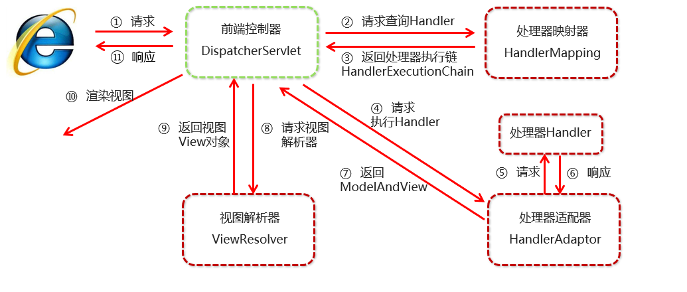

[TOC]

# SSM

## Spring 框架

### ioC 控制反转 

控制bean对象，反转了bean对象的创建者（降低耦合性）

#### 使用配置文件

##### 1.导入jar包spring-context包

##### 2.创建核心对象 （实现了ApplicationContext接口）

    1.ClassPathXmlApplicationContext（配置文件名）；    --类路径下的Xml文件用于控制应用
        读取类路径下的配置文件
    2.FileSystemXmlApplicationContext(绝对路径)
        读取任意位置的配置文件  （一般不用）
    3.AnnotationConfigApplicationContext 
        读取注解方式的配置文件

##### 3.在容器中创建bean

    1.直接构造函数创建
    <bean class="" id=""></bean> 没有id默认使用class当id 相同class可以在getbean（）中使用class+#n的方式获取（n从0开始）
    name和id一样只是不严格，支持一些特殊字符等，通常不用name --name="a b c" 可以用a/b/c取getBean(a)/getBean(b)/getBean(c)

```xml
<bean class="a.b.c"></bean> --0
<bean class="a.b.c"/> --1
```

```java
getBean("a.b.c#1")
```

    2.工厂的静态方法创建
    <bean class="" id="" factory-method="工厂的静态方法名">
    
    3.工厂的实例方法创建（要先有工厂的对象）
    <bean class="" id="" factory-bean="工厂对象的id" factory-method="工厂实例方法名">

**创建顺序没有影响**

    4.scope属性（bean标签的属性，下同）
`<bean class="a.b.c" scope="值"></bean>`

        * 值为singleton 单例模式 在spring容器创建时创建，容器销毁时销毁 （默认）
    
        * 值为prototype 多例 在使用时创建，销毁由jvm管理，不由spring容器管理
        prototype-bean而言，在xml中配置destroy-method属性没有意义
    
        * request 在创建放在request域中 每次http请求创建，仅在该请求中有效
    
        * session 在创建放在session域中 同一次会话范围内有效，也就是说如果不关闭浏览器，不管刷新多少次，都会访问同一个bean。
    
        * global session 在创建放在global session域中（全局session） 如果你在web中使用global session作用域来标识bean，那么web会自动当成session类型来使用    最新版本（5.2.0.BUILD-SNAPSHOT）中global session早就被移除了
    
        * websocket
        websocket 的作用范围是 WebSocket ，即在整个 WebSocket 中有效。web项目有效
    
        * application
        application的作用域比session又要更广一些，session作用域是针对一个 Http Session，而application作用域，则是针对一个 ServletContext，一个容器有效
    
    5.init-methoud和destroy-methoud属性
    用于指定初始化方法和销毁方法

##### 4.依赖注入（给属性赋值）

    1.通过seter方法
        1.给引用类型赋值（除String）
        <property name="属性名" ref="对象的id"></property>
        2.给基本数据类型和String类型
        <property name="属性名" ref="对象的id"></property>
        3.通过p命名空间
        p:形参名-ref/空="实参" --属性添加到bean标签中
    
    2.通过构造方法
        <constructor-arg name="形参名" value/ref="实参"></constructor>
        3.通过c命名空间
        c:形参名-ref/空="实参" --属性添加到bean标签中

**spring框架中使用了构造方法和set同时设置一个属性，set会覆盖constructor**

    3.复杂类型注入

```xml
list --<list/><value/>
array --<array/><value/>
set --<set><value/></set>
map --<map/><entry key="" value=""/>
property --<props/><prop key=""/>值
```

结构相同的标签可以互换：map-property；list--array--set；property-map（Property可换为Map<String,String>）(- 左换右 --左右互换)

**嵌套注入（List<Map<a,b>>;Map<a,list<b>>...）正常嵌套就可**

```xml
<map>
<entry key="">
<map>
<entry key="" value=""/>
</map>
</entry>
</map>
```

##### 5.import标签

    加载其他子配置文件到主配置文件

```xml
<import resource="classes:文件名"/>
classes关键字 类路径 编译后的classes目录
```

##### 5.获得bean对象

    getBean("id")   根据id获取bean对象  id不可重复  需要强转
    getBean(Class)  根据Class获取bean对象   只能有一个Class的配置创建的对象 不需要强转

##### 6.引入外部资源

```xml
<context:property-placeholder location="classpath*:.properties"/>
加载类路径下的所有包中的properties文件
```
使用    `${}`   使用外部资源中的值
        `#{}`   使用spring容器中的值

#### 使用注解

##### 原始注解

###### 实例化bean

    1.@Component
    2.@Controller web层使用的语义化注解
    3.@Service  service层使用
    4.@Repository Dao层使用

###### 依赖注入

    1.@Autowired 先根据类型依赖注入，同一个类型的bean对象有多个再根据id注入，没有就报错
    2.@Qualifier 在@Autowired不能注入的时候，使用该注解根据id进行注入，在成员变量上使用必须配合@Autowired使用，在方法形参上使用可以单独使用
    3.@Resource 等于@Autowired+@Qualifier
    4.@Value 注入基本数据类型及其包装类和String（可以注入单列集合但永远长度为1）

###### 作用域

    @Scope 标注bean的作用范围 

###### 初始化方法和销毁方法

    @PostConstruct  初始化
    @PreDestroy     销毁

##### 使用注解要扫描包，把包中的注解找到

加载spring配置文件的时候只扫描@service和@Reposity这些类，就使用exclude，相当于黑名单：

```xml
<context:componentscan base-package="com.hy.shiro.services">
<context:exclude-filter type="annotation" expression="org.springframework.stereotype.Controller"/>
<context:componentscan>
```

加载springmvc的配置文件的时候，就使用include，相当于白名单：
```xml
<context:componentscan base-package="com.hy.shiro.services" user-default-filters="falser">
<context:include-filter type="annotation" expression="org.springframework.stereotype.Controller"/>
<context:componentscan>
```

注意use-default-filters="false"这个属性：默认为true，会扫描到@Service与@Reposity等，所以配置成false，只扫描白名单中的bean注解。

最好的解释就是： context:exclude-filter是设置黑名单。比如手机黑名单，在黑名单中的人是无法打进电话的。context:include-filter是设置白名单。在手机白名单中的号码可以打进来，不在白名单也不在黑名单中的也可以打进来。所以需要针对白名单过滤进行设置，把默认的过滤器关闭，即use-default-filters="false";。然后他就仅仅扫描指定注解了。

###### 配置文件中

```xml
<context:component-scan base-package="路径"/> 多个路径用逗号隔开
```
##### 新注解

###### 配置类（基本不写）

    @Configuration  指定当前类时配置类，创建容器时会从该类上加载注解
    创建spring核心对象传参和被主配置类引用可以不写

###### 扫描包

    @ConponentScan 指定在初始化容器时要扫描的包

###### 引入别人写bean对象

    写在方法上，返回值存入spring容器 属性name代表bean的id，不写默认方法名
    需要的属性通过参数传递，先去spring中根据类型找，然后根据形参名找，否则要用@Qualifier根据id找（和@Autowired一样），还找不到就报错

###### 加载.properties文件中的配置

    @PropertySource

###### 导入子配置类

    @Import

##### spring整合junit

    1.导入spring-text包和junit包
    2.使用spring的运行器
    3.加载spring配置（配置类ckasses（配置类的字节码文件）/配置文件;locations="classpath（类路径中）:路径"）
    4.使用依赖注入注入核心对像，@Test使用
    
    spring版本为5.x那么junit版本就要为4.12以上

```java
@RunWith（SpringJUnit4ClssRunner.class）使用spring的运行器（运行器:有 main 方法，可以执行方法）
@ContextConfiguration(classes=类名.Class)
public class A{
    @Autowired
    private IAccountService as;
    @Test
    public void fun(){
    ...
    }
}
```

## AOP

### AOP的相关概念

    * Target 目标类 --被增强的类
    * Proxy 代理类 --在spring中通过动态代理技术实现，运行时生成代理对象
    * Advice 通知类/增强类 --怎么增强目标类
    * Joinpoint 连接点 --可以被增强的地方，spring中最小的连接点是方法
    * Poincut 切入点 --实际被增强的地方
    * Aspect 切面 --切入点+通知类
    * Weaving 织入 --对目标类中的切入点增强的过程

### 怎么用AOP

    1.导包spring-context和aspectJweaver包
    2.写配置文件

```xml
<aop:config>
<aop:pointcut id="" expression="execution(切点表达式)"/>
<aop:aspect id="" ref="增强的方法">
<aop:增强方式 metthod="被增强的方法" pointcut/pointcut-ref="切点表达式">(使用pointcut就不用写<aop:pointcut>)
</aop:aspect>
</aop:config>
```

#### 通知的类型

    spring原生AOP：前置 后置 环绕 异常 引介
    AspectJ的AOP：前置 后置 环绕 异常 引介 最终 --更好，spring就集合了它，并推荐使用

**<aop:aspectj-autoproxy proxy-target-class="true">**
**默认有实现接口就使用JDK的动态代理（基于接口的自动代理技术）否则使用CGLIB动态代理（基于继承的）**
**设置为true就只是使用CGLIB动态代理**

    * 前置通知 <aop:before> 在增强的方法执行之前执行 
    * 后置通知 <aop:after-returning> 在增强的方法执行之后执行 可以获取返回值
    * 环绕通知 <aop:around> 在增强的方法执行之前和之后执行 可以获取返回值
    * 异常抛出通知 <aop:throwing> 在增强的方法执行出异常式执行 可以获取异常信息 和后置只能同时执行一个 
    * 最终通知 <aop:after> 在增强的方法执行之后执行，必定会执行无论是否出异常 可以获取返回值
    
    获取返回值和获取异常信在通知方法中写形参但要和配置文件中的参数名一样

#### 切点表达式的写法

    excution([修饰符] 返回值类型 包名.类名.方法名(参数))
    
    * 修饰符可以不写
    * 返回值类型 包名.类名.方法名 可以用通配符 * 代表任意
    * 包名 类名 之间可以用 .. 代表包下的子包中的类也算
    * 参数可以用 .. 代表任意


#### 注解使用AOP

* @Aspect 通知类 写了就要开启AOP的自动代理`<aop:aspectj-autoproxy/>`或者@EnabkeAsoectJAutoProxy注解

* @Pointcut(切点表达式)+空实现方法

```java
@Pointcut(切点表达式)
public void 方法名(){}
```

* @Before(切点表达式/切点方法式注解的方法名) 前置增强
* @AfterThrowing(切点表达式/切点方法式注解的方法名) 异常增强
* @AfterReturing(切点表达式/切点方法式注解的方法名) 后置增强
* @After(切点表达式/切点方法式注解的方法名) 最终增强
* @Around(切点表达式/切点方法式注解的方法名) 环绕增强

使用注解增强的后置增强和最终增强会有执行顺序错误，所有只使用环绕增强来代替其他增强


## 怎么写程序

1.先想最简单的实现方式
2.在写这种实现方式有没有逻辑BUG
3.在想有没有更好的实现/更高级的技术/更高级的思想
4.再站在整个项目/整个模块的角度去想 当前这个功能是不是可以复用
5.写代码


## 事务

在一个业务方法中如果多次操作了持久层，而且都是非读操作，那么我们要保证这些操作必须同步，要么同时成功要么同时失败
只要有一个操作失败整个业务就失败了。


编程时事务管理
    通过在业务层中添加事务管理代码的方法管理事务，耦合性高
声明式事务管理
    通过配置文件，使用AOP思想，对业务层方法动态的添加事务管理

### 事务的隔离级别

| 脏读            | 不可重复读 | 幻读/虚读 | Y会发生，N不会发生 |                                      |
|-----------------|------------|-----------|--------------------|--------------------------------------|
| read uncommited | Y          | Y         | Y                  | 读不可提交                           |
| read commited   | N          | Y         | Y                  | Oracle数据库的默认隔离级别，读可提交 |
| repeatable      | N          | N         | Y                  | Mysql数据库的默认隔离级别，可重复读  |
| serializable    | N          | N         | N                  | 序列化,效率低                        |

### spring提供的管理事务的对象

#### PlatformTransactionManager 平台事务管理

是一个接口，不同的Dao层实现有不同的实现类，Mybatis和jdbc使用DataSourceTransactionManager实现类

#### TransactionDefinition  事务定义

用来配置事务的属性:

* REQUIRED：如果当前没有事务，就新建一个事务，如果已经存在一个事务中，加入到这个事务中。一般的选择（默认值）
* SUPPORTS：支持当前事务，如果当前没有事务，就以非事务方式执行（没有事务）
* MANDATORY：使用当前的事务，如果当前没有事务，就抛出异常
* REQUERS_NEW：新建事务，如果当前在事务中，把当前事务挂起。
* NOT_SUPPORTED：以非事务方式执行操作，如果当前存在事务，就把当前事务挂起
* NEVER：以非事务方式运行，如果当前存在事务，抛出异常
* NESTED：如果当前存在事务，则在嵌套事务内执行。如果当前没有事务，则执行 REQUIRED 类似的操作
* 超时时间：默认值是-1，没有超时限制。如果有，以秒为单位进行设置
* 是否只读：建议查询时设置为只读

### 使用xml配置事务

```xml
<!--平台事务管理器-->
<bean id="transactionManager" class="org.springframework.jdbc.datasource.DataSourceTransactionManager">
<property name="dataSource" ref="dataSource"></property>（依赖注入Datasource）
</bean>

<!--事务属性配置-->
<tx:advice id="txAdvice" transaction-manager="transactionManager">（平台事务管理器）
<tx:attributes>
<tx:method name="*"/>
<tx:method name="find*"/>（可以使用通配符）(需要管理的方法名，切点名)
<tx:method name="transfer" isolation="REPEATABLE_READ" propagation="REQUIRED" timeout="-1" read-only="false"/>
</tx:attributes>
</tx:advice>

<!--配置事务 AOP 织入-->
<aop:config>
<aop:pointcut id="myPointcut" expression="execution(* com.itheima.service.impl.*.*(..))"/>
<aop:advisor advice-ref="txAdvice" pointcut-ref="myPointcut"></aop:advisor>（spring提供的增强类和是实现了spring的的增强接口的类使用advisor，否则使用aspect）
                    配置过属性的事务              切点表达式
</aop:config>

```

### 使用注解进行事务管理

1. **事务管理器**放入spring容器（注解和xml两种方式）
2. 在业务类或业务方法上添加注解@Transactional（属性）属性可以不写有默认的 类和方法都有以方法为准
3. 开启对注解事务的支持
```xml
<tx:annotation-driven transaction-manager="事务管理器的id">
或者@EnableTransactionManagement注解在注解配置类中开启
```

## spring MVC 框架

### spring整合web工程

spring整合web工程就是在web工程中获得spring的容器

使用监听器然后把spring容器放进sessionContext中就可以保证一个web工程只有一个spring容器，并且可以监听sessionContext的创建然后就可以在，创建时就获取容器，这样就会让用户的体验更好（不用再第一次访问时创建，不会影响第一个用户的体验）

#### web.xml配置

```xml
创建spring容器要读取的配置文件
<context-param>
        <param-name>contextConfigLocation</param-name>
        <param-value>classpath:applicationcontext.xml</param-value>
    </context-param>
创建springmvc核心监听器，在监听器中创建spring容器
    <listener>
        <listener-class>org.springframework.web.context.ContextLoaderListener</listener-class>
    </listener>
```

### springMVC的作用

包装web（servlet）层，包装了接受请求（接受参数，封装数据），作出响应（调用service 返回结果转成Json字符串）
业务独特的servlet就由我们自己实现，然后放入springMVC容器使用@RequestMapping（访问路径） (请求映射) 注解标识式

##### springMMVC容器是spring容器的子类，可以取spring容器中的bean

#### 配置springMVC的前端控制器（相同部分的servlet）

```xml
配置servlet，传spring_mvc的配置文件，配置文件包含组件扫描
<servlet>
        <servlet-name>dispatcherServlet</servlet-name>
        <servlet-class>org.springframework.web.servlet.DispatcherServlet</servlet-class>
        <init-param>
            <param-name>contextConfigLocation</param-name>
            <param-value>classpath:spring_mvc.xml</param-value>
        </init-param>
    </servlet>
设置访问路径
    <servlet-mapping>
        <servlet-name>dispatcherServlet</servlet-name>
        <url-pattern>/</url-pattern>
    </servlet-mapping>
```
##### 访问路径

* /  --拦截所有路径 不包括jsp资源，包括html
* /* --拦截所有路径 包括任何资源
* *.do --拦截以.do结尾的任何资源

#### @RequestMapping

可以放在类和方法上，放在类上访问类中方法时不光要加方法的访问路径还要加类的访问路径

```java
@RequestMapping("/logon")
    public String logon(User user) {
        Integer flag = userService.logon(user);
        if (flag > 0) {
            return "success";
        }
        return "failure"; 返回值默认是转发，使用redirect是重定向 (return 页面跳转的方式:资源路径;)
                            配置了视图解析器，然后再显式使用redirect和forward就要把路径写全，因为使用关键字以后视图解析器就不走了
    }
```

#### 视图解析器

在springMVC中配置
```xml
<bean class="org.springframework.web.servlet.view.InternalResourceViewResolver" id="viewResolver">
    <property name="prefix" value="/jsp/"></property> 前缀
    <property name="suffix" value=".jsp"></property> 后缀
</bean>
```

### springMVC执行流程

* 用户发送请求至前端控制器DispatcherServlet。
* DispatcherServlet收到请求调用HandlerMapping处理器映射器。
* 处理器映射器找到具体的处理器(可以根据xml配置、注解进行查找)，生成处理器对象及处理器拦截器(如果有则生成)一并返回给DispatcherServlet。
* DispatcherServlet调用HandlerAdapter处理器适配器。
* HandlerAdapter经过适配调用具体的处理器(Controller，也叫后端控制器)。
* Controller执行完成返回ModelAndView。
* HandlerAdapter将controller执行结果ModelAndView返回给DispatcherServlet。
* DispatcherServlet将ModelAndView传给ViewReslover视图解析器。
* ViewReslover解析后返回具体View。
* DispatcherServlet根据View进行渲染视图（即将模型数据填充至视图中）。DispatcherServlet响应用户



### 请求和响应

#### 响应response

响应数据
    * 直接响应字符串
    * 页面跳转（转发，重定向）

1. contrller直接返回字符串
    此种方式会把返回的字符串和视图解析器的前后缀拼接后访问资源（显式写了forword或redirect不会走视图解析器）

2. 返回ModelAndView对象 模板和视图对象
    可以自己new出来，也可以放在参数列表中让spring MVC帮我们注入
    model对象 包装数据 --和request一样（它其实就是把数据存在request域中，所以只可以转发不能重定向）
    view 对象 返回的资源路径

```java
    addObject("键名",数据);
    setViewName(和直接返回字符串一样);
```

3. 响应字符串（异步请求中返回Json字符串）

配置处理器映射器(基本不用)

```xml
<bean class="org.springframeword.web.servlet.mvc.method.annotation.RequestMappingHandlerAdapter">
<property name="messageConverters">
<list>
<bean class="org.srpingframeword=k.http.converter.json.MappingJackson2HttpMessageConverter"/>
</list>
</property>
</bean>
```

**方法上加@ResponseBody，然后在配置文件中写`<mvc:annotation-driven/>（万能模式，上帝模式）(加载很多类，从而开启spring MVC的很多方法)`**

#### 请求request

获取请求参数
获取客户端信息
域对象
转发

1. 获取基本数据类型和string的数据
只要形参名和页面的表单要提交的数据的name相同就可以，直接让spring MVC注入
不同要加@RuqusetParam
    * value ：参数名字，即入参的请求参数名字，如username表示请求的参数区中的名字为username的参数的值将传入；

    * required：是否必须，默认是true，表示请求中一定要有相应的参数，否则将报404错误码；

    * defaultValue：默认值，表示如果请求中没有同名参数时的默认值，默认值可以是SpEL表达式。

    required=false表示请求中可以没有名字为value的值的参数，如果没有默认为null，此处需要注意如下几点：

        原子类型：必须有值，否则抛出异常，如果允许空值请使用包装类代替。
    
        Boolean包装类型类型：默认Boolean.FALSE，其他引用类型默认为null。

2. 获取pojo对象
    PoJo ： plain ordinary java object 无规则简单java对象，普通的Java类 没有继承 没有实现 可以有属性和方法
    JavaBean ： [ 实现序列化接口 ] 必须哟无参构造 所有属性私有，有公有的setter和getter方法，类必须是具体的和公共的
    PO ：persistent object 持久对象，一个PO对应数据库中的一条记录
    BO：business object 业务对象
    VO：value object 值对象 / view object 表现层对象
    DTO（TO）：Data Transfer Object 数据传输对象
    DAO：data access object数据访问对象
    只要PoJo对象的属性和页面的表单要提交的数据的name相同就可以，直接让spring MVC注入

3.获取数组
只要数组名和页面的表单要提交的数据的name相同就可以，直接让spring MVC注入

3.获取ist集合

    3.1直接获取list
    在前端页面的name写成
    name="list[0].age"(集合名[下标].属性名)
    后台写一个Vo类包装一下集合


    3.2转化成json对象的字符串
    前台设置发送json字符串对象
```JQuery
$.ajaxSetting.contextType = "application/json;chatset=utf-8";
或者设置
$.ajax{}中的contextType属性
```
    后台在形参前加@RequestBody或@RequestParam 用来将Json封装成Java对象

4.获取map，set

    转化成json对象的字符串
        前台设置发送json字符串对象
    ```JQuery
    $.ajaxSetting.contextType = "application/json;chatset=utf-8";
    或者设置
    $.ajax{}中的contextType属性
    ```
        后台在形参前加@RequestBody或@RequestParam（还有至少两种了解不深@PequestPart、@ModelAttribute，省略） 用来将Json封装成Java对象

#### @RequestBody或@RequestParam区别

    @RequestBody
    处理HttpEntity传递过来的数据，一般用来处理非Content-Type: application/x-www-form-urlencoded编码格式的数据。
    
    GET请求中，因为没有HttpEntity，所以@RequestBody并不适用。
    POST请求中，通过HttpEntity传递的参数，必须要在请求头中声明数据的类型Content-Type，SpringMVC通过使用HandlerAdapter 配置的HttpMessageConverters来解析HttpEntity中的数据，然后绑定到相应的bean上。
    
    @RequestParam
    用来处理Content-Type: 为 application/x-www-form-urlencoded编码的内容。提交方式为get或post。（Http协议中，如果不指定Content-Type，则默认传递的参数就是application/x-www-form-urlencoded类型）
    
    RequestParam实质是将Request.getParameter() 中的Key-Value参数Map利用Spring的转化机制ConversionService配置，转化成参数接收对象或字段。
    
    get方式中query String的值，和post方式中body data的值都会被Servlet接受到并转化到Request.getParameter()参数集中，所以@RequestParam可以获取的到。
    
    1. application/x-www-form-urlencoded，这种情况的数据@RequestParam、@ModelAttribute可以处理，@RequestBody也可以处理。
    2. multipart/form-data，@RequestBody不能处理这种格式的数据。（form表单里面有文件上传时，必须要指定enctype属性值为multipart/form-data，意思是以二进制流的形式传输文件。）
    3. application/json、application/xml等格式的数据，必须使用@RequestBody来处理。


### 开放静态资源

1.配置springMVC.xml

```xml
<mvc:resources mapping="/js/**" location="/js/">(放行 mapping 映射路径中的js及其子包下的所有，location 真实路径中的js下的)
或者
<mvc:default-servlet-handler/> 要配合<mvc:annotation-driven>(万能模式) 找不到就交给tomcat的Servlet去处理
```
实际开发中一般是修改前端控制器的访问路径改成*.do
@RequestMapping()中的路径默认是.*结尾

### 中文乱码解决

1.输入
```xml
web.xml中配置全局过滤的filter
<filter>
    <filter-name>CharacterEncodingFilter</filter-name>
    <filter-class>org.springframework.web.filter.CharacterEncodingFilter</filter-class>
    <init-param>
        <param-name>encoding</param-name>
        <param-value>UTF-8</param-value>
    </init-param>
    <init-param>
        <param-name>forceEncoding</param-name>
        <param-value>true</param-value>（强制使用过滤器，自己再写的编码格式就不行了）
    </init-param>
</filter>
<filter-mapping>
    <filter-name>CharacterEncodingFilter</filter-name>
    <url-pattern>/*</url-pattern>
</filter-mapping>
```

2.输出

@RequestMapping()的属性produces = ({"text/html;chartset=utf-8","application/json;charset=utf-8"})是数组，可以同时多种形式，只能是一个方法
**实际中一般使用，所有输出**

```xml
万能模式
<mvc:annotation-driven>
    <mvc:message-converters>
        <bean class="org.springframework.http.converter.StringHttpMessageConverter">
            <constructor-arg name="defaultCharset" value="UTF-8"/>
        </bean>
    </mvc:message-converters>
</mvc:annotation-driven>
```

### RestFul风格 

其实是一种访问后台方法的格式

```java
// localhost:8080/user/quick17/zhangsan/18 风格  命名规范
@RequestMapping(value="/quick17/{uname}/{age}") ({名字}占位符)
@ResponseBody
public void save17(@PathVariable(value="uname") String username) throws IOException { （和占位符中的名字要相同）
    System.out.println(username);
}
```

### 特殊格式转换

springMVC本身可以转换yyyy/MM/dd格式的时间，不能转换yyyy-MM-dd格式

在要转换的类中的成员变量上使用
@DataTimeFormat(pattern = "yyyy-MM-dd")


### 数据列权限控制（显示的数据过滤）

```java
写在@Controller中
//使用json的转换工具将对象转换成json格式字符串在返回
ObjectMapper objectMapper = new ObjectMapper();
// 设置日期格式
objectMapper.setDateFormat(new SimpleDateFormat("yyyy-MM-dd"));
// 怎么去排除一些属性
FilterProvider fp = new SimpleFilterProvider().addFilter("user",
// SimpleBeanPropertyFilter.filterOutAllExcept("username","password")); (包含)
    SimpleBeanPropertyFilter.serializeAllExcept("username","password")); （过滤）
objectMapper.setFilterProvider(fp);
```

```java
在JavaBean上写
@JsonIgnoreProperties({"password"}) （不显示密码）
```

### SpringMVC中获取JavaWEB中的原生API

```java
写在@Controller中

获取cookie
@RequestMapping(value="/quick21")
@ResponseBody
public void save21(@CookieValue(value = "JSESSIONID") String jsessionId,HttpServletRequest request) throws IOException {
    //Cookie[] cookies = request.getCookies();
    // ${cookie.last_visit.value}
    System.out.println(jsessionId);
}

获取请求头
@RequestMapping(value="/quick20")
@ResponseBody
public void save20(@RequestHeader(value = "User-Agent",required = false) String user_agent) throws IOException {
    System.out.println(user_agent);
}

获取request，response，session
@RequestMapping(value="/quick19")
@ResponseBody
public void save19(HttpServletRequest request, HttpServletResponse response, HttpSession session) throws IOException {
    System.out.println(request);
    System.out.println(response);
    System.out.println(session);
}
```

### 文件上传

文件上传的技术：Servlet3.0(有对应的API，之前要自己实现) Fileupload spring框架（使用的就是整合了Fileupload）等等

文件上传的三要素：
    * 表单中有文件项：`<input type="file">`
    * 表单的提交方式必须是post （get请求是把请求参数拼在URI上，每个浏览器支持的URL长度不同，超越长度后的处理也不同）
    * 表单的enctype属性必须是 `enctype="multipart/form-data"` （提交的格式，分段式（理解：流式）通过分隔符分隔（----------随机码（分隔符）/-----随机码--（结束符）），两个分隔符（分隔符和结束符）之间就是一个数据（input））

```html
------------7de1a433602ac(分隔符)
...
数据
------------7de1a433602ac
...
数据
------------7de1a433602ac--（结束符）
```

1. 添加依赖

```xml
<dependency>
      <groupId>commons-fileupload</groupId>
      <artifactId>commons-fileupload</artifactId>
      <version>1.3.1</version>
    </dependency>
    <dependency>
      <groupId>commons-io</groupId>
      <artifactId>commons-io</artifactId>
      <version>2.3</version>
    </dependency>
```

2. 配置多媒体解析器

```xml
<!--配置文件上传解析器-->
    <bean id="multipartResolver" class="org.springframework.web.multipart.commons.CommonsMultipartResolver"> （id是固定值，不能改不然springMVC框架识别不了）
        <property name="defaultEncoding" value="UYF-8"/> （默认编码）
        <property name="maxUploadSize" value="500000"/> （最大上传大小，单位字节）
    </bean>
```

3. 后台接收

后台使用自动注入MultipartFile对象，对象名（形参名）必须和前台input标签的name属性的值（tpye为file的）一样，多参用数组接收

* MultipartFile对象的方法
getOriginalFilename()  --获取文件名称
getNane()  --获取前台input标签的name属性的值
getSize()  --获取文件大小
getContextType()  --获取文件类型
transferTo(File f)  --* 输出文件到指定位置 根据文件
...

### 拦截器

Spring MVC 的拦截器类似于 Servlet 开发中的过滤器 Filter，用于对处理器进行预处理（请求到达请求的资源之前）和后处理（请求到达请求的资源之后返回前端之前）。但过滤器和拦截器完全不同

将拦截器按一定的顺序联结成一条链，这条链称为拦截器链（InterceptorChain）。在访问被拦截的方法或字段时，拦截器链中的拦截器就会按其之前定义的顺序被调用。拦截器也是AOP思想的具体实现。

先写拦截器（通知类）
配置拦截的Controller中的方法（目标类）

先写一个类 实现HandlerInterceptor接口 重写里面的方法

```java
public class MyInterceptor1 implements HandlerInterceptor {
    //在目标方法执行之前执行 处理请求
    public boolean preHandle(HttpServletRequest request, HttpServletResponse response, Object handler) throws ServletException, IOException {
        return false;  --返回值false是不放行，返回值true就是放行。
    }
        
    //在目标方法执行之后 视图对象返回之前执行 处理响应
    public void postHandle(HttpServletRequest request, HttpServletResponse response, Object handler, ModelAndView modelAndView) {

    }
    //在流程都执行完毕后执行 视图执行后执行（不常用）
    public void afterCompletion(HttpServletRequest request, HttpServletResponse response, Object handler, Exception ex) {
       
    }
}
```

配置：在SpringMVC的配置文件中配置

```xml
<!--配置拦截器-->
    <mvc:interceptors>
        <mvc:interceptor>
            <!--对哪些资源执行拦截操作-->
            <mvc:mapping path="/**"/> （根目录下以及其子包下的所有经过前端控制器的方法。）
            <bean class="com.itheima.interceptor.MyInterceptor1"/> （拦截器的全路径）
        </mvc:interceptor>
    </mvc:interceptors>

所有经过前端控制器的springMVC都会把它当成一个Controller中的方法，就算是你请求的是一个静态资源也是这样，而不是一个静态资源。
所以实际开发中一般把前端控制器的路径写成*.do（还可放行静态资源）
```

#### 多个过滤器的执行顺序

跟配置文件中书写的顺序有关

有两个过滤器的情况（先配置1号，再配置2号）
**会先执行1过滤器的前置方法->2过滤器的前置方法->目标资源->2后置方法->1后置方法->2最终->1最终**

### 异常的处理

系统中异常包括两类：预期异常和运行时异常RuntimeException，前者通过捕获异常从而获取异常信息，后者主要通过规范代码开发、测试等手段减少运行时异常的发生。

#### 异常处理两种方式

① 使用Spring MVC提供的简单异常处理器SimpleMappingExceptionResolver

② 实现Spring的异常处理接口HandlerExceptionResolver 自定义自己的异常处理器

1. SpringMVC已经定义好了该类型转换器，在使用时可以根据项目情况进行相应异常与视图的映射配置

```xml
<!--配置简单映射异常处理器-->
    <bean class=“org.springframework.web.servlet.handler.SimpleMappingExceptionResolver”>    
    <property name=“defaultErrorView” value=“error”/>   默认错误视图
    <property name=“exceptionMappings”>
        <map>		异常类型		                             错误视图
            <entry key="com.itheima.exception.MyException" value="error"/>
            <entry key="java.lang.ClassCastException" value="error"/>
        </map>
    </property>
</bean>
```

2. 自定义异常
* 配置文件书写

```java
①创建异常处理器类实现HandlerExceptionResolver
public class MyExceptionResolver implements HandlerExceptionResolver {
@Override
public ModelAndView resolveException(HttpServletRequest request, 
    HttpServletResponse response, Object handler, Exception ex) {
    //处理异常的代码实现
    //创建ModelAndView对象
    ModelAndView modelAndView = new ModelAndView(); 
    modelAndView.setViewName("exceptionPage");
    return modelAndView;
    }
}
```

```xml
②配置异常处理器放进容器
<bean id="exceptionResolver" class="com.itheima.exception.MyExceptionResolver"/>
```

* 注解书写(常用)
```java
@ControllerAdvice （告诉springMVC异常处理类）
public class MyException{
    @ExceptionHandler(Exception.class) (要处理什么类型的异常，写的大一点可以少写方法)
    public ModelAndView aaa(){ （返回值可以是String和ModelAndView）
        ...
        return m;
    }
}
```

## Mybatis 框架

Mybatis是一个持久层框架，好处是只用关注SQL语句即可。

**不管使用什么持久层框架都要就有的东西：**
连接数据库的4个基本参数（数据库驱动，连接哪个数据库，哪个用户和密码）
执行的sql语句
封装的结果集对象

1. 导包（写坐标）

```xml
(pom.xml)
<dependency>
    <groupId>org.mybatis</groupId>
    <artifactId>mybatis</artifactId>
    <version>3.4.5</version>
</dependency>

<dependency>
    <groupId>log4j</groupId>
    <artifactId>log4j</artifactId>
    <version>1.2.12</version>
</dependency>
```
2. 写核心配置文件

```xml
<?xml version="1.0" encoding="UTF-8" ?>
<!DOCTYPE configuration PUBLIC "-//mybatis.org//DTD Config 3.0//EN" "http://mybatis.org/dtd/mybatis-3-config.dtd"> (约束)
<configuration>

    <properties resource="jdbc.properties"></properties>（加载外部配置文件，使用${}取值，相对于classpath路径开始）
    <typeAliases >
        <!--<typeAlias type="it.heima.domin.User" alias="user"/>-->(手动起别名)
        <package name="it.heima.domin"></package> （自动扫描包起别名（和类名相同））（别名不区分大小写）
        <package name="it.heima.Dao"/>
    </typeAliases>
<environments default="aaa"> （default 默认数据库环境）
    <environment id="aaa"> （数据库环境）
        <transactionManager type="JDBC"></transactionManager> （事务管理使用JDBC的）
        <dataSource type="POOLED"> （pool 连接池）
            <property name="driver" value="${jdbc.driver}"/> （4个连接参数）
            <property name="url" value="${jdbc.url}"/>
            <property name="username" value="${jdbc.username}"/>
            <property name="password" value="${jdbc.password}"/>
        </dataSource>
    </environment>
</environments>
    <mappers >
        <mapper resource="com/itheima/user.xml"></mapper> （加载映射配置文件） （在resources 中要一次创建多级目录，使用 / 不能用 . ） ( resource 要使用 / 区分目录，从 classpath 开始)
        <!-- <mapper class="it.heima.Aaa"></mapper> --> （加载注解类 ，使用 . 区分包）
    </mappers>
</configuration>

```
```xml
<?xml version="1.0" encoding="UTF-8" ?>
<!DOCTYPE mapper PUBLIC "-//mybatis.org//DTD Mapper 3.0//EN" "http://mybatis.org/dtd/mybatis-3-mapper.dtd"> （约束）

<mapper namespace="it.heima.Dao.UserDao"> （和接口的类路径名相同，没有接口可以随便写（使用普通方式使用））
    <select id="findById" resultType="it.heima.domin.User" parameterType="int"> （查询）（基本数据类型和String可以直接写，默认有别名（这个是自带的别名））
        select * from user where id=#{id} （#{名字} 占位符 名字和参数中的属性一致）（只有一个参数且是基本数据类型及其包装类和String 名字可以随便写）
    </select>
    <select id="findAll" resultType="UsEr" > （结果集的对象是什么类的（使用了别名））（id 和接口中的方法名对应）
        select * from user
    </select>
    <insert id="insert" parameterType="it.heima.domin.User"> （参数类型）
        insert into user values (#{id},#{name},#{password})
    </insert>
    <delete id="delete" parameterType="java.lang.Integer">
        delete from user where id=#{id}
    </delete>
    <update id="update" parameterType="it.heima.domin.User">
        update user set name=#{name} ,password=#{password} where id=#{id}
    </update>
</mapper>
```
```java
@Test
    public void fun4() {
        InputStream resourceAsStream = Aa.class.getClassLoader().getResourceAsStream("mybatis.xml"); （读取主配置文件）
        SqlSession sqlSession = new SqlSessionFactoryBuilder().build(resourceAsStream).openSession(); （用sqlsession工厂构建器获取sqlsession工厂对象，再通过sqlsession工厂获取sqlsession对象）（默认不自动提交事务）
//        User users = sqlSession.selectOne("userMapper.findById",10); （查询没有的数据不会报错，而是返回null）
        User users = sqlSession.selectOne("it.heima.Dao.UserDao.findById",5);（使用哪个方法，参数）（普通使用方式）
        // sqlSession.commit();  （增删改 要手动提交事务）
        System.out.println(users);
        System.out.println("-----------------------------");
        sqlSession.close(); （关流）
    }

    @Test
    public void fun5() {
        InputStream resourceAsStream = Aa.class.getClassLoader().getResourceAsStream("mybatis.xml");
        SqlSession sqlSession = new SqlSessionFactoryBuilder().build(resourceAsStream).openSession(true);（true 是自动提交事务）
        UserDao mapper = sqlSession.getMapper(UserDao.class); （接口使用方式，使用动态代理生成接口的对象）
        User byId = mapper.findById(5); （调用代理对象的方法）
        System.out.println(byId);
        System.out.println("-----------------------------");
        sqlSession.close();
    }
```
### 使用到的设计模式

|设计模式|作用|描述|
|:-:|:-:|:-:|
| 构建者模式 |创建对象|把多个小对象合成一个大对象返回给你|
|工厂模式|创建对象|创建一个对象的过程如果很复杂就会使用其简化创建过程|
|代理模式（jdk动态代理）|增强对象|动态生成一个接口的实现类|

### 为什么要保持配置文件中namespace属性要和接口的全限定类名一样？

Mapper 接口开发方法只需要程序员编写Mapper 接口（相当于Dao 接口），由Mybatis 框架根据接口定义创建接口的动态代理对象，代理对象的方法体同上边Dao接口实现类方法。

Mapper 接口开发需要遵循以下规范：

**1) Mapper.xml文件中的namespace与mapper接口的全限定名相同**

**2) Mapper接口方法名和Mapper.xml中定义的每个statement的id相同**

**3) Mapper接口方法的输入参数类型和mapper.xml中定义的每个sql的parameterType的类型相同**

**4) Mapper接口方法的输出参数类型和mapper.xml中定义的每个sql的resultType的类型相同**

在加载核心配置文件时，会解析配置文件，解析到一个Map集合中，key是namespace+id Value是Mapper对象（sql语句，结果集）
，在调用代理对象的方法是就会通过反射去找调用方法的名称和当前类的全限定类名，然后去查Map。

### 一些标签

* selectKey (在sql语句前后加入语句)
```xml
<insert id = "saveUser" parameterType="user">
    <selectKey (插入新数据的主键) keyProperty = "id" （实体类中的主键的属性名称）keyColumn="id" （表中的主键的字段名称） resultType ="int" （主键的数据类型） order= "AFTER" （获取主键的函数是在插入语句之前或之后执行）>
    select LAST_INSERT_ID() （返回插入数据的id）
    </selectKey>
    insert into mybatis values (#{id},#{username},#{password})
```

* resultMap （改变实体类的属性名）

```xml
<resultMap id ="xxoo" type="user2"> （id唯一，type 实体类 说明要描述谁）
    <id property="uid" column="id"> (映射实体类和表中字段的队形关系) （property 属性 ：实体中） （column 属性 ：表中的字段名）（描述主键关系）
    <result > (描述非主键的对应关系)
</resultMap>
```

* where + if（条件判断）

```xml
<select id="findByCondition" parameterType="user" resultType="user">
    select * from User
    <where>
        <if test="id!=0"> (test=表达式 如果是实体类的属性，直接写不要加#{}或${},区分大小写)
            and id=#{id} （会自动处理and，会删除第一个and，如果 都不满足 where 条件就不会出现）
        </if>
        <if test="username!=null">
            and username=#{username}
        </if>
    </where>
</select>
```

* where + foreach (循环执行sql的拼接操作)

循环执行sql的拼接操作，例如：SELECT * FROM USER WHERE id IN (1,2,5)。

 ```xml
<select id="findByIds" parameterType="list" resultType="user">
    select * from User
    <where>
        <foreach collection="array" （遍历类型） open="id in(" （开始） close=")" （结束） item="id" （变量名） separator="," （分隔符）>
            #{id} （取值）
        </foreach>
    </where>
</select>
 ```

* sql （抽取sql片段）

```xml
<!--抽取sql片段简化编写-->
<sql id="selectUser"> select * from User </sql>
<select id="findById" parameterType="int" resultType="user">
    <include refid="selectUser"></include> where id=#{id}
</select>
```
* set (添加)

```xml
<update id="" parameterType="">
update user(数据库)
<set> (可以自动去除最后一个语句的逗号)
    <if test="">
    username=#{username},
    </if>
</set>
where id = #{id}
```

### typeHandlers 标签 （核心配置中）

无论是 MyBatis 在预处理语句（PreparedStatement）中设置一个参数时，还是从结果集中取出一个值时， 都会用类型处理器将获取的值以合适的方式转换成 Java 类型。下表描述了一些默认的类型处理器（截取部分）。

 

你可以重写类型处理器或创建你自己的类型处理器来处理不支持的或非标准的类型。具体做法为：实现 org.apache.ibatis.type.TypeHandler 接口， 或继承一个很便利的类 org.apache.ibatis.type.BaseTypeHandler， 然后可以选择性地将它映射到一个JDBC类型。例如需求：一个Java中的Date数据类型，我想将之存到数据库的时候存成一个1970年至今的毫秒数，取出来时转换成java的Date，即java的Date与数据库的varchar毫秒值之间转换。

* 开发步骤：

①定义转换类继承类BaseTypeHandler<T>

②覆盖4个未实现的方法，其中setNonNullParameter为java程序设置数据到数据库的回调方法，getNullableResult为查询时 mysql的字符串类型转换成 java的Type类型的方法

③在MyBatis核心配置文件中进行注册

④测试转换是否正确

```java
public class MyDateTypeHandler extends BaseTypeHandler<Date> {
    public void setNonNullParameter(PreparedStatement preparedStatement, int i, Date date, JdbcType type) {
        preparedStatement.setString(i,date.getTime()+"");
    }（set方法，java传数据到数据库）


    （get方法，数据库传数据到java）（不管你用何种方式取数据都可以转换类型）
    public Date getNullableResult(ResultSet resultSet, String s) throws SQLException {
        return new Date(resultSet.getLong(s));
    }（通过列名取数据）
    public Date getNullableResult(ResultSet resultSet, int i) throws SQLException {
        return new Date(resultSet.getLong(i));
    }（通过id取数据）
    public Date getNullableResult(CallableStatement callableStatement, int i) throws SQLException {
        return callableStatement.getDate(i);
    }（通过sql中的参数位置）
}
```

```xml
<!--注册类型自定义转换器-->
<typeHandlers>
    <typeHandler handler="com.itheima.typeHandlers.MyDateTypeHandler"></typeHandler>
</typeHandlers>
```

### plugins标签

MyBatis可以使用第三方的插件来对功能进行扩展，分页助手PageHelper是将分页的复杂操作进行封装，使用简单的方式即可获得分页的相关数据

开发步骤：

①导入通用PageHelper的坐标

②在mybatis核心配置文件中配置PageHelper插件

③测试分页数据获取


#### ①导入通用PageHelper坐标

```xml
<!-- 分页助手 -->
<dependency>
    <groupId>com.github.pagehelper</groupId>
    <artifactId>pagehelper</artifactId>
    <version>3.7.5</version>
</dependency>
<dependency>
    <groupId>com.github.jsqlparser</groupId>
    <artifactId>jsqlparser</artifactId>
    <version>0.9.1</version>
</dependency>

```

#### ②在mybatis核心配置文件中配置PageHelper插件

```xml
<!-- 注意：分页助手的插件  配置在通用馆mapper之前 -->
<plugin interceptor="com.github.pagehelper.PageHelper">
    <!-- 指定方言 -->
    <property name="dialect" value="mysql"/>(mysql数据库)
</plugin>
```

#### ③测试分页代码实现

```java
@Test
public void testPageHelper(){
    //设置分页参数 写在查询前
    PageHelper.startPage(1,2);

    List<User> select = userMapper2.select(null);
    for(User user : select){
        System.out.println(user);
    }
}
```

**获得分页相关的其他参数**

```java
//其他分页的数据 必须写在查询后
PageInfo<User> pageInfo = new PageInfo<User>(select);
System.out.println("总条数："+pageInfo.getTotal());
System.out.println("总页数："+pageInfo.getPages());
System.out.println("当前页："+pageInfo.getPageNum());
System.out.println("每页显示长度："+pageInfo.getPageSize());
System.out.println("是否第一页："+pageInfo.isIsFirstPage());
System.out.println("是否最后一页："+pageInfo.isIsLastPage());

```

### MyBatis核心配置文件常用标签：

1. properties标签：该标签可以加载外部的properties文件

2. typeAliases标签：设置类型别名

3. environments标签：数据源环境配置标签

4. typeHandlers标签：配置自定义类型处理器

5. plugins标签：配置MyBatis的插件

### 表之间的关系

* 在数据库中 分三类
一对一 ： 唯一外键/主键相同     在java中添加一个对方类型的属性
一对多 ： 在多的一方添加对方的主键  在java中添加一个对方类型的集合的属性
/（多对一）相当于多个一对一
多对多 ： 建立中间表        多个一对多

* 在 Mybatis 中表之间分为两类
一对一
一对多

### 多表联查（配置文件）

可以配置一个集合返回值这个，Mybatis会自动帮你封装

* 一对一
```xml
<resultMap id="orderMap" type="com.itheima.domain.Order">

    <result property="id" column="id"></result>
    <result property="ordertime" column="ordertime"></result>
    <result property="total" column="total"></result>

    <association property="user" （属性名） javaType="com.itheima.domain.User" （要封装的类（属性的那个类）的全限定名） >（一对一，使用association（只是一个不是集合））
        <result column="uid" property="id"></result> （column 表中列名 property 类中属性名）
        <result column="username" property="username"></result>
        <result column="password" property="password"></result>
        <result column="birthday" property="birthday"></result>
    </association>
</resultMap>
```

* 一对多
```xml
<mapper namespace="com.itheima.mapper.UserMapper">

    <resultMap id="userMap" type="com.itheima.domain.User">
        (<id/>)(主键)
        <result column="id" property="id"></result>
        <result column="username" property="username"></result>
        <result column="password" property="password"></result>
        <result column="birthday" property="birthday"></result>

        <collection property="orderList" ofType="com.itheima.domain.Order">（一对多使用collection oftype （要封装的类（属性的那个类）的全限定名）（可以用别名））
            (<id/>) (主键)
            <result column="oid" property="id"></result> （普通属性）
            <result column="ordertime" property="ordertime"></result>
            <result column="total" property="total"></result>
        </collection>
    </resultMap>

    <select id="findAll" resultMap="userMap">
        select *,o.id oid from user u left join orders o on u.id=o.uid
    </select>
</mapper>
```

### 延迟加载和立即加载

* 延迟加载:懒加载(lazy)就是延时加载，在使用时才加载。
* 立即加载：初始换就加载。

通常：
查询一对一时，会立即加载guanlianxinx
查询一对多时，采用懒加载

```xml
懒加载配置 开启Mybatis支持延迟加载
<settings>
<setting name ="lazyLoadingEnabled" value="true"/>
<setting name ="aggressiveLazyLoading" value="false"/>
</settings>
```

```xml
一对多
<mapper namespace="com.itheima.mapper.UserMapper">

    <resultMap id="userMap" type="com.itheima.domain.User">
        (<id/>)(主键)
        <result column="id" property="id"></result>
        <result column="username" property="username"></result>
        <result column="password" property="password"></result>
        <result column="birthday" property="birthday"></result>

        <collection property="orderList" ofType="com.itheima.domain.Order" select="com.itheima.dao.UerDao.dindAll" （分布查询的第二步要调用的方法） column="id" (select中要传递的参数)
        >（一对多使用collection oftype （要封装的类（属性的那个类）的全限定名）（可以用别名））
            
        </collection>
    </resultMap>
    <select id="findAll" resultMap="userMap">
        select * from user (分布查询的第一步)
    </select>
</mapper>

```

### 注解查询

* @Select(sql语句)
* @Update(sql语句)
* @Delete(sql语句)
* @Insert(sql语句)
* @Param(id) 可以对应表中的字段名和形参

```java
@Result：实现结果集封装

@Results：可以与@Result 一起使用，封装多个结果集

@One：实现一对一结果集封装

@Many：实现一对多结果集封装
```

* @SelectProvider、@UpdateProvider、@InsertProvider和@DeleteProvider。

1. 无参数@SelectProvide方法
在Mapper接口方法上和@SelectProvide指定类方法上，均无参数：

```java
UserMapper.java：
1     @SelectProvider(type = SqlProvider.class, method = "selectAllUser")
2     @ResultMap("userMap")
3     public List<User> getAllUser();
SqlProvider.java：
1     public String selectAllUser() {
2         return "select * from user";
3     }
```

2. 一个参数的@SelectProvide方法
对于只有一个参数的情况，可以直接使用，参数名获取。
但是，如果在getUser方法中，对userId方法使用了@Param注解的话，那么相应selectUser方法必须接受Map<String, Object>做为参数：

```java
UserMapper.java：
1     @SelectProvider(type = SqlProvider.class, method = "selectUser2")
2     @ResultMap("userMap")
3     public User getUser2(@Param("userId") long userId);
SqlProvider.java：
1     public String selectUser2(Map<String, Object> para) {
2         return "select * from user where userId=" + para.get("userId");
3     }
```

3. 更多参数的@SelectProvide方法

在超过一个参数的情况下，@SelectProvide方法必须接受Map<String, Object>做为参数，
如果参数使用了@Param注解，那么参数在Map中以@Param的值为key，如下例中的userId；
如果参数没有使用@Param注解，那么参数在Map中以参数的顺序为key，如下例中的password：
```java
UserMapper.java：
1     @SelectProvider(type = SqlProvider.class, method = "selectUserCheck")
2     @ResultMap("userMap")
3     public User getUserCheck(@Param("userId") long userId, String password);

SqlProvider.java：
1     public String selectUserCheck(Map<String, Object> para) {
2         return "select * from user where userId=" + para.get("userId") + " and password='" + para.get("1") + "'";
3     }
```
4. 一些限制
在Mapper接口和@SelectProvide方法类中，不要使用重载，也就是说，不要使用方法名相同参数不同的方法，以避免发生诡异问题。

注意：
对于同一个接口不能同时使用xml配置和注解配置
使用xml配置时最好和Dao接口的包名相同（就可以使用package扫描包了，不用指定）
不同的接口可以用不同的实现方式

    1. 接口1 xml
    2. 接口2 注解

```xml
<mappers>
    <!--扫描使用注解的类-->
    <mapper class="com.itheima.mapper.UserMapper"></mapper>
    <!-- <mapper resource="com/itheima/dao/UserDao.xml"></mapper> (加载xml) -->
</mappers>
```

或者指定扫描包含映射关系的接口所在的包也可以

```xml
<mappers>
    <!--扫描使用注解的类所在的包-->
    <package name="com.itheima.mapper"></package>
</mappers>
```

注解配置 一对多
```java
@Select("select * from city") （sql语句）
    @Results({
            @Result(id=true,property = "id",column="id"), （id=true 是主键）
            @Result(property = "name",column = "name"),
            @Result(property = "pro_id",column = "pro_id"), （其他属性）
            @Result(property = "provinces" （要封装的属性名） ,column = "pro_id" （要传的参数） , 
            many = @Many(
                    select = "com.itheima.dao.ProvinceDao.findProById" （调用的方法） ,fetchType = FetchType.EAGER (加载方式，立即加载（EAGER），延迟加载（LAZY）)
            ))（一对多用many=@Many(select,fechType)  一对一 one=@One()）
    })
    List<User> findAllCity(); （接口方法）
```

## SSM 整合

```xml
<!-- 整合Mybatis -->
<!-- sqlsessionFactory对象 -->
<bean id="sessionFactory" class="org.mybatis.spring.SqlSessionFactoryBean">
    <property name="dataSource" ref="dataSource"></property>（要一个数据库连接池）
    <property name="typeAliasesPackage" value="com.itheima.domain"/> （实体类的包名）
    <!--<property value="classpath*:com/itheima/dao/*.xml" name="mapperLocations"/> （加载Mybatis映射xml）（注解就包扫描） -->
</bean>
<!--生成Dao的实现类-->
<bean class="org.mybatis.spring.mapper.MapperScannerConfigurer" id="scannerConfigurer">
    <property name="basePackage" value="com.itheima.dao"/> （接口包名）
    <property name="sqlSessionFactoryBeanName" value="sessionFactory"/> （sqlsessionFactory对象）（特殊，因为它要的是String类型的值，所以虽然是要对象但还是写value）
</bean>
```

* web.xml中写
    1. spring监听器
    2. 全局的初始参数（指定spring的配置文件）
    3. 前端控制器
    4. 请求过滤器
* spring配置文件
    1. 包扫描
    2. 加载外部配置文件
    3. 配置数据源
    4. 配置事务管理器 （开启事务）
    5. 配置AOP
* springMVC配置文件
    1. 包扫描
    2. 配置加载驱动（万能模式 还要设置响应的编码格式）
    3. 配置静态资源访问权限（找不到就交给tomcat）
    4. 配置视图解析器
    5. 配置拦截器
    6. 配置文件上传解析器

# Other

## Vue.js(Vue)

### MVVM模式

MVVM是Model-View-ViewModel的简写。它本质上就是MVC 的改进版。MVVM 就是将其中的View 的状态和行为 抽象化，让我们将视图 UI 和业务逻辑分开 MVVM模式和MVC模式一样，主要目的是分离视图（View）和模型（Model）
　　Vue.js 是一个提供了 MVVM 风格的双向数据绑定的 Javascript 库，专注于View 层。它的核心是 MVVM 中的 VM， 也就是 ViewModel。 ViewModel负责连接 View 和 Model，保证视图和数据的一致性，这种轻量级的架构让前端 开发更加高效、便捷。
简单的讲:类似一个jQuery的js框架，可以使View和Model的数据保持一致。

### 插值表达式 

数据绑定常见的形式就是使用“Mustache”语法 (双大括号) 的文本插值，Mustache 标签将会被替代为对应数据对 象上属性的值。无论何时，绑定的数据对象上属性发生了改变，插值处的内容都会更新。Vue.js 都提供了完全的 JavaScript 表达式支持。这些表达式会在所属**Vue 实例的数据作用域**下作为 JavaScript 被解析。

```js
{{ number + 1 }}
 
{{ ok ? 'YES' : 'NO' }}
```
有个限制就是，每个绑定都只能包含单个 表达式，所以下面的例子都不会生效。

```js
<!-- 这是语句，不是表达式 --> 
{{ var a = 1 }} 
<!-- 流控制也不会生效，请使用三元表达式 --> 
{{ if (ok) { return message } 
```

### VueJS 常用系统指令

#### v-on

可以用 v-on 指令监听 DOM 事件，并在触发时运行一些 JavaScript 代码 

例如： v-on:click=方法  点击事件

#### 事件修饰符

* .stop 阻止事件向下传播
* .prevent 阻止事件的默认行为
* .capture 
* .self 
* .once

简写@事件名称=方法

```html
<!DOCTYPE html> 
<html>
<head>
<meta charset="utf-8" />
<title>v-on 事件修饰符</title>
<script src="js/vuejs-2.5.16.js"></script>
</head>

    <body>
        <div id="app">
            <form @submit.prevent action="http://www.itcast.cn" method="get">
                <input type="submit" value="提交"/>
            </form>
            <div @click="fun1">
                <a @click.stop href="http://www.itcast.cn">itcast</a>
            </div>
    </div>
        <script>
            new Vue({
            el:'#app', //表示当前vue对象接管了div区域
            methods:{
                fun1:function(){
                    alert("hello itcast");
                    }
                }
            });
        </script>
    </body>
</html>

```

#### 其他命令

1. 修改属性v-bind:属性名称="" / 简写 :属性名称="" 只有变量的值改了属性的才会改变，你改属性的值变不会变
2. v-text="" （文本）和v-html=""  (可以解析标签)配合 {{变量名}}
3. 同步属性的值和变量的值 v-model 你改属性的值变量也会变
4. v-for 可以遍历数组，集合，还有对象
    * 数组 ` <li v-for="(item,index) in list">{{item+"  "+index}}</li>` 第一个是值第二个是索引  其他都一样
    * 集合 ` <tr v-for="p in products"> <td> {{p.id}} </td> </tr>` p是集合中的对象
    * 对象 `<li v-for="(value,key) in product">{{key}}--{{value}}</li> ` key 属性名 value属性值
5. v-if=布尔值  是根据表达式的值来决定是否渲染元素 为假 就不加载这个标签 通过加载和不加载来实现标签的显示或隐藏 只会显示隐藏一次使用
6. v-show=布尔值  是根据表达式的值来切换元素的display css属性 修改这个标签的透明度来实现标签的显示或隐藏 频繁显示隐藏使用

### Vue对象的属性

el:""  选择器
data:{} 数据
methods:{} 方法
created:function(){} 生命周期中的创建对象后执行的方法（这时页面也加载完毕了）

### ajax

Axios 是一个基于 promise 的 HTTP 库，可以用在浏览器和 node.js 中 

1. 引入axios

2. post请求

```js
axios.post('/user',{  firstName:'Fred',  lastName:'Flintstone' }) 
.then(function(res){  console.log(res); }) 
.catch(function(err){  console.log(err); });
```

3.get

```js
//通过给定的ID来发送请求 
axios.get('/user?ID=12345')  
.then(function(response){    console.log(response);  })  
.catch(function(err){    console.log(err);  }); 
//以上请求也可以通过这种方式来发送 
axios.get('/user',{  params:{    ID:12345  } }) 
.then(function(response){  console.log(response); }) 
.catch(function(err){  console.log(err); });
```

## maven 高级

### idea配置maven一定要配置默认编码格式(-Dfile.encoding=gbk)

### maven的依赖范围


|依赖范围|对于编译classpath有效|对于测试classpath有效|对于运行时classpath有效| 例子 |
|:-:|:-:|:-:|:-:|:-:|
| compile  | Y  | Y | Y | spring-core|
| test   | -  | Y | - | Junit      |
| provided | Y | Y  | - | servlet-api  |
| runtime  | -  | Y   | Y | JDBC驱动   |
| system | Y | Y | - | 本地的，maven仓库之外的类库 |

### 依赖传递

在maven中，依赖是可以传递的，假设存在三个项目，分别是项目A，项目B以及项目C。假设C依赖B，B依赖A，（直接依赖）那么我们可以根据maven项目依赖的特征不难推出项目C也依赖A(间接依赖)。

### 依赖冲突

由于依赖传递现象的存在， spring-webmvc 依赖 spirng-beans-4.2.4，spring-aop 依赖 spring-beans-5.0.2，但是发现 spirng-beans-4.2.4 加入到了工程中，而我们希望 spring-beans-5.0.2 加入工程。这就造成了依赖冲突。

### 如何解决依赖冲突

1.使用maven提供的依赖调解原则 

    * 第一声明者优先原则 用先声明的
    
    ​* 路径近者优先原则 直接依赖先于间接依赖

2.排除依赖 可以使用exclusions标签将传递过来的依赖排除出去

3.锁定版本 （没有导jar包，还要再dependencies中导jar包（这时不用再写版本号了））

    采用直接锁定版本的方法确定依赖jar包的版本，版本锁定后则不考虑依赖的声明顺序或依赖的路径，以锁定的版本为准添加到工程中，此方法在企业开发中经常使用。
    
    版本锁定的使用方式：
    
    第一步：在dependencyManagement标签中锁定依赖的版本
    
    第二步：在dependencies标签中声明需要导入的maven坐标
    
    ①在dependencyManagement标签中锁定依赖的版本

```xml
<properties>
        <spring.version>5.0.5.RELEASE</spring.version>
        <springmvc.version>5.0.5.RELEASE</springmvc.version>
        <mybatis.version>3.4.5</mybatis.version>
</properties>
 <!--锁定jar版本-->
    <dependencyManagement>
        <dependencies>
            <!-- Mybatis -->
            <dependency>
                <groupId>org.mybatis</groupId>
                <artifactId>mybatis</artifactId>
                <version>${mybatis.version}</version>
            </dependency>
        </dependencies>
    </dependencyManagement>
    <dependencies>
        <dependency>
            <groupId>org.mybatis</groupId>
            <artifactId>mybatis</artifactId>
        </dependency>
    </dependencies>
```

### maven工程的继承

在Java语言中，类之间是可以继承的，通过继承，子类就可以引用父类中非private的属性和方法。同样，在maven工程之间也可以继承，子工程继承父工程后，就可以使用在父工程中引入的依赖。继承的目的是为了消除重复代码。

```xml
<parent>
    <artifactId>bbb</artifactId>
    <groupId>com.itheima</groupId>
    <version>1.0-SNAPSHOT</version>
</parent>
```

### maven工程的聚合

在maven工程的pom.xml文件中可以使用<modules>标签将其他maven工程聚合到一起，聚合的目的是为了进行统一操作。

例如拆分后的maven工程有多个，如果要进行打包，就需要针对每个工程分别执行打包命令，操作起来非常繁琐。这时就可以使用<modules>标签将这些工程统一聚合到maven工程(父工程必须打包成pom`<packaging>pom</packaging>`)中，需要打包的时候，只需要在此工程中执行一次打包命令，其下被聚合的工程就都会被打包了。

```xml
<modules>
    <module>ssm_demo_dao</module>
    <module>ssm_demo_domain</module>
    <module>ssm_demo_service</module>
    <module>ssm_demo_web</module>
</modules>
```

## maven私服

### 私服说明 

maven仓库分为本地仓库和远程仓库，而远程仓库又分为maven中央仓库、其他远程仓库和私服（私有服务器）。其中，中央仓库是由maven官方提供的，而私服就需要我们自己搭建了。

maven私服就是公司局域网内的maven远程仓库，每个员工的电脑上安装maven软件并且连接maven私服，程序员可以将自己开发的项目打成jar并发布到私服，其它项目组成员就可以从私服下载所依赖的jar。私服还充当一个代理服务器的角色，当私服上没有jar包时会从maven中央仓库自动下载。

nexus 是一个maven仓库管理器（其实就是一个软件），nexus可以充当maven私服，同时nexus还提供强大的仓库管理、构件搜索等功能。

### 搭建maven私服

①下载nexus

https://help.sonatype.com/repomanager2/download/download-archives---repository-manager-oss

②安装nexus

将下载的压缩包进行解压，进入bin目录


打开cmd窗口并进入上面bin目录下，执行nexus.bat install命令安装服务（注意需要以管理员身份运行cmd命令）


③启动nexus

经过前面命令已经完成nexus的安装，可以通过如下两种方式启动nexus服务：

在Windows系统服务中启动nexus


在命令行执行nexus.bat start命令启动nexus


④访问nexus

启动nexus服务后，访问http://localhost:8081/nexus

点击右上角LogIn按钮，进行登录。使用默认用户名admin和密码admin123登录系统

登录成功后点击左侧菜单Repositories可以看到nexus内置的仓库列表（如下图）


nexus仓库类型

通过前面的仓库列表可以看到，nexus默认内置了很多仓库，这些仓库可以划分为4种类型，每种类型的仓库用于存放特定的jar包，具体说明如下：

①hosted，宿主仓库，部署自己的jar到这个类型的仓库，包括Releases和Snapshots两部分，Releases为公司内部发布版本仓库、 Snapshots为公司内部测试版本仓库 

②proxy，代理仓库，用于代理远程的公共仓库，如maven中央仓库，用户连接私服，私服自动去中央仓库下载jar包或者插件

③group，仓库组，用来合并多个hosted/proxy仓库，通常我们配置自己的maven连接仓库组

④virtual(虚拟)：兼容Maven1版本的jar或者插件


nexus仓库类型与安装目录对应关系


### 5.3 将项目发布到maven私服

maven私服是搭建在公司局域网内的maven仓库，公司内的所有开发团队都可以使用。例如技术研发团队开发了一个基础组件，就可以将这个基础组件打成jar包发布到私服，其他团队成员就可以从私服下载这个jar包到本地仓库并在项目中使用。

将项目发布到maven私服操作步骤如下：

1. 配置maven的settings.xml文件

```xml
<server>
<id>releases</id>
<username>admin</username>   
<password>admin123</password>
</server>
<server>
<id>snapshots</id>
<username>admin</username>
<password>admin123</password>
</server>
```

​      注意：一定要在idea工具中引入的maven的settings.xml文件中配置 

2. 配置项目的pom.xml文件

```xml
<distributionManagement>
<repository>
   <id>releases</id>
   <url>http://localhost:8081/nexus/content/repositories/releases/</url>
</repository>
<snapshotRepository>
   <id>snapshots</id>               <url>http://localhost:8081/nexus/content/repositories/snapshots/</url>    </snapshotRepository>
</distributionManagement>
```

3. 执行mvn deploy命令


### 5.4 从私服下载jar到本地仓库

前面我们已经完成了将本地项目打成jar包发布到maven私服，下面我们就需要从maven私服下载jar包到本地仓库。

具体操作步骤如下：

在maven的settings.xml文件中配置下载模板

```xml
<profile>
    <id>dev</id>
        <repositories>
        <repository>
            <id>nexus</id>
        <!--仓库地址，即nexus仓库组的地址-->
            <url>
            http://localhost:8081/nexus/content/groups/public/</url>
        <!--是否下载releases构件-->
            <releases>
            <enabled>true</enabled>
            </releases>
        <!--是否下载snapshots构件-->
            <snapshots>
                <enabled>true</enabled>
            </snapshots>
        </repository>
        </repositories>
<pluginRepositories>
    <!-- 插件仓库，maven的运行依赖插件，也需要从私服下载插件 -->
    <pluginRepository>
        <id>public</id>
        <name>Public Repositories</name>
        <url>
        http://localhost:8081/nexus/content/groups/public/</url>
        </pluginRepository>
        </pluginRepositories>
</profile>
```

在maven的settings.xml文件中配置激活下载模板

```xml
<activeProfiles>
    <activeProfile>dev</activeProfile>
</activeProfiles>
```

## 6. 将第三方jar安装到本地仓库和maven私服

在maven工程的pom.xml文件中配置某个jar包的坐标后，如果本地的maven仓库不存在这个jar包，maven工具会自动到配置的maven私服下载，如果私服中也不存在，maven私服就会从maven中央仓库进行下载。

但是并不是所有的jar包都可以从中央仓库下载到，比如常用的Oracle数据库驱动的jar包在中央仓库就不存在。此时需要到Oracle的官网下载驱动jar包，然后将此jar包通过maven命令安装到我们本地的maven仓库或者maven私服中，这样在maven项目中就可以使用maven坐标引用到此jar包了。

### 6.1 将第三方jar安装到本地仓库

①下载Oracle的jar包（略）

②mvn install命令进行安装

​      mvn install:install-file -Dfile=ojdbc14-10.2.0.4.0.jar -DgroupId=com.oracle -DartifactId=ojdbc14 – 

​      Dversion=10.2.0.4.0 -Dpackaging=jar

③查看本地maven仓库，确认安装是否成功

### 6.2 将第三方jar安装到maven私服

①下载Oracle的jar包（略）

②在maven的settings.xml配置文件中配置第三方仓库的server信息

```xml
<server>
  <id>thirdparty</id>
  <username>admin</username>
  <password>admin123</password>
</server>
```

③执行mvn deploy命令进行安装

​      mvn deploy:deploy-file -Dfile=ojdbc14-10.2.0.4.0.jar -DgroupId=com.oracle -DartifactId=ojdbc14 –

​      Dversion=10.2.0.4.0 -Dpackaging=jar –

​      Durl=http://localhost:8081/nexus/content/repositories/thirdparty/ -DrepositoryId=thirdparty
