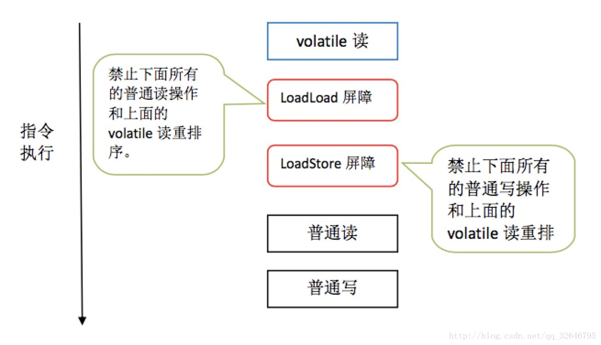
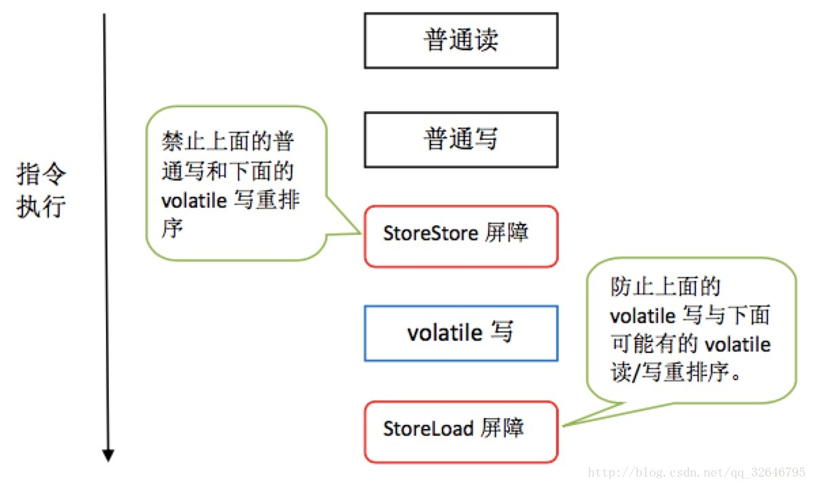

[toc]

# java一些关键字

## transient （瞬态）关键字

被修饰后不被序列化
　　对象的序列化可以通过实现两种接口来实现，若实现的是Serializable接口，则所有的序列化将会自动进行，若实现的是Externalizable接口，则没有任何东西可以自动序列化，需要在writeExternal方法中进行手工指定所要序列化的变量，这与是否被transient修饰无关。

## volatile 关键字

　　在Java中，每个线程都有一个独立的内存空间，称为工作内存; 它保存了用于执行操作的不同变量的值。在执行操作之后，线程将变量的更新值复制到主存储器，这样其他线程可以从那里读取最新值。
　　简单地说，volatile关键字标记一个变量，在多个线程访问它的情况下，总是转到主内存，读取和写入。
　　volatile具有synchronized关键字的“可见性”，但是没有synchronized关键字的“并发正确性”，也就是说不保证线程执行的有序性。也就是说，volatile变量对于每次使用，线程都能得到当前volatile变量的最新值。但是volatile变量并不保证并发的正确性。

**注意**

    当变量的值由自身的上一个决定时，如n=n+1、n++ 等，volatile关键字将失效，只有当变量的值和自身上一个值无关时对该变量的操作才是原子级别的。

### Happens-Before (先行发生)

happens-before原则
1. 程序次序规则：一个线程内，按照代码顺序，书写在前面的操作先行发生于书写在后面的操作；
2. 锁定规则：一个unLock操作先行发生于后面对同一个锁额lock操作；
3. volatile变量规则：对一个变量的写操作先行发生于后面对这个变量的读操作；
4. 传递规则：如果操作A先行发生于操作B，而操作B又先行发生于操作C，则可以得出操作A先行发生于操作C；
5. 线程启动规则：Thread对象的start()方法先行发生于此线程的每个一个动作；
6. 线程中断规则：对线程interrupt()方法的调用先行发生于被中断线程的代码检测到中断事件的发生；
7. 线程终结规则：线程中所有的操作都先行发生于线程的终止检测，我们可以通过Thread.join()方法结束、Thread.isAlive()的返回值手段检测到线程已经终止执行；
8. 对象终结规则：一个对象的初始化完成先行发生于他的finalize()方法的开始；

* as-if-serial 语义的意思指:不管怎么重排序， 单线程下的执行结果不能被改变(简直就是废话)


从Java 5开始，volatile关键字还提供了额外的功能，可确保包括非volatile变量在内的所有变量的值与Volatile写操作一起写入主存储器。
这称为Happens-Before，因为它为所有变量提供了对另一个读取线程的可见性。**此外，JVM不会重新排序volatile变量的读写指令。（其实并没有禁止重新排序，只是根据一定规则分段了,详见内存屏障）**

```java
我们来看看这个例子：
Thread 1
    object.aNonValitileVariable = 1;
    object.aVolatileVariable = 100; // volatile write

Thread 2:
    int aNonValitileVariable = object.aNonValitileVariable;
    int aVolatileVariable =  object.aVolatileVariable;
```

在这种情况下，当Thread 1写入 aVolatileVariable 的值时，aNonValitileVariable 的值也会写入主存储器。即使它不是一个volatile的变量，它也表现出一种不稳定的行为。

#### 应用场景

* 单例模式中使用懒汉式：（解决线程安全问题）
双重检查加锁并不代码百分百一定没有线程安全问题了。

因为，这里会涉及到一个指令重排序问题。

`instance = new Singleton2()`其实可以分为下面的步骤：
1. 申请一块内存空间；
2. 在这块空间里实例化对象；
3. instance的引用指向这块空间地址；

指令重排序存在的问题是：

对于以上步骤，指令重排序很有可能不是按上面123步骤依次执行的。
比如，先执行1申请一块内存空间，然后执行3步骤，instance的引用去指向刚刚申请的内存空间地址，
那么，当它再去执行2步骤，判断instance时，由于instance已经指向了某一地址，它就不会再为null了，
因此，也就不会实例化对象了。这就是所谓的指令重排序安全问题。
那么，如何解决这个问题呢？

加上volatile关键字，因为volatile可以禁止指令重排序。

```java
public class Singleton2 {

    private Singleton2(){

    }

    private static volatile Singleton2 instance;

    public static Singleton2 getInstance(){
        if(instance == null) {
            synchronized (Singleton2.class){
                if (instance == null){
                    instance = new Singleton2();
                }
            }
        }
        return instance;
    }

}
```
```java
另一种解决方法
public class Singleton{        
    private Singleton(){        
        …        
    }        
    private static class SingletonContainer{        
        private static Singleton instance = new Singleton();        
    }        
    public static Singleton getInstance(){        
        return SingletonContainer.instance;        
    }        
}   
```
　　JVM内部的机制能够保证当一个类被加载的时候，这个类的加载过程是线程互斥的。这样当我们第一次调用getInstance的时候，JVM能够帮我们保证instance只被创建一次，并且会保证把赋值给instance的内存初始化完毕，这样我们就不用担心3.2中的问题。此外该方法也只会在第一次调用的时候使用互斥机制，这样就解决了3.1中的低效问题。最后instance是在第一次加载SingletonContainer类时被创建的，而SingletonContainer类则在调用getInstance方法的时候才会被加载，因此也实现了惰性加载。

## assert 关键字 （断言）

1. 断言用处
前置条件断言：代码执行之前必须具备的特性
后置条件断言：代码执行之后必须具备的特性
前后不变断言：代码执行前后不能变化的特性

2. 断言使用方式
断言可以有两种形式
    1. assert Expression1
    2. assert Expression1:Expression2

    其中Expression1应该总是一个布尔值，Expression2是断言失败时输出的失败消息的字符串。如果Expression1为假，则抛出一个 AssertionError，这是一个错误，而不是一个异常，也就是说是一个不可控制异常（unchecked Exception),AssertionError由于是错误，所以可以不捕获，但不推荐这样做，因为那样会使你的系统进入不稳定状态。起用断言断言在默认情况下是关闭的，要在编译时启用断言，需要使用source1.4标记 既javac source1.4 Test.java ,在运行时启用断言需要使用 -ea参数 。要在系统类中启用和禁用断言可以使用 -esa 和 -dsa参数。

3. 断言的副作用

    由于程序员的问题，断言的使用可能会带来副作用
```java
例如：boolean isEnable=false;
...
assert isEnable=true;
这个断言的副作用是因为它修改了程序中变量的值并且未抛出错误，这样的错误如果不细心的检查是很难发现的。
```
但是同时我们可以根据以上的副作用得到一个有用的特性，根据它来测试断言是否打开。

```java
public class AssertExampleTwo{
    public static void main(String args[]){
        boolean isEnable=false;
        ...
        assert isEnable=true;
        if(isEnable==false){
            throw new RuntimeException("Assertion shoule be enable!");
        }
    }
}
```

* 何时需要使用断言

1. 可以在预计正常情况下程序不会到达的地方放置断言 ：`assert false`
2. 断言可以用于检查传递给私有方法的参数。（对于公有方法，因为是提供给外部的接口，所以必须在方法中有相应的参数检验,才能保证代码的健壮性）
3. 使用断言测试方法执行的前置条件和后置条件4.使用断言检查类的不变状态，确保任何情况下，某个变量的状态必须满足。（如age属性应大于0小于某个合适值）

* 什么地方不要使用断言
断言语句不是永远会执行，可以屏蔽也可以启用,因此：
    1. 不要使用断言作为公共方法的参数检查，公共方法的参数永远都要执行
    2. 断言语句不可以有任何边界效应，不要使用断言语句去修改变量和改变方法的返回值

参考：
链接：https://www.jianshu.com/p/75d7db5e2353

### native 关键字

用来声明一个方法是由与计算机相关的语言（如C/C++/FORTRAN语言）实现的

# 内存屏障(Memory Barrier)

在执行程序时为了提高性能，提高并行度，编译器和处理器常常会对指令做重排序。重排序分三种类型：

编译器优化的重排序。编译器在不改变单线程程序语义的前提下，可以重新安排语句的执行顺序。
　　指令级并行的重排序。现代处理器采用了指令级并行技术（Instruction-Level Parallelism， ILP）来将多条指令重叠执行。如果不存在数据依赖性，处理器可以改变语句对应机器指令的执行顺序。
　　内存系统的重排序。由于处理器使用缓存和读/写缓冲区，这使得加载和存储操作看上去可能是在乱序执行。

问题：重排序都可能会导致多线程程序出现内存可见性问题

既然讲了问题所在，也说了volatile能解决这个问题，那到底为啥能解决呢？

* CPU的角度
其实这种问题不只是出现在Java上，毕竟一切的尽头都是机器指令，所以只要运行在计算机上都会有这种问题，所以其实指令集也针对乱序在多线程时出现的问题做出了拓展，这里我们以x86为例：

|指令|解释|
|:-:|:-:|
| sfence |内存写屏障，保证这条指令前的所有的存储指令必须在这条指令之前执行，并且在执行此条指令时把写入到CPU的私有缓存的数据刷到公有内存(以下均简称主存)|
| lfence | 内存读屏障，保证这条指令后的所有读取指令在这条指令后执行，并且执行此条指令时，清空CPU的读取缓存，也就是说强制接下来的load从主存中取数据|
| mfence | full barrier，代价最大的barrier，有上述两种barrier的效果，当然也是最稳健的的barrier|
| lock |这个是一种同步指令，也可以禁止lock前的指令和之后的指令重排序(这个指令稍微复杂一些，可以实现的功能也很多)|

* Java的抽象
Java这个时候又来了一波抽象，他把barrier分成了4种 内存模型

|屏障类型|指令示例|	解释|
|:-:|:-:|:-:|
| LoadLoadBarriers | Load1; LoadLoad;Load2 |确保 Load1 数据的装载，之前于Load2 及所有后续装载指令的装载。（禁止后面的普通读和之前的 load1 （volatile 读）重排序）|
| StoreStoreBarriers | Store1; StoreStore;Store2 |确保 Store1 数据对其他处理器可见(刷新到内存)，之前于Store2 及所有后续存储指令的存储（禁止前面的普通写和后面的 Store2 重排序）|
| LoadStoreBarriers | Load1; LoadStore;Store2 | Load1 数据装载，之前于Store2 及所有后续的存储指令刷新到内存。（禁止后面的普通写和之前的 load1 重排序）|
| StoreLoadBarriers | Store1; StoreLoad;Load2 |确保 Store1 数据对其他处理器变得可见(指刷新到内存)，之前于Load2 及所有后续装载指令的装载。 StoreLoad Barriers 会使该屏障之前的所有内存访问指令(存储和装载指令)完成之后，才执行该屏障之后的内存访问指令。（禁止之前的 volatile 写 和后面的 volatile 读/写 重排序）（禁止之前的写操作和之后的 volatile 读 重排序）|

这四个barrier是JVM内存模型的规范，而不是具体的字节码指令，因为你可以看到volatile变量在字节码中只是一个标志位，javap搞出来的字节码中并没有任何的barriers，只是说JVM执行引擎会在执行时会插一个对应的屏障，或者说在JIT/AOT生成机器指令的时候插一条对应逻辑的barriers，说句人话，这个barrier不是javac插的。




* synchronized
synchronized我们都知道就是锁，但是在java中，synchronized也是可以保证线程可见性的，我们知道信号量只能实现锁的功能，它是没有我们之前说过的内存屏障的功能的，那其实synchronized在代码块最后也是会加入一个barrier的(应该是store barrier)

* final
final除了我们平时所理解的语义之外，其实还蕴含着**禁止把构造器final变量的赋值重排序到构造器外面**，实现方式就是在final变量的写之后插入一个store-store barrier

* 思考
```java
public class Singleton {
    public volatile static Singleton sInstance = new Singleton();
    public LinkedList<String> mList = new LinkedList<>();

    public static void main(String[] args) {
        sInstance.mList.add("A");//A
    }
}
```
在A处，add函数内部是不是也被”框”在(sIntance的)屏障中间了呢？

我认为不会，因为sInstance.mList在是一个load操作，add()又是另外一个操作，所以我觉得add应该会在barrier的外面

我的想法是（和原文不同）
```java
//store-load barrier
LinkedList<String> list = sInstance.mList;
//load-store barrier
mList.add("A");
```

会降低性能，看实际情况使用 volatile 关键字

***
连接：
https://blog.csdn.net/qq_32646795/article/details/78221064 
https://www.cnblogs.com/hexinwei1/p/9897945.html

### jsp

2019.07.21今天突然碰到一个小问题，用IDEA打开jsp页面后缀不对是 .do 的，后来发现是因为我spring的前端控制器，配置了 *.do 的过滤方式，由此我重新的知道了 jsp 的本质是一个 servlet jsp是一个类不是一个客户端的页面，它是会被编译成一个 class 文件的。

# 单例模式

第一种（懒汉，线程不安全）：

```java
public class Singleton {  
    private static Singleton instance;  
    private Singleton (){}  
    
    public static Singleton getInstance() {  
    if (instance == null) {  
        instance = new Singleton();  
    }  
    return instance;  
    }  
}
```

这种写法lazy loading很明显，但是致命的是在多线程不能正常工作。

第二种（懒汉，线程安全）：

```java
public class Singleton {  
    private static Singleton instance;  
    private Singleton (){}
    public static synchronized Singleton getInstance() {  
    if (instance == null) {  
        instance = new Singleton();  
    }  
    return instance;  
    }
}
```
 
这种写法能够在多线程中很好的工作，而且看起来它也具备很好的lazy loading，但是，遗憾的是，效率很低，99%情况下不需要同步。

第三种（饿汉）：

```java
    public class Singleton {  
        private static Singleton instance = new Singleton();  
        private Singleton (){}  
        public static Singleton getInstance() {  
        return instance;  
        }  
    }  
```

这种方式基于classloder机制避免了多线程的同步问题，不过，instance在类装载时就实例化，虽然导致类装载的原因有很多种，在单例模式中大多数都是调用getInstance方法， 但是也不能确定有其他的方式（或者其他的静态方法）导致类装载，这时候初始化instance显然没有达到lazy loading的效果。

第四种（饿汉，变种）：

```java
    public class Singleton {  
        private Singleton instance = null;  
        static {  
        instance = new Singleton();  
        }  
        private Singleton (){}  
        public static Singleton getInstance() {  
        return this.instance;  
        }  
    }  
```

表面上看起来差别挺大，其实更第三种方式差不多，都是在类初始化即实例化instance。

 第五种（静态内部类）：

```java
public class Singleton {  
    private static class SingletonHolder {  
    private static final Singleton INSTANCE = new Singleton();  
    }  
    private Singleton (){}  
    public static final Singleton getInstance() {  
    return SingletonHolder.INSTANCE;  
    }  
}  
```

这种方式同样利用了classloder的机制来保证初始化instance时只有一个线程，它跟第三种和第四种方式不同的是（很细微的差别）：第三种和第四种方式是只要Singleton类被装载了，那么instance就会被实例化（没有达到lazy loading效果），而这种方式是Singleton类被装载了，instance不一定被初始化。因为SingletonHolder类没有被主动使用，只有显示通过调用getInstance方法时，才会显示装载SingletonHolder类，从而实例化instance。想象一下，如果实例化instance很消耗资源，我想让他延迟加载，另外一方面，我不希望在Singleton类加载时就实例化，因为我不能确保Singleton类还可能在其他的地方被主动使用从而被加载，那么这个时候实例化instance显然是不合适的。这个时候，这种方式相比第三和第四种方式就显得很合理。

第六种（枚举）：

```java
public enum Singleton {  
    INSTANCE;  
    public EnumSingleton  whateverMethod() {  
            return INSTANCE;
    }  
}  
```

```java
public enum Singleton {
    Instance;
    public void anyMethod(){}
}
```

这种方式是Effective Java作者Josh Bloch 提倡的方式，它不仅能避免多线程同步问题，而且还能防止反序列化重新创建新的对象，可谓是很坚强的壁垒啊，不过，个人认为由于1.5中才加入enum特 性，用这种方式写不免让人感觉生疏，在实际工作中，我也很少看见有人这么写过。

第七种（双重校验锁）：

```java
    public class Singleton {  
        private volatile static Singleton singleton;  
        private Singleton (){}  
        public static Singleton getSingleton() {  
        if (singleton == null) {  
            synchronized (Singleton.class) {  
            if (singleton == null) {  
                singleton = new Singleton();  
            }  
            }  
        }  
        return singleton;  
        }  
    }  
```

## 总结

有两个问题需要注意：

1. 如果单例由不同的类装载器装入，那便有可能存在多个单例类的实例。假定不是远端存取，例如一些servlet容器对每个servlet使用完全不同的类装载器，这样的话如果有两个servlet访问一个单例类，它们就都会有各自的实例。

2. 如果Singleton实现了java.io.Serializable接口，那么这个类的实例就可能被序列化和复原。不管怎样，如果你序列化一个单例类的对象，接下来复原多个那个对象，那你就会有多个单例类的实例。

对第一个问题修复的办法是：

```java
    private static Class getClass(String classname)      
                                             throws ClassNotFoundException {     
          ClassLoader classLoader = Thread.currentThread().getContextClassLoader();     
          
          if(classLoader == null)     
             classLoader = Singleton.class.getClassLoader();     
          
          return (classLoader.loadClass(classname));     
       }     
    }  
```

对第二个问题修复的办法是：

```java
    public class Singleton implements java.io.Serializable {     
       public static Singleton INSTANCE = new Singleton();     
          
       protected Singleton() {     
            
       }     
       private Object readResolve() {     
                return INSTANCE;     
          }    
    }   
```

参考：
https://www.cnblogs.com/duojia/p/4543393.html